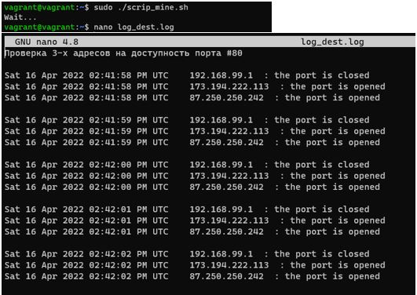
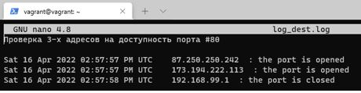
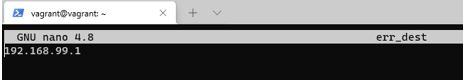

## Домашнее задание к занятию "4.1. Командная оболочка Bash: Практические навыки"

__1.  1. Обязательная задача 1.__

__Есть скрипт:__
``` 
a=1
b=2
c=a+b
d=$a+$b
e=$(($a+$b))
```
__Какие значения переменным c,d,e будут присвоены? Почему?__
 
Выполнено:

|     Переменная       |       Значение        |        Обоснование        |
|-------------|-------------|---------------| 
|     c     |     a+b     |конкатенация строк и «+»|
|     d     |     1+2     |вывод значенией строковых переменных и «+»|
|     e     |     3     |арифметическое сложение значений строковых переменных| 

________________________ 
 
__2. Обязательная задача 2__

__На нашем локальном сервере упал сервис и мы написали скрипт, который постоянно проверяет его доступность, записывая дату проверок до тех пор, пока сервис не станет доступным (после чего скрипт должен завершиться). В скрипте допущена ошибка, из-за которой выполнение не может завершиться, при этом место на Жёстком Диске постоянно уменьшается. Что необходимо сделать, чтобы его исправить:__

```
while ((1==1)
do
	curl https://localhost:4757
	if (($? != 0))
	then
		date >> curl.log
	fi
done
```
Ваш скрипт:
```
while ((1==1))
do
    curl https://localhost:4757
    if (($? != 0))
    then
        date  >> curl.log
    else
        break                     #принудительный выход из цикла
    fi
done
```
________________________ 

__3. Обязательная задача 3__

__Необходимо написать скрипт, который проверяет доступность трёх IP: 192.168.0.1, 173.194.222.113, 87.250.250.242 по 80 порту и записывает результат в файл log. Проверять доступность необходимо пять раз для каждого узла.__

Ваш скрипт:
```
#!/usr/bin/env bash
p=1
ip_3=192.168.99.1
ip_2=173.194.222.113
ip_1=87.250.250.242
arr=($ip_1 $ip_2 $ip_3)
echo 'Wait...'
echo 'Проверка 3-х адресов на доступность порта #80 '  > log_dest.log
echo -e >> log_dest.log
while [ $p -lt 6 ]
do
    i=0
    for i in {0..2}
    do
        nc -zw1 ${arr[i]} 80
        if (($? == 0))
        then
            echo $(date  +%c) '  ' ${arr[i]} ' : the port is opened'  >> log_dest.log
        else
            echo $(date  +%c) '  ' ${arr[i]} ' : the port is closed'  >> log_dest.log
        fi
    done
    echo -e >> log_dest.log
    p=$(( $p+1 ))
done
```


________________________ 
 
__4. Обязательная задача 4__
 
__Необходимо дописать скрипт из предыдущего задания так, чтобы он выполнялся до тех пор, пока один из узлов не окажется недоступным. Если любой из узлов недоступен - IP этого узла пишется в файл error, скрипт прерывается.__
 
Ваш скрипт:
```
#!/usr/bin/env bash
p=1
ip_3=192.168.99.1
ip_2=173.194.222.113
ip_1=87.250.250.242
arr=($ip_1 $ip_2 $ip_3)
echo 'Wait...'
echo 'Проверка 3-х адресов на доступность порта #80 '  > log_dest.log
echo -e >> log_dest.log
while [ $p -lt 6 ]
do
    i=0
    for i in {0..2}
    do
       nc -zw1 ${arr[i]} 80
       if (($? == 0))
       then
           echo $(date  +%c) '  ' ${arr[i]} ' : the port is opened'  >> log_dest.log
       else
           echo $(date  +%c) '  ' ${arr[i]} ' : the port is closed'  >> log_dest.log
           echo ${arr[i]} > err_dest
           break 2                       #принудительный выход из вложенного цикла
       fi
    done
    echo -e >> log_dest.log
    p=$(( $p+1 ))
done
```

Вывод в лог-файл (обрыв заполнения файла по срабатыванию «break 2»): 
	

 
Вывод в файл ошибок (вывод ip, который недоступен по порту «80»):
	

________________________
