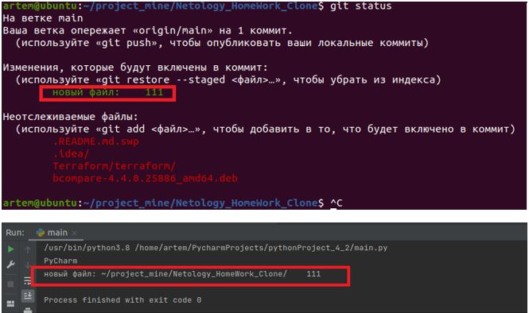
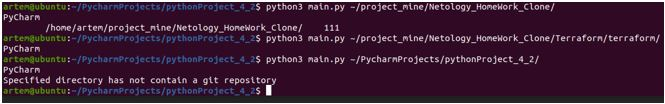
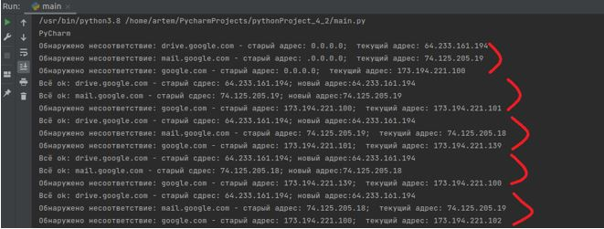

## Домашнее задание к занятию «4.2 Использование Python для решения типовых DevOps задач»

__1. Обязательная задача 1.__

__Есть скрипт:__
```
	
#!/usr/bin/env python3
a = 1
b = '2'
c = a + b
```

Выполнено:

|     Вопрос       |       Ответ        |
|-------------|-------------| 
|     Какое значение будет присвоено пере-менной c?  |     TypeError: unsupported operand type(s) for +: 'int' and 'str'   |
|     Как получить для перемен-ной c значение 12?   |     c=str(a)+b    |
|     Как получить для перемен-ной c значение 3?    |     c=a+int(b)     | 

________________________ 

__2. Обязательная задача 2.__	

__Мы устроились на работу в компанию, где раньше уже был DevOps Engineer. Он написал скрипт, позволяющий узнать, какие файлы модифицированы в репозитории, относительно локальных изменений. Этим скриптом недовольно начальство, потому что в его выводе есть не все изменённые файлы, а также непонятен полный путь к директории, где они находятся. Как можно доработать скрипт ниже, чтобы он исполнял требования вашего руководителя?__
	
```
#!/usr/bin/env python3

import os

bash_command = ["cd ~/netology/sysadm-homeworks", "git status"]
result_os = os.popen(' && '.join(bash_command)).read()
is_change = False
for result in result_os.split('\n'):
    if result.find('modified') != -1:
        prepare_result = result.replace('\tmodified:   ', '')
        print(prepare_result)
        break
```
__Ваш скрипт:__

```
import os

basedir = "~/project_mine/Netology_HomeWork_Clone/"
bash_command = [f"cd {basedir}", "git status "]
result_os = os.popen(' && '.join(bash_command)).read()
for result in result_os.split('\n'):
    if result.find('новый файл') != -1:
        prepare_result = result.replace('новый файл:', basedir)
        print('новый файл:'+ prepare_result)
```

Вывод скрипта при тестировании (изменен файл «111», он есть в отслеживаемых):
	

________________________ 

__3. Обязательная задача 3__

__Доработать скрипт выше так, чтобы он мог проверять не только локальный репозиторий в текущей директории, а также умел воспринимать путь к репозиторию, который мы передаём как входной параметр. Мы точно знаем, что начальство коварное и будет проверять работу этого скрипта в директориях, которые не являются локальными репозиториями.__
	
__Ваш скрипт:__
```
import os
import sys

basedir = ""
try:
    basedir = sys.argv[1]
except:
    print("Invalid repository path specified")
if basedir != "":
    bash_command = [f"cd {basedir}",  "git status "]
    result_os_list = os.listdir(basedir);
    if result_os_list.__contains__(".git"):
        result_os = os.popen(' && '.join(bash_command)).read()
        for result in result_os.split('\n'):
            if result.find('новый файл') != -1:
                prepare_result = result.replace('новый файл:', basedir)
                print(prepare_result)
    else:
        print("Specified directory has not contain a git repository")
```
Вывод скрипта при запуске при тестировании:

 - каталог ~/project_mine/Netology_HomeWork_Clone/  содержит один добавленный файл «111»
	
 - каталог ~/project_mine/Netology_HomeWork_Clone/Terraform/terraform/ не содержит добав-ленных файлов
	
 - каталог ~/PycharmProjects/pythonProject_4_2/ не содержит файлов  .git


________________________ 
	
__4. Обязательная задача 4__
	
__Наша команда разрабатывает несколько веб-сервисов, доступных по http. Мы точно знаем, что на их стенде нет никакой балансировки, кластеризации, за DNS прячется конкретный IP сервера, где установлен сервис. Проблема в том, что отдел, занимающийся нашей инфраструктурой очень часто меняет нам сервера, поэтому IP меняются примерно раз в неделю, при этом сервисы сохраняют за собой DNS имена. Это бы совсем никого не беспокоило, если бы несколько раз сервера не уезжали в такой сегмент сети нашей компании, который недоступен для разработчиков. Мы хотим написать скрипт, который опрашивает веб-сервисы, получает их IP, выводит информацию в стандартный вывод в виде: <URL сервиса> - <его IP>. Также, должна быть реализована возможность проверки текущего IP сервиса c его IP из предыдущей проверки. Если проверка будет провалена - оповестить об этом в стандартный вывод сообщением: [ERROR] <URL сервиса> IP mismatch: <старый IP> <Новый IP>. Будем считать,что наша разработка реализовала сервисы: drive.google.com, mail.google.com, google.com.__
	
__Ваш скрипт:__
```	
import socket
import time

services_ip = {'drive.google.com':'0.0.0.0', 'mail.google.com':'.0.0.0.0', 'google.com':'0.0.0.0'}
while(1==1):
    for service_current in services_ip.keys():
        ip_current = socket.gethostbyname(service_current)
        if(ip_current == services_ip[service_current]):
            print(f'Всё ok: {service_current} - старый сдрес: {services_ip[service_current]}; новый адрес:{ip_current}')
        else:
            print(f'Обнаружено несоответствие: {service_current} - старый адрес: {services_ip[service_current]};  текущий адрес: {ip_current}')
            services_ip[service_current] = ip_current
    time.sleep(3)
```

Вывод скрипта при запуске при тестировании:


________________________ 
