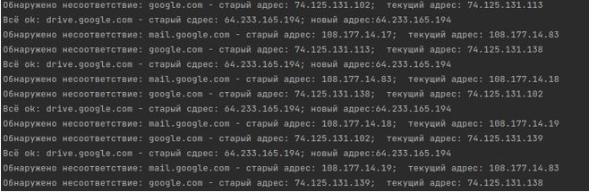
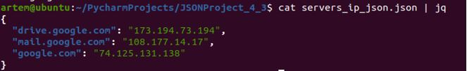

## Домашнее задание к занятию «4.3. Языки разметки JSON и YAML»

__1. Обязательная задача 1.__

__Мы выгрузили JSON, который получили через API запрос к нашему сервису:__
```
    { "info" : "Sample JSON output from our service\t",
        "elements" :[
            { "name" : "first",
            "type" : "server",
            "ip" : 7175 
            },
            { "name" : "second",
            "type" : "proxy",
            "ip : "71.78.22.43"
            }
        ]
    }

```
__Нужно найти и исправить все ошибки, которые допускает наш сервис__

С точки зрения синтаксиса ошибки следующие:

    Строка 6 – отсутствует запятая

    Строка 9 – отсутствуют кавычки
________________________ 

__2. Обязательная задача 2.__	

__В прошлый рабочий день мы создавали скрипт, позволяющий опрашивать веб-сервисы и получать их IP. К уже реализованному функционалу нам нужно добавить возможность записи JSON и YAML файлов, описывающих наши сервисы. Формат записи JSON по одному сервису: { "имя сервиса" : "его IP"}. Формат записи YAML по одному сервису: - имя сервиса: его IP. Если в момент исполнения скрипта меняется IP у сервиса - он должен так же поменяться в yml и json файле.__

__Ваш скрипт:__
```
import socket
import time
import json
import yaml

services_ip = {'drive.google.com':'0.0.0.0', 'mail.google.com':'.0.0.0.0', 'google.com':'0.0.0.0'}
while (1==1):
    for service_current in services_ip.keys():
        ip_current = socket.gethostbyname(service_current)
        if(ip_current == services_ip[service_current]):
            print(f'Всё ok: {service_current} - старый сдрес: {services_ip[service_current]}; новый адрес:{ip_current}')
            with open("servers_ip_json.json", "w") as json_file:
                 json_file.write(json.dumps(services_ip))
            with open("servers_ip_yaml.yaml", "w") as yaml_file:
                 yaml_file.write(yaml.dump(services_ip))
        else:
            print(f'Обнаружено несоответствие: {service_current} - старый адрес: {services_ip[service_current]};  текущий адрес: {ip_current}')
            services_ip[service_current] = ip_current
    time.sleep(3)
```

Вывод скрипта при запуске при тестировании:



__json-файл(ы), который(е) записал ваш скрипт:__



__yml-файл(ы), который(е) записал ваш скрипт:__


________________________ 
