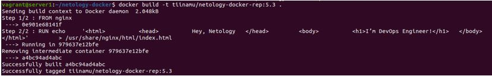
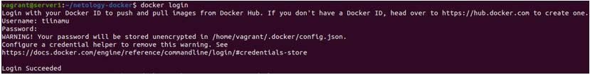

## Домашнее задание к занятию "5.3. Введение. Экосистема. Архитектура. Жизненный цикл Docker контейнера"

__1.	Задача 1__

__Сценарий выполения задачи:__
__•	создайте свой репозиторий на https://hub.docker.com;__
__•	выберете любой образ, который содержит веб-сервер Nginx;__
__•	создайте свой fork образа;__
__•	реализуйте функциональность: запуск веб-сервера в фоне с индекс-страницей, содержащей HTML-код ниже:__
```
<html>
<head>
Hey, Netology
</head>
<body>
<h1>I’m DevOps Engineer!</h1>
</body>
</html>
Опубликуйте созданный форк в своем репозитории и предоставьте ответ в виде ссылки на https://hub.docker.com/username_repo.
```
__Решение__

*1)	Скачиваем образ nginx:*
```
~$ docker pull nginx
```


*2)	Создаем Dockerfile:*
```
FROM nginx
RUN echo \
        '<html> \
         <head> \
         Hey, Netology \
         </head> \
         <body> \
         <h1>I’m DevOps Engineer!</h1> \
         </body> \
         </html>' \
         > /usr/share/nginx/html/index.html
```
*3)	Делаем fork образа:*
```
~$ docker build -t tiinamu/netology-docker-rep:5.3 .
```


*4)	Логинимся*
```
~$ docker login
```


*5)	Пушим образ в репозиторий на hub.docker.com:*
```
~$ docker push tiinamu/netology-docker-rep:5.3
```
*6)	Ссылка на репозиторий с образом: https://hub.docker.com/repository/docker/tiinamu/netology-docker-rep *

*7)	Запускаем контейнер с пробросом на 80 порт хоста:*
```
~$ docker run -d -p 80:80 tiinamu/netology-docker-rep:5.3
```


*8)	Проверяем результат:*


__2.	Задача 2__

__Посмотрите на сценарий ниже и ответьте на вопрос: "Подходит ли в этом сценарии использование Docker контейнеров или лучше подойдет виртуальная машина, физическая машина? Может быть возможны разные варианты?"
Детально опишите и обоснуйте свой выбор.__

__Сценарий:
•	Высоконагруженное монолитное java веб-приложение;
•	Nodejs веб-приложение;
•	Мобильное приложение c версиями для Android и iOS;
•	Шина данных на базе Apache Kafka;
•	Elasticsearch кластер для реализации логирования продуктивного веб-приложения - три ноды elasticsearch, два logstash и две ноды kibana;
•	Мониторинг-стек на базе Prometheus и Grafana;
•	MongoDB, как основное хранилище данных для java-приложения;
•	Gitlab сервер для реализации CI/CD процессов и приватный (закрытый) Docker Registry.__

__Решение:__

|  № |       Сценарий        |    Подходит ли в этом сценарии использование Docker контейнеров или лучше подойдет виртуальная машина, физическая машина    |
|-------|-------------|-------------|
|  1  | Высоконагруженное монолитное java веб-приложение | Лучше подойдет аппаратная виртуализация, либо физический сервер из-за высокой нагруженности |
|  2  | Nodejs веб-приложение | Docker – для возможности упаковать приложение и все его зависимости в единый образ |
|  3  | Мобильное приложение c версиями для Android и iOS | Docker – для возможности упаковать приложение и все его зависимости в единый образ |
|  4  | Шина данных на базе Apache Kafka | Исходя из того, что образ Kafka имеется в репозитории DockerHub, наверное, имеет смысл попробовать через Docker |
|  5  | Elasticsearch кластер для реализации логирования продуктивного веб-приложения - три ноды elasticsearch, два logstash и две ноды kibana | Нет предложений, нет информации про Elasticsearch |
|  6  | Мониторинг-стек на базе Prometheus и Grafana | Исходя из того, что образ Prometheus имеется в репозитории DockerHub, наверное, имеет смысл попробовать через Docker |
|  7  | MongoDB, как основное хранилище данных для java-приложения | Лучше подойдет аппаратная виртуализация, либо физический сервер, как более отказоустойчивое решение |
|  8  | Gitlab сервер для реализации CI/CD процессов и приватный (закрытый) Docker Registry | Нет предположений, не хватает информации |

________________________ 
