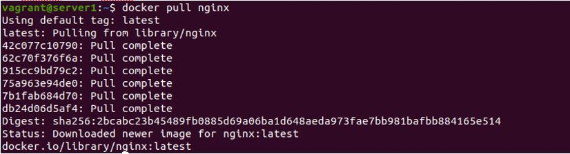

## Домашнее задание к занятию "5.3. Введение. Экосистема. Архитектура. Жизненный цикл Docker контейнера"

__1.	Задача 1__

__Сценарий выполения задачи:__

__•	создайте свой репозиторий на https://hub.docker.com;__

__•	выберете любой образ, который содержит веб-сервер Nginx;__

__•	создайте свой fork образа;__

__•	реализуйте функциональность: запуск веб-сервера в фоне с индекс-страницей, содержащей HTML-код ниже:__

```
<html>
<head>
Hey, Netology
</head>
<body>
<h1>I’m DevOps Engineer!</h1>
</body>
</html>
Опубликуйте созданный форк в своем репозитории и предоставьте ответ в виде ссылки на https://hub.docker.com/username_repo.
```
__Решение__

*1)	Скачиваем образ nginx:*
```
~$ docker pull nginx
```


*2)	Создаем Dockerfile:*
```
FROM nginx
RUN echo \
        '<html> \
         <head> \
         Hey, Netology \
         </head> \
         <body> \
         <h1>I’m DevOps Engineer!</h1> \
         </body> \
         </html>' \
         > /usr/share/nginx/html/index.html
```
*3)	Делаем fork образа:*
```
~$ docker build -t tiinamu/netology-docker-rep:5.3 .
```


*4)	Логинимся*
```
~$ docker login
```


*5)	Пушим образ в репозиторий на hub.docker.com:*
```
~$ docker push tiinamu/netology-docker-rep:5.3
```
*6)	Ссылка на репозиторий с образом: https://hub.docker.com/repository/docker/tiinamu/netology-docker-rep*

*7)	Запускаем контейнер с пробросом на 80 порт хоста:*
```
~$ docker run -d -p 80:80 tiinamu/netology-docker-rep:5.3
```


*8)	Проверяем результат:*


________________________ 

__2.	Задача 2__

__Посмотрите на сценарий ниже и ответьте на вопрос: "Подходит ли в этом сценарии использование Docker контейнеров или лучше подойдет виртуальная машина, физическая машина? Может быть возможны разные варианты?" Детально опишите и обоснуйте свой выбор.__

__Сценарий:__

__•	Высоконагруженное монолитное java веб-приложение;__

__•	Nodejs веб-приложение;__

__•	Мобильное приложение c версиями для Android и iOS;__

__•	Шина данных на базе Apache Kafka;__

__•	Elasticsearch кластер для реализации логирования продуктивного веб-приложения - три ноды elasticsearch, два logstash и две ноды kibana;__

__•	Мониторинг-стек на базе Prometheus и Grafana;__

__•	MongoDB, как основное хранилище данных для java-приложения;__

__•	Gitlab сервер для реализации CI/CD процессов и приватный (закрытый) Docker Registry.__

__Решение:__

|  № |       Сценарий        |    Подходит ли в этом сценарии использование Docker контейнеров или лучше подойдет виртуальная машина, физическая машина    |
|-------|-------------|-------------|
|  1  | Высоконагруженное монолитное java веб-приложение | Лучше подойдет аппаратная виртуализация, либо физический сервер из-за высокой нагруженности |
|  2  | Nodejs веб-приложение | Docker – для возможности упаковать приложение и все его зависимости в единый образ |
|  3  | Мобильное приложение c версиями для Android и iOS | Docker – для возможности упаковать приложение и все его зависимости в единый образ |
|  4  | Шина данных на базе Apache Kafka | Исходя из того, что образ Kafka имеется в репозитории DockerHub, наверное, имеет смысл попробовать через Docker |
|  5  | Elasticsearch кластер для реализации логирования продуктивного веб-приложения - три ноды elasticsearch, два logstash и две ноды kibana | Нет предложений, нет информации про Elasticsearch |
|  6  | Мониторинг-стек на базе Prometheus и Grafana | Исходя из того, что образ Prometheus имеется в репозитории DockerHub, наверное, имеет смысл попробовать через Docker |
|  7  | MongoDB, как основное хранилище данных для java-приложения | Лучше подойдет аппаратная виртуализация, либо физический сервер, как более отказоустойчивое решение |
|  8  | Gitlab сервер для реализации CI/CD процессов и приватный (закрытый) Docker Registry | Нет предположений, не хватает информации |
________________________ 

__3.	Задача 3__

__•	Запустите первый контейнер из образа centos c любым тэгом в фоновом режиме, подключив папку /data из текущей рабочей директории на хостовой машине в /data контейнера;__

__•	Запустите второй контейнер из образа debian в фоновом режиме, подключив папку /data из текущей рабочей директории на хостовой машине в /data контейнера;__

__•	Подключитесь к первому контейнеру с помощью docker exec и создайте текстовый файл любого содержания в /data;__

__•	Добавьте еще один файл в папку /data на хостовой машине;__

__•	Подключитесь во второй контейнер и отобразите листинг и содержание файлов в /data контейнера.__

__Решение__

*3.1)  Запускаем первый контейнер из образа centos c любым тэгом в фоновом режиме, подключив папку /data из текущей рабочей директории на хостовой машине в /data контейнера:*
```
~/netology-docker$ docker run -v /data:/data --name my-container-centos -d -t centos
```


*3.2)  Запускаем второй контейнер из образа debian в фоновом режиме, подключив папку /data из текущей рабочей директории на хостовой машине в /data контейнера*
```
~/netology-docker$ docker run -v /data:/data --name my-container-debian -d -t debian
```


*Проверяем запущенные контейнеры (убеждаемся, что запустились):*


*3.3)	Подключаемся к первому контейнеру (my-container-centos) с помощью docker exec и создаем md-файл в /data:*
```
$ docker exec my-container-centos /bin/bash -c "echo  first_test>/data/readme_test_docker.md"
```


*3.4)	Добавляем еще один файл (readme_test_host.txt) в папку /data на хостовой машине:*
```
$ sudo touch /data/readme_test_host.txt 
$ sudo nano /data/readme_test_host.txt
```


*3.5)	Подключаемся во второй контейнер (my-container-debian) и отображаем листинг и содержание файлов в директории /data контейнера.*
```
~/netology-docker$ docker exec -it my-container-debian /bin/bash 

root@97f7ddf4d1e8:/# ls -lha /data
total 16K
drwxr-xr-x 2 root root 4.0K Jun  1 16:16 .
drwxr-xr-x 1 root root 4.0K Jun  1 16:03 ..
-rw-r--r-- 1 root root   11 Jun  1 16:09 readme_test_docker.md
-rw-r--r-- 1 root root   16 Jun  1 16:11 readme_test_host.txt
root@97f7ddf4d1e8:/# exit 
```

________________________ 

__4.	Задача 4 (*)__

__Воспроизвести практическую часть лекции самостоятельно.
Соберите Docker образ с Ansible, загрузите на Docker Hub и пришлите ссылку вместе с остальными ответами к задачам.__


