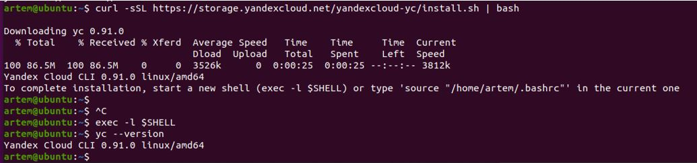

## Домашнее задание к занятию «5.4 Оркестрация группой Docker контейнеров на примере Docker Compose»

__1.	Задача 1__

__Создать собственный образ операционной системы с помощью Packer.__

__Решение__

1). Ставим yc:
```
artem@ubuntu:~$ curl -sSL https://storage.yandexcloud.net/yandexcloud-yc/install.sh | bash
```

_____________________________________

