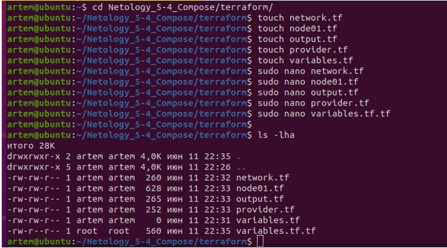
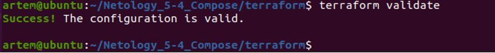

## Домашнее задание к занятию «5.4 Оркестрация группой Docker контейнеров на примере Docker Compose»

__1.	Задача 1__

__Создать собственный образ операционной системы с помощью Packer.__

__Решение__

*__1). Ставим, настриваем yc__*
```
artem@ubuntu:~$ curl -sSL https://storage.yandexcloud.net/yandexcloud-yc/install.sh | bash
```

```
artem@ubuntu:~$ exec -l $SHELL
artem@ubuntu:~$ cd Netology_5-4_Compose/
artem@ubuntu:~/Netology_5-4_Compose$ yc init
```
вводим токен AQAAAAAN_tZ5AATuwSsx5JrfJUgGr8kj0SbPdKY 
(со страницы https://oauth.yandex.ru/verification_code#access_token=AQAAAAAN_tZ5AATuwSsx5JrfJUgGr8kj0SbPdKY&token_type=bearer&expires_in=31229311)

```
yc init:
```


Создаем подсети:
```
artem@ubuntu:~/Netology_5-4_Compose$ yc vpc subnet create \
> --name my-subnet-a \
> --zone ru-central1-a \
> --range 10.1.2.0/24 \
> --network-name net \
> --description "my first subnet via yc"
id: e9b6f5nc33537jnbnn2e
folder_id: b1gjl0488dbj7totafg8
created_at: "2022-06-08T16:50:02Z"
name: my-subnet-a
description: my first subnet via yc
network_id: enpe08sn5jr0noprnguq
zone_id: ru-central1-a
v4_cidr_blocks:
- 10.1.2.0/24
```


Проверяем, что создались подсети:


*__2). Ставим Packer версии 1.8.1__*
```
artem@ubuntu:/$ export VER="1.8.1"
artem@ubuntu:/$ sudo wget https://releases.hashicorp.com/packer/${VER}/packer_${VER}_linux_amd64.zip 
```


Распаковываем:
```
artem@ubuntu:/$ sudo unzip packer_${VER}_linux_amd64.zip
```


Переносим в папку /usr/local/bin
```
artem@ubuntu:/$ sudo mv packer /usr/local/bin
```
Проверяем версию: 


Переходим в папку packer и проверяем валидацию:
```
artem@ubuntu:~/Netology_5-4_Compose/packer$ packer validate centos-7-base.json
```


Собираем образ packer-ом:
```
packer build centos-7-base.json
```


Проверяем, что создался образ:
```
artem@ubuntu:~/Netology_5-4_Compose/packer$ yc compute image list
```


Теперь образ ОС доступен в UI: Yandex.Cloud:

_____________________________________

__2.	Задача 2__

__Создать вашу первую виртуальную машину в Яндекс.Облаке.__

__Решение__

Создаем файлы в директории terraform:
(сами файлы: https://github.com/netology-code/virt-homeworks/tree/virt-11/05-virt-04-docker-compose/src/terraform)



Создаем сервисный аккаунт в каталоге netology-tiinamu-new:
```
artem@ubuntu:~/Netology_5-4_Compose$ yc iam service-account create --name my-robot \
> --description "this is my favorite service account"
```


Теперь надо назначить роль editor этому сервисному аккаунту, а для этого выяснить id сервисного аккаунта:
```
yc resource-manager folder add-access-binding netology-tiinamu-new \
  --role editor \
  --subject serviceAccount:aje10prv6nj8qjr5roku
```


Проверяем сервисные роли и их права:
```
artem@ubuntu:~/Netology_5-4_Compose$ yc iam service-account list
```


Создаем файлик с ключом для сервисного аккаунта: key.json:
```
yc iam key create --service-account-name my-robot --output key.json
```


Удаляем сеть и подсеть (которые создавали для packer-а), чтобы не выйти за лимиты (они описаны в терраформе):
```
artem@ubuntu:~/Netology_5-4_Compose/terraform$ yc vpc subnet delete --name my-subnet-a && yc vpc network delete --name net
```


Установим Terraform из официального репозитория.
Выполним команду в оболочке терминала, чтобы добавить ключ GPG для Terraform в вашу систему:
```
curl -fsSL https://apt.releases.hashicorp.com/gpg | sudo apt-key add -
```
Затем выполняем команду, чтобы загрузить Terraform с веб-сайта Hashicorp:
```
sudo apt-add-repository "deb [arch=$(dpkg --print-architecture)] https://apt.releases.hashicorp.com $(lsb_release -cs) main"
```
После добавления репозитория устанавливаем Terraform, выполнив следующую команду:
```
sudo apt update
sudo apt install terraform
```
Проверим версию Terraform 
```
terraform -v
```


Проводим инициализацию: *terraform init* – терраформ скачает все зависимости для него


Далее надо провести валидацию конфига terraform:

Затем 
```
terraform validate:
```


Затем говорим terraform plan, чтобы посмотреть, что terraform собирается нам создать
```
artem@ubuntu:~/Netology_5-4_Compose/terraform$ terraform plan
```


Далее
```
artem@ubuntu:~/Netology_5-4_Compose/terraform$ terraform apply -auto-approve
```


Смотрим в UI как создалась машина:


_____________________________________

__3.	Задача 3__

__Создать ваш первый готовый к боевой эксплуатации компонент мониторинга, состоящий из стека микросервисов.__

__Решение__

Идем в директорию ansible, подставляем внешний ip в inventory-файл:


Сгенерим ключи в директории *.ssh*:
```
artem@ubuntu:~/.ssh$ ssh-keygen -t rsa
```


Запускаем playbook:
```
artem@ubuntu:~/Netology_5-4_Compose/ansible$ ansible-playbook provision.yml
```


Можем зайти на виртуалку и проверим, что собрал docker:
```
docker images
```


Проверим, какие микросервисы запустились:


Посмотрим через docker-compose на микросервисы в табличном виде (с портами):


Посмотрим через ctop:
```
[root@node01 stack]# yum install wget –y
[root@node01 stack]# sudo wget https://github.com/bcicen/ctop/releases/download/v0.7.7/ctop-0.7.7-linux-amd64 -O /usr/local/bin/ctop
[root@node01 stack]# sudo chmod +x /usr/local/bin/ctop
[root@node01 stack]# /usr/local/bin/ctop
```


Заходим по порту 3000 на внешний ip
```
http://51.250.90.228:3000/
```


Удаляем виртуалку с облака(последовательно удалятся машина, подсеть, сеть):
```

artem@ubuntu:~/Netology_5-4_Compose/terraform$ terraform destroy
```


Удаляем образ с облака:
```
yc compute image delete -–id fd84756mb8sn06j43dpj
```

_____________________________________


