## Домашнее задание к занятию "5.5. Оркестрация кластером Docker контейнеров на примере Docker Swarm"

__1.	Задача 1__

__Дайте письменые ответы на следующие вопросы:__

__•	В чём отличие режимов работы сервисов в Docker Swarm кластере: replication и global?__

__•	Какой алгоритм выбора лидера используется в Docker Swarm кластере?__

__•	Что такое Overlay Network?__


__Решение__

|     Вопрос       |       Ответ        |
|-------------|-------------| 
|     В чём отличие режимов работы сервисов в Docker Swarm кластере: replication и global?  |     Режим global позволяет запускать сервис на всех нодах сразу. Режим replication подразумевает указание нод для запуска экземляров сервисов.    |
|     Какой алгоритм выбора лидера используется в Docker Swarm кластере?   |     В Docker Swarm кластере используется алгоритм поддержания распределенного консенсуса — Raft. Суть – проведение голосования нод в кластере. В кластере одновременно могут работать несколько управляющих нод (manager) и большое количество worker-нод. Каждая управляющая нода может заменить «поврежденную» ноду в любой момент.    |
|     Что такое Overlay Network?    |     Overlay Network - внутренняя виртуальная сеть кластера docker swarm. Она связывает несколько хостов, на которых запущен docker. Ее используют контейнеры, расположенные на разных хостах в кластере swarm.    | 

________________________________________


__2.  Задача 2__

__Создать ваш первый Docker Swarm кластер в Яндекс.Облаке
Для получения зачета, вам необходимо предоставить скриншот из терминала (консоли), с выводом команды:__

__docker node ls__

__Решение__

__1.	Авторизуемся в Yandex.Cloud__

```
artem@ubuntu:~/Netology_5-5_Swarm$ yc init
```
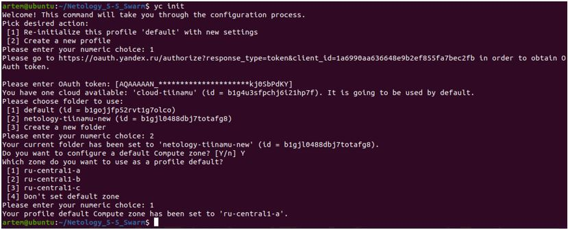  

__2.	Создаем сеть и подсеть, чтобы собрать образ ОС с помощью Packer и запускаем сборку образа.__

__2.1.	Создаем сеть__
```
artem@ubuntu:~/Netology_5-5_Swarm$ yc vpc network create \
> --name net \
> --labels my-label=netology \
> --description "my second network via yc"
...
id: enpvt4q8dcdtvgq8tb2k
folder_id: b1gjl0488dbj7totafg8
created_at: "2022-06-18T12:30:37Z"
name: net
description: my second network via yc
labels:
  my-label: netology
```
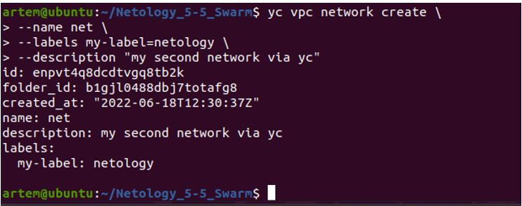  

__2.2.	Создаем подсеть__
```
artem@ubuntu:~/Netology_5-4_Compose$ yc vpc subnet create \
> --name my-subnet-a \
> --zone ru-central1-a \
> --range 10.1.2.0/24 \
> --network-name net \
> --description "my second subnet via yc"
…
id: e9b1b3ss50pjgoqp9lbm
folder_id: b1gjl0488dbj7totafg8
created_at: "2022-06-18T12:33:12Z"
name: my-subnet-a
description: my second subnet via yc
network_id: enpvt4q8dcdtvgq8tb2k
zone_id: ru-central1-a
v4_cidr_blocks:
- 10.1.2.0/24
```
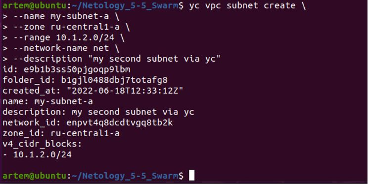  

Проверяем, что создались подсети:

artem@ubuntu:~/Netology_5-5_Swarm$ yc vpc subnet list

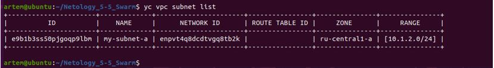  

__2.3.	Ставим Packer версии 1.8.1__
```
artem@ubuntu:/$ export VER="1.8.1"
artem@ubuntu:/$ sudo wget https://releases.hashicorp.com/packer/${VER}/packer_${VER}_linux_amd64.zip 
```
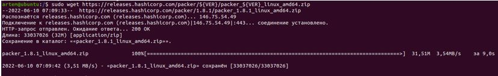  

Распаковываем:
```
artem@ubuntu:/$ sudo unzip packer_${VER}_linux_amd64.zip
```
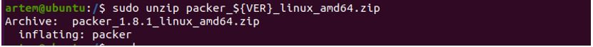 

Переносим в папку /usr/local/bin
```
artem@ubuntu:/$ sudo mv packer /usr/local/bin
```
Проверяем версию:

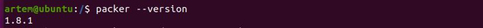  

__2.4.	В файле :~/ Netology_5-5_Swarm/packer$ packer validate centos-7-base.json проставляем актуальные значения следующих полей:__
```
"folder_id": "b1gjl0488dbj7totafg8"
"token": "AQAAAAAN_tZ5AATuwSsx5JrfJUgGr8kj0SbPdKY"
"subnet_id": "e9b1b3ss50pjgoqp9lbm"
```

__2.5.	Переходим в папку packer и проверяем валидацию:__
```
artem@ubuntu:~/Netology_5-5_Swarm/packer$ packer validate centos-7-base.json
```
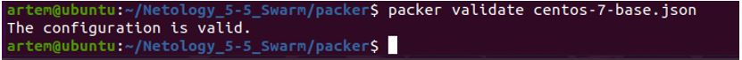  

__2.6.	Собираем образ packer-ом:__
```
packer build centos-7-base.json
```
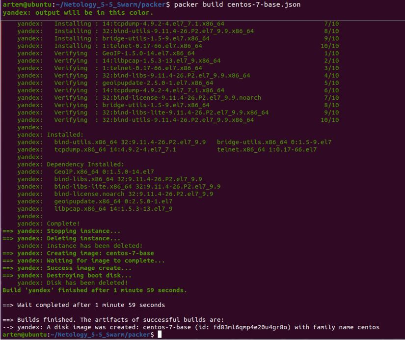  

__2.7.	Проверяем, что создался образ:__
```
artem@ubuntu:~/Netology_5-5_Swarm/packer$ yc compute image list
```
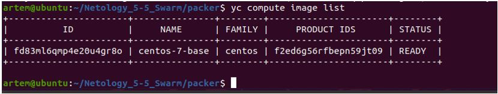  

Теперь образ ОС доступен в UI: Yandex.Cloud:

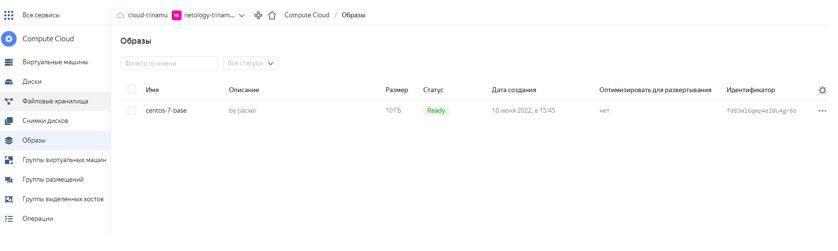  

__2.8.	Создаем структуру директорий и файлов в следующем виде:__
```
artem@ubuntu:~/Netology_5-5_Swarm$ tree
├── ansible
│   ├── monitoring
│   │   ├── alertmanager
│   │   │   ├── conf
│   │   │   │   ├── alertmanager.yml
│   │   │   │   └── docker-entrypoint.sh
│   │   │   └── Dockerfile
│   │   ├── caddy
│   │   │   └── Caddyfile
│   │   ├── docker-compose.yml
│   │   ├── dockerd-exporter
│   │   │   └── Caddyfile
│   │   ├── grafana
│   │   │   ├── dashboards
│   │   │   │   ├── swarmprom-nodes-dash.json
│   │   │   │   ├── swarmprom-prometheus-dash.json
│   │   │   │   └── swarmprom-services-dash.json
│   │   │   ├── datasources
│   │   │   │   └── prometheus.yaml
│   │   │   ├── Dockerfile
│   │   │   └── swarmprom_dashboards.yml
│   │   ├── node-exporter
│   │   │   ├── conf
│   │   │   │   └── docker-entrypoint.sh
│   │   │   └── Dockerfile
│   │   └── prometheus
│   │       ├── conf
│   │       │   ├── docker-entrypoint.sh
│   │       │   ├── prometheus.yml
│   │       │   └── weave-cortex.yml
│   │       ├── Dockerfile
│   │       └── rules
│   │           ├── swarm_node.rules.yml
│   │           └── swarm_task.rules.yml
│   ├── roles
│   │   ├── configure-hosts-file
│   │   │   └── tasks
│   │   │       └── main.yml
│   │   ├── docker-installation
│   │   │   └── tasks
│   │   │       └── main.yml
│   │   ├── docker-swarm-add-manager
│   │   │   └── tasks
│   │   │       └── main.yml
│   │   ├── docker-swarm-add-worker
│   │   │   └── tasks
│   │   │       └── main.yml
│   │   ├── docker-swarm-init
│   │   │   └── tasks
│   │   │       └── main.yml
│   │   ├── docker-swarm-leave
│   │   │   └── tasks
│   │   │       └── main.yml
│   │   └── install-tools
│   │       └── tasks
│   │           └── main.yml
│   ├── swarm-deploy-cluster.yml
│   ├── swarm-deploy-stack.yml
│   └── swarm-deploy-sync.yml
├── packer
│   └── centos-7-base.json
└── terraform
    ├── ansible.cfg
    ├── ansible.tf
    ├── inventory.tf
    ├── key.json
    ├── network.tf
    ├── node01.tf
    ├── node02.tf
    ├── node03.tf
    ├── node04.tf
    ├── node05.tf
    ├── node06.tf
    ├── output.tf
    ├── provider.tf
    ├── terraform.tfstate
    ├── terraform.tfstate.backup
    └── variables.tf

31 directories, 47 files
```
__2.9.	Создаем сервисный аккаунт в каталоге netology-tiinamu-new:__
```
artem@ubuntu:~/Netology_5-5_Swarm$ yc iam service-account create --name my-robot \
> --description "this is my favorite service account"
```
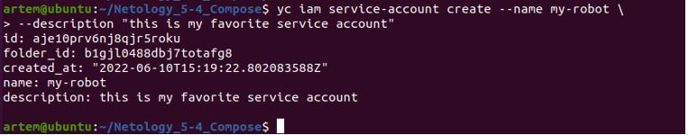  

Теперь надо назначить роль editor этому сервисному аккаунту, а для этого выяснить id сервисного аккаунта:
```
yc resource-manager folder add-access-binding netology-tiinamu-new \
  --role editor \
  --subject serviceAccount:aje10prv6nj8qjr5roku
```
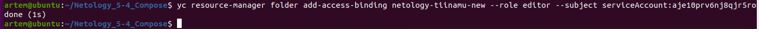  

Проверяем сервисные роли и их права:
```
artem@ubuntu:~/Netology_5-5_Swarm$ yc iam service-account list 
```
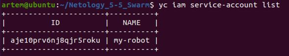 
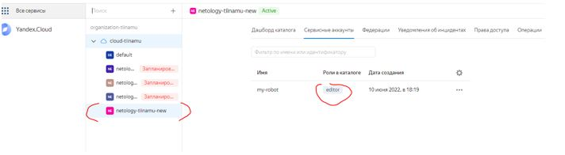 

__2.10.	Создаем файлик с ключом для сервисного аккаунта: key.json:__
```
yc iam key create --service-account-name my-robot --output key.json
```
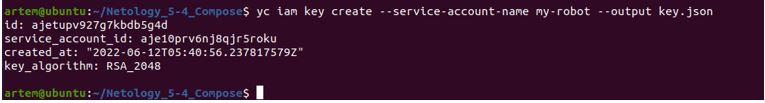 

__3.	Удаляем сеть и подсеть, которые использовали packer-ом для сборки образа ОС, чтобы не выйти за лимиты:__
```
artem@ubuntu:~/Netology_5-5_Swarm/terraform$ yc vpc subnet delete --name my-subnet-a && yc vpc network delete --name net
```
 

__4.	Создаем 6 Виртуальных машин с помощью Terraform__

__4.1.	Установим Terraform из официального репозитория.__

Выполним команду в оболочке терминала, чтобы добавить ключ GPG для Terraform в нашу систему:
```
curl -fsSL https://apt.releases.hashicorp.com/gpg | sudo apt-key add -
```
Затем выполняем команду, чтобы загрузить Terraform с веб-сайта Hashicorp:
```
sudo apt-add-repository "deb [arch=$(dpkg --print-architecture)] https://apt.releases.hashicorp.com $(lsb_release -cs) main"
```
После добавления репозитория устанавливаем Terraform, выполнив следующую команду:
```
sudo apt update
sudo apt install terraform
```
Проверим версию Terraform командой terraform -v

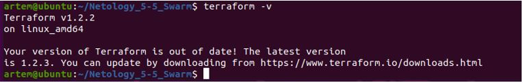 

4.2.	Меняем на актуальные значения: 
```
-	yandex_cloud_id, 
-	yandex_folder_id, 
-	centos-7-base
```
в файле ~/Netology_5-5_Swarm/terraform/variables.tf:

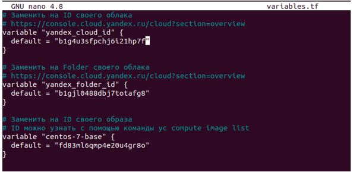 

__4.3.	Проводим инициализацию: terraform init – Terraform скачает все зависимости для него__
```
artem@ubuntu:~/Netology_5-5_Swarm/terraform$ terraform init
```
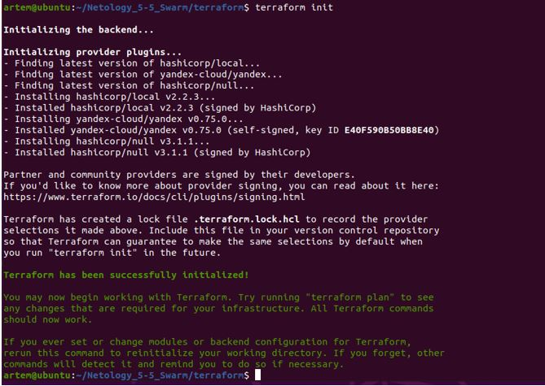 

__4.4.	Далее надо провести валидацию конфига terraform:__
```
$ terraform validate
```
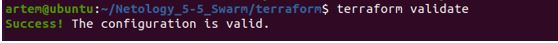 

__4.5.	Затем говорим terraform plan, чтобы посмотреть, что terraform собирается нам создать__
```
artem@ubuntu:~/Netology_5-5_Swarm/terraform$ terraform plan
```
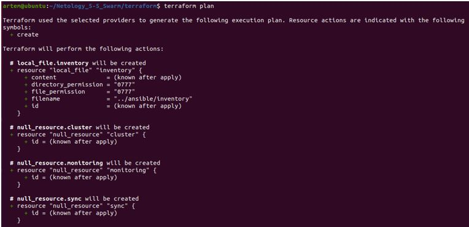 
.................

Видим, что terraform запланировал создание 13-ти сущностей:

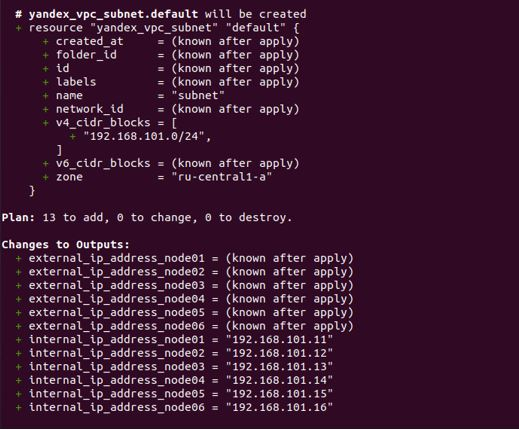 

__4.6.	 Далее terraform apply__
```
artem@ubuntu:~/Netology_5-4_Compose/terraform$ terraform apply -auto-approve
```

__4.7.	Узнаем ip-адреса созданных виртуальных машин – заходим в динамически создаваемый файл__
```
artem@ubuntu:~/Netology_5-5_Swarm/ansible$ nano inventory
```
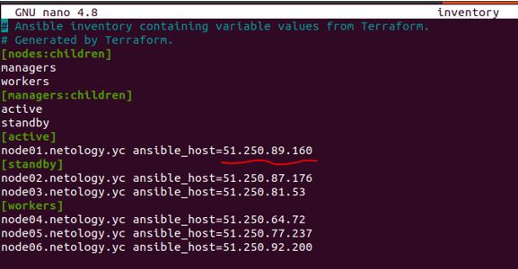 

__4.8.	Заходим на одну из машин по любому адресу__
```
artem@ubuntu:~/Netology_5-5_Swarm/terraform$ ssh centos@51.250.89.160
[centos@node01 ~]$ sudo -i
```
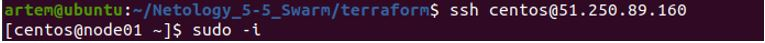 

__4.9.	Посмотрим список созданных узлов из-под этой ВМ:__
```
[root@node01 ~]# docker node ls
```
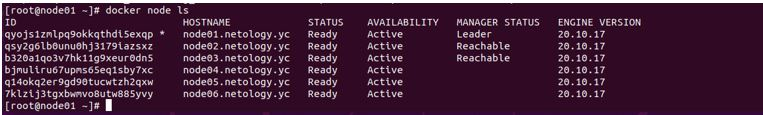 
__________________________

__3.  Задача 3__

__Создать ваш первый, готовый к боевой эксплуатации кластер мониторинга, состоящий из стека микросервисов.
Для получения зачета, вам необходимо предоставить скриншот из терминала (консоли), с выводом команды:__

__docker service ls__

Проверим, какие микросервисы задеполены из-под одной из ВМ:
```
[root@node01 ~]# docker service ls
```
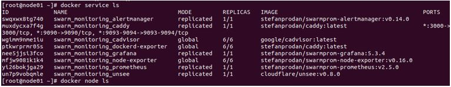 
__________________________

__4*  Выполнить на лидере Docker Swarm кластера команду (указанную ниже) и дать письменное описание её функционала, что она делает и зачем она нужна:__
__# см.документацию: https://docs.docker.com/engine/swarm/swarm_manager_locking/__
__docker swarm update --autolock=true__


