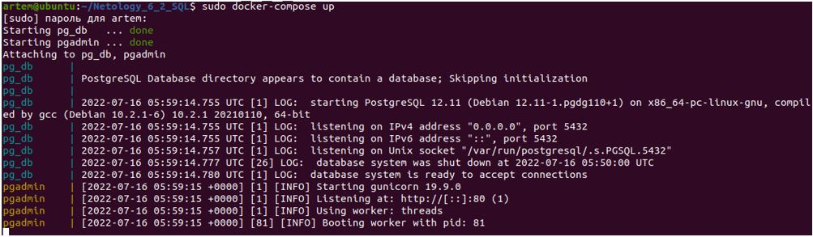
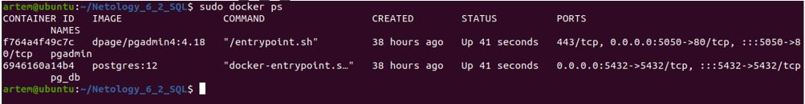
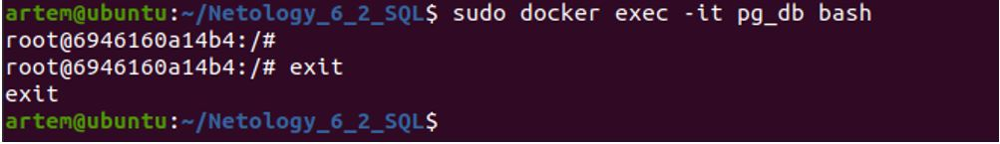
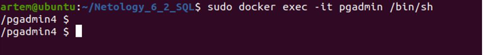
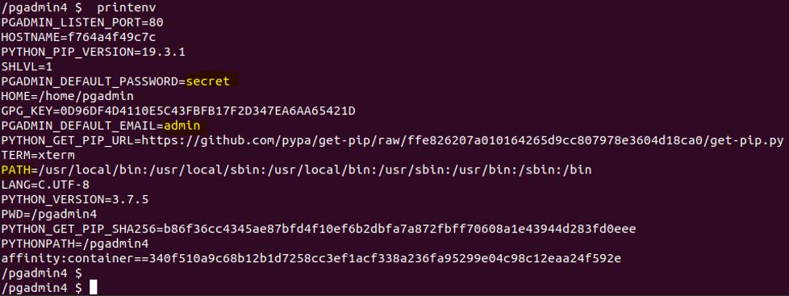

## Домашнее задание к занятию "Домашнее задание к занятию "6.2. SQL"

__Введение__

__Перед выполнением задания вы можете ознакомиться с дополнительными материалами (https://github.com/netology-code/virt-homeworks/blob/master/additional/README.md)__.

__1.	Задача 1__

__Используя docker поднимите инстанс PostgreSQL (версию 12) c 2 volume, в который будут складываться данные БД и бэкапы. Приведите получившуюся команду или docker-compose манифест.__

__Решение:__

Создадим каталог для проекта *~/Netology_6_2_SQL*
Создадим *docker-compose.yml* – файл:
```
version: '3'
services:
  db:                                              #контейнер для БД psql
    container_name: pg_db_new
    image: postgres:12
    environment:
     POSTGRES_USER: bantserev
     POSTGRES_PASSWORD: qwerty
     POSTGRES_DB: my_db
    ports:
     - "5432:5432"
    volumes:
     - database_volume_6_2:/home/database_6_2/
     - backup_volume_6_2:/home/backup_6_2/
    networks:
    - bridge

  pgadmin:                                        #контейнер для pgAdmin4
    container_name: pgadmin
    image: dpage/pgadmin4
    environment:
      PGADMIN_DEFAULT_EMAIL: bancerev@gmail.com
      PGADMIN_DEFAULT_PASSWORD: secret
    ports:
      - "5050:80"
    depends_on:
      - db
    restart: always
    networks:
      - bridge

networks:
  bridge:
    driver: bridge

    ipam:
     config:
       - subnet: 172.10.1.0/16
         gateway: 172.10.1.1
         aux_addresses:
           db: 172.10.1.10
           pgadmin: 172.10.1.20      
volumes:
  database_volume_6_2:
  backup_volume_6_2:
```
В манифесте описаны два контейнера – для самого инстанса psql и для приложения pgAdmin, чтобы в дальнейшем поработать с БД в GUI.

Запускаем 
```
artem@ubuntu:~/Netology_6_2_SQL$ sudo docker-compose up
```
 

Проверяем, какие контейнеры запустились:
```
artem@ubuntu:~/Netology_6_2_SQL$ sudo docker ps
```


Проверим, что можем зайти в контейнер с postgres
```
artem@ubuntu:~/Netology_6_2_SQL$ sudo docker exec -it pg_db_new bash
```
 

Проверим, что можем зайти в контейнер с *pgAdmin4*
```
artem@ubuntu:~/Netology_6_2_SQL$ sudo docker exec -it pgadmin /bin/sh
```
 

Далее проверим окружение, пароли, логины внутри второго контейнера (пароль потом поменял, как в манифесте)
```
/pgadmin4 $  printenv
```
 
________________________________________

__2.	Задача 2__

__В БД из задачи 1:__

__•	создайте пользователя test-admin-user и БД test_db__

__•	в БД test_db создайте таблицу orders и clients (спeцификация таблиц ниже)__

__•	предоставьте привилегии на все операции пользователю test-admin-user на таблицы БД test_db__

__•	создайте пользователя test-simple-user__

__•	предоставьте пользователю test-simple-user права на SELECT/INSERT/UPDATE/DELETE данных таблиц БД test_db__

__*Таблица orders:*__

__+•	id (serial primary key)__
__+•	наименование (string)__
__+•	цена (integer)__

*__Таблица clients:*__
•	id (serial primary key)
•	фамилия (string)
•	страна проживания (string, index)
•	заказ (foreign key orders)

__Приведите:
•	итоговый список БД после выполнения пунктов выше,
•	описание таблиц (describe)
•	SQL-запрос для выдачи списка пользователей с правами над таблицами test_db
•	список пользователей с правами над таблицами test_db__

__Решение:__


|     Типы сущностей, которые нужно будет хранить в БД       |       Подходящие типы СУБД для каждой сущности        |
|-------------|-------------| 
|     Электронные чеки в json виде  |     СУБД: Документно-ориентированная NoSQL (MongoDB) – в качестве объекта хранения выступает документ в конкретном формате json.    |
|     Склады и автомобильные дороги для логистической компании   |     СУБД: Графовая NoSQL. Названия складов рассмотреть в качестве узлов, а дороги – в качестве ребер графовой структуры.    |
|     Генеалогические деревья    |     СУБД: Сетевая NoSQL – использует иерархическую модель данных, что подойдет для описания родственных связей.    | 
|     Кэш идентификаторов клиентов с ограниченным временем жизни для движка аутентификации    |     СУБД: Ключ-значение NoSQL, где ключ - это идентификатор, а значение – атрибут клиента (пример – Redis).    | 
|     Отношения клиент-покупка для интернет-магазина    |     СУБД: реляционная СУБД. Можно построить много логически связанных таблиц, которые потом связать через ключи.    | 
________________________________________
