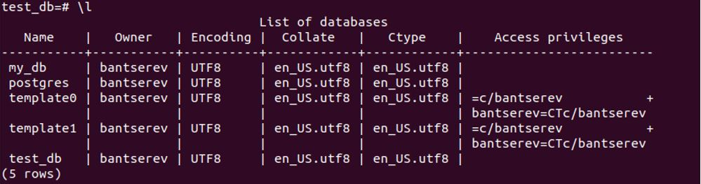
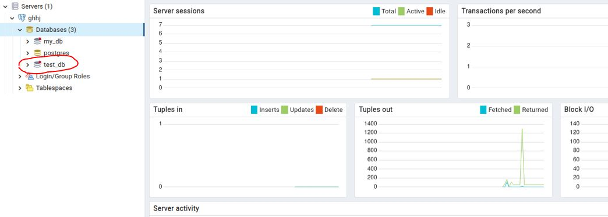
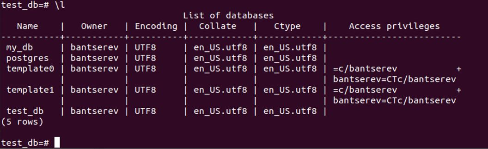
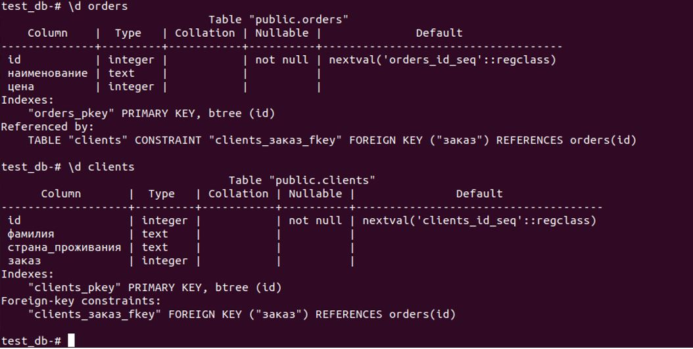
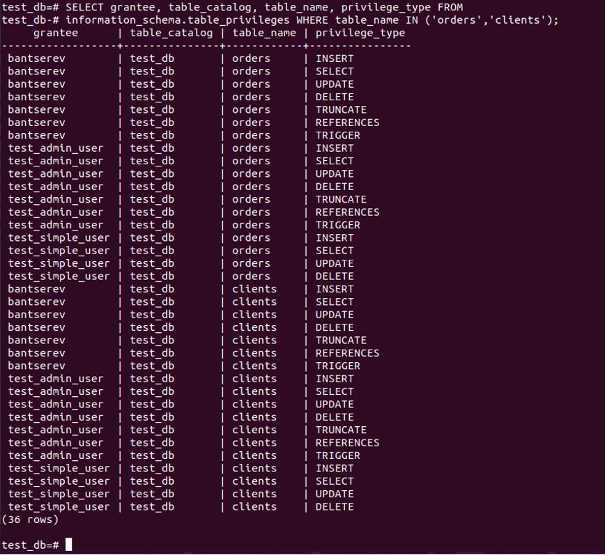
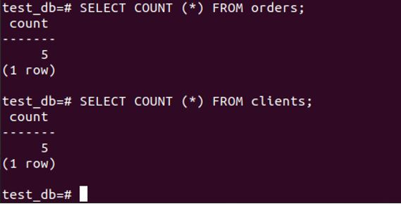
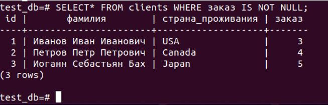
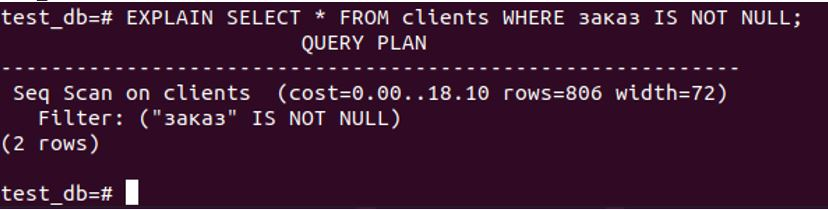

## Домашнее задание к занятию "Домашнее задание к занятию "6.2. SQL"

__Введение__

__Перед выполнением задания вы можете ознакомиться с дополнительными материалами (https://github.com/netology-code/virt-homeworks/blob/master/additional/README.md)__.

__1.	Задача 1__

__Используя docker поднимите инстанс PostgreSQL (версию 12) c 2 volume, в который будут складываться данные БД и бэкапы. Приведите получившуюся команду или docker-compose манифест.__

__Решение:__

Создадим каталог для проекта *~/Netology_6_2_SQL*

Создадим *docker-compose.yml* – файл:
```
version: '3'
services:
  db:                                              #контейнер для БД psql
    container_name: pg_db_new
    image: postgres:12
    environment:
     POSTGRES_USER: bantserev
     POSTGRES_PASSWORD: qwerty
     POSTGRES_DB: my_db
    ports:
     - "5432:5432"
    volumes:
     - database_volume_6_2:/home/database_6_2/
     - backup_volume_6_2:/home/backup_6_2/
    networks:
    - bridge

  pgadmin:                                        #контейнер для pgAdmin4
    container_name: pgadmin
    image: dpage/pgadmin4
    environment:
      PGADMIN_DEFAULT_EMAIL: bancerev@gmail.com
      PGADMIN_DEFAULT_PASSWORD: secret
    ports:
      - "5050:80"
    depends_on:
      - db
    restart: always
    networks:
      - bridge

networks:
  bridge:
    driver: bridge

    ipam:
     config:
       - subnet: 172.10.1.0/16
         gateway: 172.10.1.1
         aux_addresses:
           db: 172.10.1.10
           pgadmin: 172.10.1.20      
volumes:
  database_volume_6_2:
  backup_volume_6_2:
```
В манифесте описаны два контейнера – для самого инстанса psql и для приложения pgAdmin, чтобы в дальнейшем поработать с БД в GUI.

Запускаем 
```
artem@ubuntu:~/Netology_6_2_SQL$ sudo docker-compose up
```
 

Проверяем, какие контейнеры запустились:
```
artem@ubuntu:~/Netology_6_2_SQL$ sudo docker ps
```


Проверим, что можем зайти в контейнер с postgres
```
artem@ubuntu:~/Netology_6_2_SQL$ sudo docker exec -it pg_db_new bash
```
 

Проверим, что можем зайти в контейнер с *pgAdmin4*
```
artem@ubuntu:~/Netology_6_2_SQL$ sudo docker exec -it pgadmin /bin/sh
```
 

Далее проверим окружение, пароли, логины внутри второго контейнера (пароль потом поменял, как в манифесте)
```
/pgadmin4 $  printenv
```
 
________________________________________

__2.	Задача 2__

__В БД из задачи 1:__

__•	создайте пользователя test-admin-user и БД test_db__

__•	в БД test_db создайте таблицу orders и clients (спeцификация таблиц ниже)__

__•	предоставьте привилегии на все операции пользователю test-admin-user на таблицы БД test_db__

__•	создайте пользователя test-simple-user__

__•	предоставьте пользователю test-simple-user права на SELECT/INSERT/UPDATE/DELETE данных таблиц БД test_db__


__*Таблица orders:*__

•	id (serial primary key)

•	наименование (string)

•	цена (integer)


__*Таблица clients:*__

•	id (serial primary key)

•	фамилия (string)

•	страна проживания (string, index)

•	заказ (foreign key orders)


__Приведите:__

__•	итоговый список БД после выполнения пунктов выше__

__•	описание таблиц (describe)__

__•	SQL-запрос для выдачи списка пользователей с правами над таблицами test_db__

__•	список пользователей с правами над таблицами test_db__


__Решение:__

2.1)	создадим БД test_db (createdb) и выполним подключение (psql) к созданной базе:
```
artem@ubuntu:~/Netology_6_2_SQL$ sudo docker exec -it pg_db_new bash
root@7dffed4502c4:/# 
root@7dffed4502c4:/# createdb test_db -U bantserev
root@7dffed4502c4:/#
root@7dffed4502c4:/# psql -d test_db -U bantserev
psql (12.11 (Debian 12.11-1.pgdg110+1))
Type "help" for help.
test_db=#
```
 

В графическом интерфейсе pgAdmin также видим, что БД создалась (подключение через браузер http://localhost:5050):
 

2.2)	создадим пользователя test-admin-user:
```
test_db=# CREATE USER test_admin_user;
CREATE ROLE
```
2.3)	в БД test_db создадим таблицы orders и clients:
```
test_db=# CREATE TABLE orders
(
   id SERIAL PRIMARY KEY,
   наименование TEXT,
   цена INTEGER
);
CREATE TABLE

test_db=# CREATE TABLE clients
(
    id SERIAL PRIMARY KEY,
    фамилия TEXT,
    страна_проживания TEXT,
    заказ INTEGER,
    FOREIGN KEY (заказ) REFERENCES orders(id)
);
```

2.4)	предоставим привилегии на все операции пользователю test-admin-user на таблицы БД test_db:
```
test_db=# GRANT ALL ON TABLE orders TO test_admin_user;
GRANT
test_db=# GRANT ALL ON TABLE clients TO test_admin_user;
GRANT
```

2.5)	создадим пользователя test-simple-user:
```
test_db=# CREATE USER test_simple_user;
CREATE ROLE
```

2.6)	предоставим пользователю *test-simple-user* права на *SELECT/INSERT/UPDATE/DELETE* данных таблиц БД *test_db*:
```
test_db=# GRANT SELECT,INSERT,UPDATE,DELETE ON TABLE orders TO test_simple_user;
GRANT
test_db=# GRANT SELECT,INSERT,UPDATE,DELETE ON TABLE clients TO test_simple_user;
GRANT
```

2.7)	итоговый список БД после выполнения пунктов выше: 
 

2.8)	описание таблиц (describe):
 

2.9)	SQL-запрос для выдачи списка пользователей с правами над таблицами test_db:
```
test_db=# SELECT grantee, table_catalog, table_name, privilege_type FROM information_schema.table_privileges WHERE table_name IN ('orders','clients');
```

2.10)	список пользователей с правами над таблицами test_db: 
 
________________________________________

__3.	Задача 3__

__Используя SQL синтаксис - наполните таблицы следующими тестовыми данными:__

__*Таблица orders:*__

|     Наименование       |       Цена        |
|-------------|-------------| 
|     Шоколад  |     10    |
|     Принтер   |     3000    |
|     Книга    |     500    | 
|     Монитор    |     7000    | 
|     Гитара    |     4000    | 

__*Таблица clients:*__

|     ФИО       |       Страна проживания        |
|-------------|-------------| 
|     Иванов Иван Иванович  |     USA    |
|     Петров Петр Петрович   |     Canada    |
|     Иоганн Себастьян Бах    |     Japan    | 
|     Ронни Джеймс Дио    |     Russia    | 
|     Ritchie Blackmore    |     Russia    | 

__Используя SQL синтаксис:__

  __•	вычислите количество записей для каждой таблицы__
    
  __•	приведите в ответе:__
    
   __o	запросы__
        
   __o	результаты их выполнения__
        
__Решение:__

3.1)	наполним таблицы требуемыми тестовыми данными:
```
test_db=# INSERT INTO orders VALUES (1, 'Шоколад', 10), (2, 'Принтер', 3000), (3, 'Книга', 500), (4, 'Монитор', 7000), (5, 'Гитара', 4000);
INSERT 0 5
test_db=# INSERT INTO clients VALUES (1, 'Иванов Иван Иванович', 'USA'), (2, 'Петров Петр Петрович', 'Canada'), (3, 'Иоганн Себастьян Бах', 'Japan'), (4, 'Ронни Джеймс Дио', 'Russia'), (5, 'Ritchie Blackmore', 'Russia');
INSERT 0 5
```

3.2)	SQL-запросы для вычисления количества записей в таблицах:
```
SELECT COUNT (*) FROM orders;
SELECT COUNT (*) FROM clients;
```

3.3)	Результаты их выполнения:

 
________________________________________

__4.	Задача 4__

__Часть пользователей из таблицы *clients* решили оформить заказы из таблицы orders. Используя foreign keys свяжите записи из таблиц, согласно таблице:__

|     ФИО       |       Заказ        |
|-------------|-------------| 
|     Иванов Иван Иванович  |     Книга    |
|     Петров Петр Петрович   |     Монитор    |
|     Иоганн Себастьян Бах    |     Гитара    |

__Приведите SQL-запросы для выполнения данных операций.__

__Приведите SQL-запрос для выдачи всех пользователей, которые совершили заказ, а также вывод данного запроса.__

__Подсказка - используйте директиву UPDATE.__


__Решение:__

4.1)	свяжем записи из таблиц следующими запросами:
```
test_db=# UPDATE clients SET заказ=(select id from orders where наименование='Книга') WHERE фамилия='Иванов Иван Иванович';
UPDATE 1
test_db=# UPDATE clients SET заказ=(select id from orders where наименование='Монитор') WHERE фамилия='Петров Петр Петрович';
UPDATE 1
test_db=# UPDATE clients SET заказ=(select id from orders where наименование='Гитара') WHERE фамилия='Иоганн Себастьян Бах';
UPDATE 1
```

4.2)	с помощью запроса *SELECT** *FROM clients WHERE заказ IS NOT NULL;* выведем пользователей, которые совершили заказ:
 
________________________________________

__5.	Задача 5__

__Получите полную информацию по выполнению запроса выдачи всех пользователей из задачи 4 (используя директиву EXPLAIN).
Приведите получившийся результат и объясните что значат полученные значения.__

__Решение:__


5.1)	Используем директиву *EXPLAIN* для получения полной информации по выполнению запроса по выдачи всех вользователей
```
test_db=# EXPLAIN SELECT * FROM clients WHERE заказ IS NOT NULL; :
```
 

  Значение (стоимость) 0.00 — ожидаемые затраты на получение первой строки
  
  Значение (стоимость) 18.10 – ожидаемые затраты на получение всех строк
  
  Значение rows – ожидаемое число строк
  
  Значение width - ожидаемый средний размер строк

Далее запись проверяется на условие <заказ IS NOT NULL> - если условие выполняется, запись вводится
________________________________________


__6.	Задача 6__

__Создайте бэкап БД test_db и поместите его в volume, предназначенный для бэкапов (см. Задачу 1).__

__Остановите контейнер с PostgreSQL (но не удаляйте volumes).__

__Поднимите новый пустой контейнер с PostgreSQL.__

__Восстановите БД test_db в новом контейнере.__

__Приведите список операций, который вы применяли для бэкапа данных и восстановления.__


__Решение:__

6.1)	Создаём бэкап *БД test_db* и помещаем его в *volume*, предназначенный для бэкапов:
```
root@7dffed4502c4:/# pg_dump -U bantserev test_db > /home/backup_6_2/test_db.backup
```

6.2)	Остановливаем контейнер с *PostgreSQL pg_db_new*:
```
$ docker stop pg_db_new
```
6.3)	Поднимаем новый пустой контейнер с PostgreSQL:
```
$ docker run --name pg_db_new_2 -e POSTGRES_PASSWORD=qwerty -d postgres:12
```

6.4)	Восстанавливаем БД test_db в новом контейнере. Для этого скопируем файл дампа из контейнера *pg_db_new* в контейнер *pg_db_new_2*:
```
$ docker cp pg_db:/home/backup_6_2/test_db.backup backup/ && docker cp backup_6_2/test_db.backup pg_db_new_2:/home/
```
6.5)	восстанавливаем базу:
```
root@7dffed4502c4:/# psql -U postgres -d test_db -f /home/test_db.backup
```
________________________________________
