## Домашнее задание к занятию "Домашнее задание к занятию "6.3. MySQL"

__Введение__

__Перед выполнением задания вы можете ознакомиться с дополнительными материалами (https://github.com/netology-code/virt-homeworks/blob/master/additional/README.md)__.

__1.	Задача 1__

__Используя docker, поднимите инстанс MySQL (версию 8). Данные БД сохраните в volume.__

__Изучите бэкап БД и восстановитесь из него.__

__Перейдите в управляющую консоль mysql внутри контейнера.__

__Используя команду \h получите список управляющих команд.__

__Найдите команду для выдачи статуса БД и приведите в ответе из ее вывода версию сервера БД.__

__Подключитесь к восстановленной БД и получите список таблиц из этой БД.__

__Приведите в ответе количество записей с price > 300.__

__В следующих заданиях мы будем продолжать работу с данным контейнером.__


__Решение:__

1.1)	Подготовим docker-манифест:

В папке проекта Netology_6_3 создадим каталог docker-compose.yml

```
version: '3.7'
services:
  db:
    container_name: mysql_db
    image: mysql:8
#    restart: always
    environment:
      MYSQL_DATABASE: my_db_mysql
      MYSQL_USER: bantserev
      MYSQL_PASSWORD: qwerty
      MYSQL_ROOT_PASSWORD: qwerty
    volumes:
      - my_db_vol:/var/lib/mysql

volumes:
  my_db_vol:
```

1.2)	Проверим, как заходим в контейнер
```
artem@ubuntu:~/Netology_6_3_MySQL$ sudo docker exec -it mysql_db bash
```
и посмотрим на окружение:
```
bash-4.4# printenv
MYSQL_PASSWORD=qwerty
HOSTNAME=8a7d0f9f3286
MYSQL_DATABASE=my_db_mysql
MYSQL_ROOT_PASSWORD=qwerty
PWD=/
HOME=/root
MYSQL_MAJOR=8.0
GOSU_VERSION=1.14
MYSQL_USER=bantserev
MYSQL_VERSION=8.0.29-1.el8
affinity:container==e10a00eec96f8e88d7f0a56a1f66cdc6fb757c8379d57fdaa8631b1b95d7e7b0
TERM=xterm
SHLVL=1
PATH=/usr/local/sbin:/usr/local/bin:/usr/sbin:/usr/bin:/sbin:/bin
MYSQL_SHELL_VERSION=8.0.29-1.el8
_=/usr/bin/printenv
```

1.3)	Скопируем файл бэкапа с гита в папку проекта:
```
artem@ubuntu:~/Netology_6_3_MySQL$ touch test_dump.sql
artem@ubuntu:~/Netology_6_3_MySQL$ sudo nano test_dump.sql
(https://github.com/netology-code/virt-homeworks/blob/master/06-db-03-mysql/test_data/test_dump.sql) 
```

1.4)	Создадим папку для бэкапа в контейнере *mysql_db*:
```
bash-4.4# mkdir backup
```
Скопируем бэкап в контейнер:
```
artem@ubuntu:~/Netology_6_3_MySQL$ sudo docker cp test_dump.sql mysql_db:/backup/test_dump.sql
```
Проверим, что бэкап записался в папку проекта:
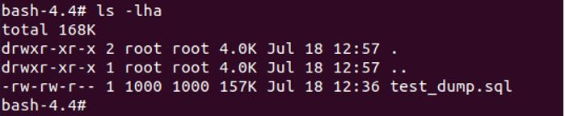 

1.5)	Зайдем в управляющий интерфейс *mysql*:
```
bash-4.4# mysql -h 127.0.0.1 -u root –p
```
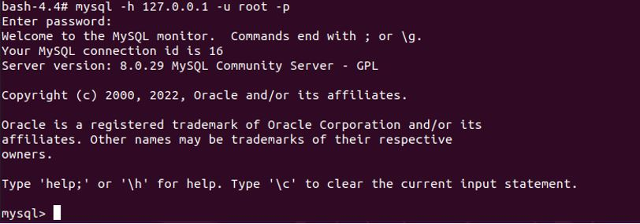 

1.6)	Используя команду *\h* получаем список управляющих команд.
```
mysql> \h

For information about MySQL products and services, visit:
   http://www.mysql.com/
For developer information, including the MySQL Reference Manual, visit:
   http://dev.mysql.com/
To buy MySQL Enterprise support, training, or other products, visit:
   https://shop.mysql.com/

List of all MySQL commands:
Note that all text commands must be first on line and end with ';'
?         (\?) Synonym for `help'.
clear     (\c) Clear the current input statement.
connect   (\r) Reconnect to the server. Optional arguments are db and host.
delimiter (\d) Set statement delimiter.
edit      (\e) Edit command with $EDITOR.
ego       (\G) Send command to mysql server, display result vertically.
exit      (\q) Exit mysql. Same as quit.
go        (\g) Send command to mysql server.
help      (\h) Display this help.
nopager   (\n) Disable pager, print to stdout.
notee     (\t) Don't write into outfile.
pager     (\P) Set PAGER [to_pager]. Print the query results via PAGER.
print     (\p) Print current command.
prompt    (\R) Change your mysql prompt.
quit      (\q) Quit mysql.
rehash    (\#) Rebuild completion hash.
source    (\.) Execute an SQL script file. Takes a file name as an argument.
status    (\s) Get status information from the server.
system    (\!) Execute a system shell command.
tee       (\T) Set outfile [to_outfile]. Append everything into given outfile.
use       (\u) Use another database. Takes database name as argument.
charset   (\C) Switch to another charset. Might be needed for processing binlog with multi-byte charsets.
warnings  (\W) Show warnings after every statement.
nowarning (\w) Don't show warnings after every statement.
resetconnection(\x) Clean session context.
query_attributes Sets string parameters (name1 value1 name2 value2 ...) for the next query to pick up.
ssl_session_data_print Serializes the current SSL session data to stdout or file

For server side help, type 'help contents'

mysql>
```

1.7)	Проверим версию сервера БД
```
mysql> \s
--------------
mysql  Ver 8.0.29 for Linux on x86_64 (MySQL Community Server - GPL)

Connection id:		12
Current database:	
Current user:		root@127.0.0.1
SSL:			Cipher in use is TLS_AES_256_GCM_SHA384
Current pager:		stdout
Using outfile:		''
Using delimiter:	;
Server version:		8.0.29 MySQL Community Server - GPL
Protocol version:	10
Connection:		127.0.0.1 via TCP/IP
Server characterset:	utf8mb4
Db     characterset:	utf8mb4
Client characterset:	latin1
Conn.  characterset:	latin1
TCP port:		3306
Binary data as:		Hexadecimal
Uptime:			48 min 20 sec

Threads: 2  Questions: 10  Slow queries: 0  Opens: 118  Flush tables: 3  Open tables: 37  Queries per second avg: 0.003
--------------

mysql>
```

1.8)	Посмотрим все БД в инстансе 
```
mysql> show databases;
```
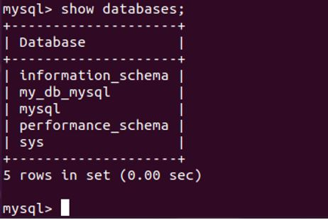

1.9)	Подключимся к восстановленной БД *my_db_mysql*
```
mysql> use my_db_mysql
```

1.10)	Получим писок таблиц из этой БД
```
mysql> SHOW TABLES;
```
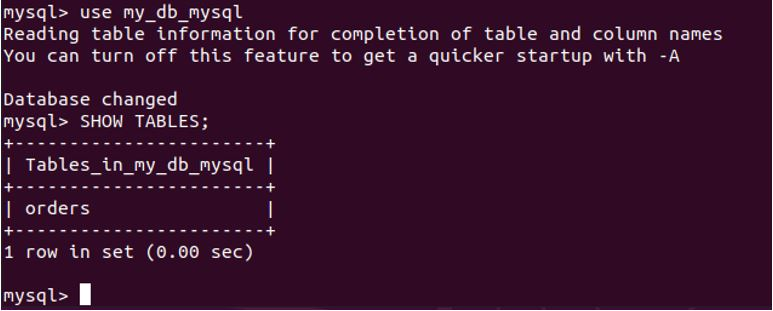

1.11)	Получим записи с *price>300*
```
mysql> SELECT * FROM orders WHERE price > 300;
```
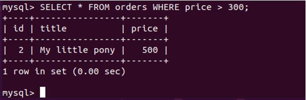

1.12)	Получим количество записей с *price > 300*
```
mysql> SELECT count(*) FROM orders WHERE price > 300;
```
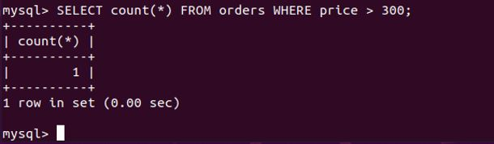
________________________________________


__2.	Задача 2__

__Создайте пользователя test в БД c паролем test-pass, используя:__


__•	плагин авторизации mysql_native_password__

__•	срок истечения пароля - 180 дней__

__•	количество попыток авторизации - 3__

__•	максимальное количество запросов в час - 100__

__•	аттрибуты пользователя:__

    __o	Фамилия "Pretty"__
  
    __o	Имя "James"__
  
__Предоставьте привелегии пользователю test на операции SELECT базы test_db.__

__Используя таблицу INFORMATION_SCHEMA.USER_ATTRIBUTES получите данные по пользователю test и приведите в ответе к задаче.__

__Решение:__

2.1)	Создаём пользователя test в БД my_db_mysql с указанными аттрибутами:
```
mysql> CREATE USER 'test'@'localhost'
    -> IDENTIFIED WITH mysql_native_password BY 'test-pass'
    -> WITH MAX_QUERIES_PER_HOUR 100
    -> PASSWORD EXPIRE INTERVAL 180 DAY
    -> FAILED_LOGIN_ATTEMPTS 3
    -> ATTRIBUTE '{"fname": "Pretty", "lname": "James"}';
Query OK, 0 rows affected (0.01 sec)
mysql>
```

2.2)	Предоставим привелегии пользователю *test* на операции *SELECT* базы *my_db_mysql*:
```
mysql> GRANT SELECT ON my_db_mysql. * TO 'test'@'localhost';
```
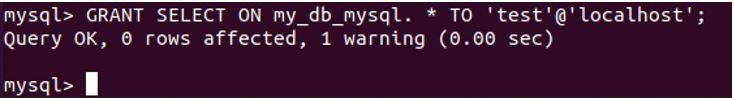

2.3)	Используя таблицу *INFORMATION_SCHEMA.USER_ATTRIBUTES* получим данные по пользователю *test*:
```
mysql> SELECT * FROM INFORMATION_SCHEMA.USER_ATTRIBUTES WHERE USER = 'test';
```
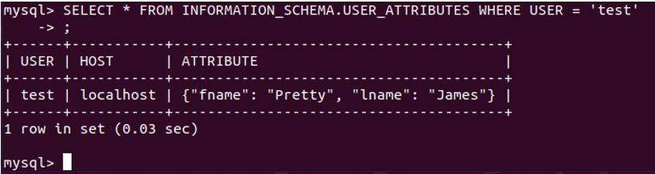
________________________________________

__3.	Задача 3__

__Установите профилирование SET profiling = 1. Изучите вывод профилирования команд SHOW PROFILES;.
Исследуйте, какой engine используется в таблице БД test_db и приведите в ответе.
Измените engine и приведите время выполнения и запрос на изменения из профайлера в ответе:__

__•	на MyISAM__
__•	на InnoDB__

__Решение:__

3.1)	Установим профилирование:
```
mysql> SET profiling=1;
Query OK, 0 rows affected, 1 warning (0.00 sec)
```

3.2)	Вывод команды *SHOW PROFILES;* покажет длительности выполнения запросов:
```
mysql> SHOW PROFILES;
```
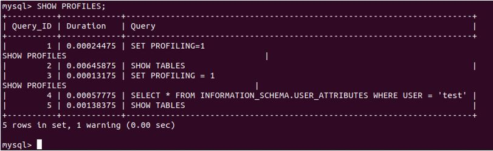

3.3)	Исследуем, какой *Engine* используется в *my_db_mysql*:

*Способ 1:*
```
mysql> SHOW TABLE STATUS FROM my_db_mysql;
```
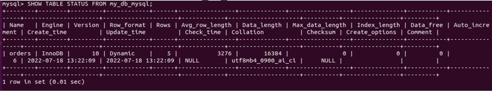

*Способ 2:*
```
mysql> SELECT table_schema,table_name,engine FROM information_schema.tables WHERE table_schema = DATABASE();
```
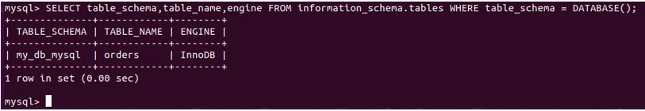

В таблице orders БД my_db_mysql используется Engine InnoDB:

3.4)	Изменим *Engine*:

- Меняем движок на *MyISAM*
```
mysql> ALTER TABLE orders ENGINE = InnoDB;
```
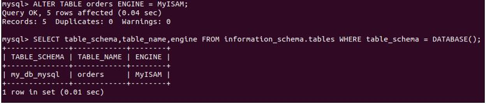

- Меняем движок на *InnoDB*:
```
mysql> ALTER TABLE orders ENGINE = InnoDB;
```
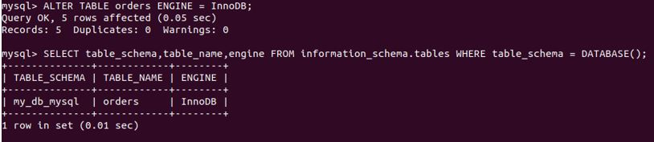

3.5)	Смотрим время выполнения запросов через *PROFILES*:
```
mysql> SHOW PROFILES;
```
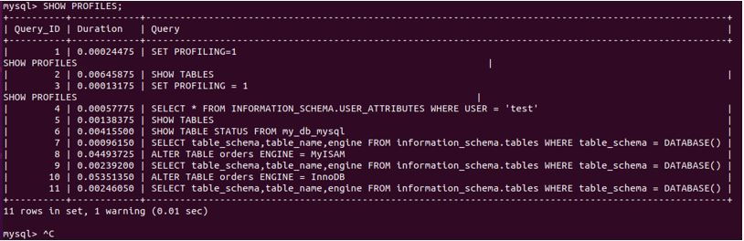

__4.	Задача 4__

__Изучите файл my.cnf в директории /etc/mysql.__

__Измените его согласно ТЗ (движок InnoDB):__

__-	Скорость IO важнее сохранности данных__

__-	Нужна компрессия таблиц для экономии места на диске__

__-	Размер буффера с незакомиченными транзакциями 1 Мб__

__-	Буффер кеширования 30% от ОЗУ__

__-	Размер файла логов операций 100 Мб__

__Приведите в ответе измененный файл my.cnf.__
 
__Решение:__

4.1)	Содержание файла my.cnf:
```
bash-4.4# cat my.cnf
# For advice on how to change settings please see
# http://dev.mysql.com/doc/refman/8.0/en/server-configuration-defaults.html

[mysqld]
#
# Remove leading # and set to the amount of RAM for the most important data
# cache in MySQL. Start at 70% of total RAM for dedicated server, else 10%.
# innodb_buffer_pool_size = 128M
#
# Remove leading # to turn on a very important data integrity option: logging
# changes to the binary log between backups.
# log_bin
#
# Remove leading # to set options mainly useful for reporting servers.
# The server defaults are faster for transactions and fast SELECTs.
# Adjust sizes as needed, experiment to find the optimal values.
# join_buffer_size = 128M
# sort_buffer_size = 2M
# read_rnd_buffer_size = 2M

# Remove leading # to revert to previous value for default_authentication_plugin,
# this will increase compatibility with older clients. For background, see:
# https://dev.mysql.com/doc/refman/8.0/en/server-system-variables.html#sysvar_default_authentication_plugin
# default-authentication-plugin=mysql_native_password
skip-host-cache
skip-name-resolve
datadir=/var/lib/mysql
socket=/var/run/mysqld/mysqld.sock
secure-file-priv=/var/lib/mysql-files
user=mysql

pid-file=/var/run/mysqld/mysqld.pid
[client]
socket=/var/run/mysqld/mysqld.sock

!includedir /etc/mysql/conf.d/
bash-4.4#
```
4.2)	Измененный файл my.cnf.
```
bash-4.4# cat my.cnf
# For advice on how to change settings please see
# http://dev.mysql.com/doc/refman/8.0/en/server-configuration-defaults.html

[mysqld]
#
# Remove leading # and set to the amount of RAM for the most important data
# cache in MySQL. Start at 70% of total RAM for dedicated server, else 10%.
# innodb_buffer_pool_size = 128M
#
# Remove leading # to turn on a very important data integrity option: logging
# changes to the binary log between backups.
# log_bin
#
# Remove leading # to set options mainly useful for reporting servers.
# The server defaults are faster for transactions and fast SELECTs.
# Adjust sizes as needed, experiment to find the optimal values.
# join_buffer_size = 128M
# sort_buffer_size = 2M
# read_rnd_buffer_size = 2M

# Remove leading # to revert to previous value for default_authentication_plugin,
# this will increase compatibility with older clients. For background, see:
# https://dev.mysql.com/doc/refman/8.0/en/server-system-variables.html#sysvar_default_authentication_plugin
# default-authentication-plugin=mysql_native_password
skip-host-cache
skip-name-resolve
datadir=/var/lib/mysql
socket=/var/run/mysqld/mysqld.sock
secure-file-priv=/var/lib/mysql-files
user=mysql

pid-file=/var/run/mysqld/mysqld.pid
[client]
socket=/var/run/mysqld/mysqld.sock

!includedir /etc/mysql/conf.d/

# Системные переменные InnoDB
innodb_flush_log_at_trx_commit = 0
innodb_file_per_table = ON
innodb_log_buffer_size= 1M
innodb_buffer_pool_size = 1G
max_binlog_size= 100M
```

