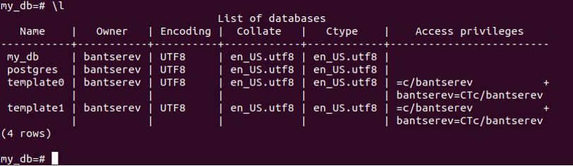
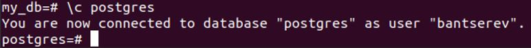

## Домашнее задание к занятию "Домашнее задание к занятию "6.4. PostgreSQL"

__Введение__

__Перед выполнением задания вы можете ознакомиться с дополнительными материалами (https://github.com/netology-code/virt-homeworks/blob/master/additional/README.md)__.

__1.	Задача 1__


__Решение:__

__Используя docker поднимите инстанс PostgreSQL (версию 13). Данные БД сохраните в volume.__

__Подключитесь к БД PostgreSQL используя psql.__

__Воспользуйтесь командой \? для вывода подсказки по имеющимся в psql управляющим командам.__

__Найдите и приведите управляющие команды для:__

__•	вывода списка БД__

__•	подключения к БД__

__•	вывода списка таблиц__

__•	вывода описания содержимого таблиц__

__•	выхода из psql__

__Решение:__

1.1)	Подготовим docker-манифест:
```
version: '3.7'
services:
  db:
    container_name: pg_db_6_4
    image: postgres:13
    environment:
     POSTGRES_USER: bantserev
     POSTGRES_PASSWORD: qwerty
     POSTGRES_DB: my_db
    ports:
     - "5432:5432"
    volumes:
     - database_volume_6_2:/home/database_6_2/
     - backup_volume_6_2:/home/backup_6_2/
    networks:
     - bridge
  pgadmin:
    container_name: pgadmin_6_4
    image: dpage/pgadmin4
    environment:
      PGADMIN_DEFAULT_EMAIL: bancerev@gmail.com
      PGADMIN_DEFAULT_PASSWORD: secret
    ports:
      - "5050:80"
    depends_on:
      - db
    restart: always
    networks:
      - bridge

networks:
  bridge:
    driver: bridge

volumes:
  database_volume_6_2:
  backup_volume_6_2:
```

1.2)	Зайдем в контейнер
```
artem@ubuntu:~/Netology_6_4_PostgreSQL$ sudo docker exec -it pg_db_6_4 bash
```

1.3)	Подключимся к базе *my_db*:
```
psql -d my_db -U bantserev
my_db=#
```

1.4)	Проверим вывод списка БД:
```
my_db=# \l
```
 

1.5)	Подключение к БД postgres:
```
my_db=# \c postgres
```
 

1.6)	Выведем список таблиц (+ системные)
```
postgres=# \dtS
                    List of relations
   Schema   |          Name           | Type  |   Owner   
------------+-------------------------+-------+-----------
 pg_catalog | pg_aggregate            | table | bantserev
 pg_catalog | pg_am                   | table | bantserev
 pg_catalog | pg_amop                 | table | bantserev
 pg_catalog | pg_amproc               | table | bantserev
 pg_catalog | pg_attrdef              | table | bantserev
 pg_catalog | pg_attribute            | table | bantserev
 pg_catalog | pg_auth_members         | table | bantserev
 pg_catalog | pg_authid               | table | bantserev
 pg_catalog | pg_cast                 | table | bantserev
 pg_catalog | pg_class                | table | bantserev
 pg_catalog | pg_collation            | table | bantserev
 pg_catalog | pg_constraint           | table | bantserev
 pg_catalog | pg_conversion           | table | bantserev
 pg_catalog | pg_database             | table | bantserev
 pg_catalog | pg_db_role_setting      | table | bantserev
 pg_catalog | pg_default_acl          | table | bantserev
 pg_catalog | pg_depend               | table | bantserev
 pg_catalog | pg_description          | table | bantserev
 pg_catalog | pg_enum                 | table | bantserev
 pg_catalog | pg_event_trigger        | table | bantserev
 pg_catalog | pg_extension            | table | bantserev
 pg_catalog | pg_foreign_data_wrapper | table | bantserev
 pg_catalog | pg_foreign_server       | table | bantserev
 pg_catalog | pg_foreign_table        | table | bantserev
 pg_catalog | pg_index                | table | bantserev
 pg_catalog | pg_inherits             | table | bantserev
 pg_catalog | pg_init_privs           | table | bantserev
 pg_catalog | pg_language             | table | bantserev
 pg_catalog | pg_largeobject          | table | bantserev
 pg_catalog | pg_largeobject_metadata | table | bantserev
 pg_catalog | pg_namespace            | table | bantserev
 pg_catalog | pg_opclass              | table | bantserev
 pg_catalog | pg_operator             | table | bantserev
 pg_catalog | pg_opfamily             | table | bantserev
 pg_catalog | pg_partitioned_table    | table | bantserev
 pg_catalog | pg_policy               | table | bantserev
 pg_catalog | pg_proc                 | table | bantserev
 pg_catalog | pg_publication          | table | bantserev
 pg_catalog | pg_publication_rel      | table | bantserev
 pg_catalog | pg_range                | table | bantserev
 pg_catalog | pg_replication_origin   | table | bantserev
 pg_catalog | pg_rewrite              | table | bantserev
 pg_catalog | pg_seclabel             | table | bantserev
 pg_catalog | pg_sequence             | table | bantserev
 pg_catalog | pg_shdepend             | table | bantserev
 pg_catalog | pg_shdescription        | table | bantserev
 pg_catalog | pg_shseclabel           | table | bantserev
 pg_catalog | pg_statistic            | table | bantserev
 pg_catalog | pg_statistic_ext        | table | bantserev
 pg_catalog | pg_statistic_ext_data   | table | bantserev
 pg_catalog | pg_subscription         | table | bantserev
 pg_catalog | pg_subscription_rel     | table | bantserev
 pg_catalog | pg_tablespace           | table | bantserev
 pg_catalog | pg_transform            | table | bantserev
 pg_catalog | pg_trigger              | table | bantserev
 pg_catalog | pg_ts_config            | table | bantserev
 pg_catalog | pg_ts_config_map        | table | bantserev
 pg_catalog | pg_ts_dict              | table | bantserev
 pg_catalog | pg_ts_parser            | table | bantserev
 pg_catalog | pg_ts_template          | table | bantserev
 pg_catalog | pg_type                 | table | bantserev
 pg_catalog | pg_user_mapping         | table | bantserev
(62 rows) 
```

1.7)	Вывод описания содержимого таблиц:
```
postgres=# \dS+ pg_aggregate
                                   Table "pg_catalog.pg_aggregate"
      Column      |   Type   | Collation | Nullable | Default | Storage  | Stats target | Description 
------------------+----------+-----------+----------+---------+----------+--------------+-------------
 aggfnoid         | regproc  |           | not null |         | plain    |              
 aggkind          | "char"   |           | not null |         | plain    |              
 aggnumdirectargs | smallint |           | not null |         | plain    |              
 aggtransfn       | regproc  |           | not null |         | plain    |              
 aggfinalfn       | regproc  |           | not null |         | plain    |              
 aggcombinefn     | regproc  |           | not null |         | plain    |              
 aggserialfn      | regproc  |           | not null |         | plain    |              
 aggdeserialfn    | regproc  |           | not null |         | plain    |              
 aggmtransfn      | regproc  |           | not null |         | plain    |              
 aggminvtransfn   | regproc  |           | not null |         | plain    |              
 aggmfinalfn      | regproc  |           | not null |         | plain    |              
 aggfinalextra    | boolean  |           | not null |         | plain    |              
 aggmfinalextra   | boolean  |           | not null |         | plain    |              
 aggfinalmodify   | "char"   |           | not null |         | plain    |              
 aggmfinalmodify  | "char"   |           | not null |         | plain    |              
 aggsortop        | oid      |           | not null |         | plain    |              
 aggtranstype     | oid      |           | not null |         | plain    |              
 aggtransspace    | integer  |           | not null |         | plain    |              
 aggmtranstype    | oid      |           | not null |         | plain    |              
 aggmtransspace   | integer  |           | not null |         | plain    |              
 agginitval       | text     | C         |          |         | extended |              
 aggminitval      | text     | C         |          |         | extended |              
Indexes:
    "pg_aggregate_fnoid_index" UNIQUE, btree (aggfnoid)
Access method: heap
```

1.8)	Выход из *psql*
```
postgres=# \q
```
_____________________________

__2.	Задача 2__

__Используя psql создайте БД test_database.__

__Изучите бэкап БД.__

__Восстановите бэкап БД в test_database.__

__Перейдите в управляющую консоль psql внутри контейнера.__

__Подключитесь к восстановленной БД и проведите операцию ANALYZE для сбора статистики по таблице.__

__Используя таблицу pg_stats, найдите столбец таблицы orders с наибольшим средним значением размера элементов в байтах.__

__Приведите в ответе команду, которую вы использовали для вычисления и полученный результат.__

__Решение:__


2.1)	Создадим БД *test_database*:
```
my_db=# CREATE DATABASE test_database;
CREATE DATABASE
```
``` 
my_db=# \l
                                    List of databases
     Name      |   Owner   | Encoding |  Collate   |   Ctype    |    Access privileges    
---------------+-----------+----------+------------+------------+-------------------------
 my_db         | bantserev | UTF8     | en_US.utf8 | en_US.utf8 | 
 postgres      | bantserev | UTF8     | en_US.utf8 | en_US.utf8 | 
 template0     | bantserev | UTF8     | en_US.utf8 | en_US.utf8 | =c/bantserev           +
               |           |          |            |            | bantserev=CTc/bantserev
 template1     | bantserev | UTF8     | en_US.utf8 | en_US.utf8 | =c/bantserev           +
               |           |          |            |            | bantserev=CTc/bantserev
 test_database | bantserev | UTF8     | en_US.utf8 | en_US.utf8 | 
(5 rows)
```

2.2)	Скопируем бэкап (https://github.com/netology-code/virt-homeworks/blob/virt-11/06-db-04-postgresql/test_data/test_dump.sql ), размещенный в *~/Netology_6_4_PostgreSQL*, в контейнер *pg_db_6_4*:
```
artem@ubuntu:~/Netology_6_4_PostgreSQL$ sudo docker cp test_dump.sql pg_db_6_4:/backup/test_dump.sql
```

2.3)	Восстановим бэкап:
```
root@b70653011403:/# psql -U bantserev -d test_database < /backup/test_dump.sql
SET
SET
SET
SET
SET
 set_config 
------------
 
(1 row)

SET
SET
SET
SET
SET
SET
CREATE TABLE
ERROR:  role "postgres" does not exist
CREATE SEQUENCE
ERROR:  role "postgres" does not exist
ALTER SEQUENCE
ALTER TABLE
COPY 8
 setval 
--------
      8
(1 row)

ALTER TABLE
root@b70653011403:/# psql -d my_db -U bantserev
psql (13.7 (Debian 13.7-1.pgdg110+1))
Type "help" for help.
```

2.4)	 Подключимся к БД *test_database*, посмотрим список существующих таблиц (кроме системных) и соберем статистику с помощью *ANALYZE*:
```
test_database=# \dt
          List of relations
 Schema |  Name  | Type  |   Owner   
--------+--------+-------+-----------
 public | orders | table | bantserev
(1 row)

test_database=#

test_database=# ANALYZE verbose orders;
INFO:  analyzing "public.orders"
INFO:  "orders": scanned 1 of 1 pages, containing 8 live rows and 0 dead rows; 8 rows in sample, 8 estimated total rows
ANALYZE
test_database=# 
```

2.5)	Найдем столбец таблицы *orders* с наибольшим средним значением размера элементов в байтах (это title):
```
test_database=# select attname, avg_width from pg_stats where tablename='orders';
 attname | avg_width 
---------+-----------
 id      |         4
 title   |        16
 price   |         4
(3 rows)

test_database=#
```
_____________________________

__3.	Задача 3__

__Архитектор и администратор БД выяснили, что ваша таблица orders разрослась до невиданных размеров и поиск по ней занимает долгое время. Вам, как успешному выпускнику курсов DevOps в нетологии предложили провести разбиение таблицы на 2 (шардировать на orders_1 - price>499 и orders_2 - price<=499).__

__Предложите SQL-транзакцию для проведения данной операции.__

__Можно ли было изначально исключить "ручное" разбиение при проектировании таблицы orders?__

__Решение:__

Выполним в *pgAdmin4*. Разобьем исходнуюу таблицу *orders* на *orders_1* и *orders_2* согласно условию и удалим из исходной данные по условию:
```
/*создаем первую урезанную таблицу по условию*/
CREATE TABLE orders_1 (LIKE orders);
INSERT INTO orders_1 SELECT * FROM orders WHERE price >499;
DELETE FROM orders WHERE price >499;

/*создаем вторую урезанную таблицу по условию*/
CREATE TABLE orders_2 (LIKE orders);
INSERT INTO orders_2 SELECT * FROM orders WHERE price <=499;
DELETE FROM orders WHERE price <=499;
```
Проверим таблицу orders_1:


Проверим таблицу orders_2:


Исключить "ручное" разбиение при проектировании таблицы orders можно было, если делать её партиционированной.
_____________________________

__4.	Задача 4__

__Используя утилиту pg_dump создайте бекап БД test_database.__

__Как бы вы доработали бэкап-файл, чтобы добавить уникальность значения столбца title для таблиц test_database?__

__Решение:__

Создадим бэкап базы test_database и проверим, что он создался:
```
root@b70653011403:/# pg_dump -U bantserev -d test_database >/backup/test_database_dump_my.sql
root@b70653011403:/# 
root@b70653011403:/# cd backup/
root@b70653011403:/backup# ls -lha
total 16K
drwxr-xr-x 2 root root 4.0K Jul 20 08:16 .
drwxr-xr-x 1 root root 4.0K Jul 20 08:16 ..
-rw-r--r-- 1 root root 2.1K Jul 20 08:16 test_database_dump_my.sql
-rw-r--r-- 1 root root 2.1K Jul 20 08:00 test_dump.sql
root@b70653011403:/backup#
```

Уникальность столбца *title* можно выполнить путем добавления в бэкап-файл следующей строки:
```
ALTER TABLE ONLY public.orders ADD CONSTRAINT title_unique UNIQUE (title);
```
_____________________________
