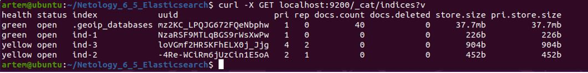

## Домашнее задание к занятию "Домашнее задание к занятию "6.5. Elasticsearch"

__Введение__

__1.	Задача 1__

__В этом задании вы потренируетесь в:__

__•	установке elasticsearch__

__•	первоначальном конфигурировании elastcisearch__

__•	запуске elasticsearch в docker__

__Используя докер образ centos:7 как базовый и документацию по установке и запуску Elastcisearch:

__составьте Dockerfile-манифест для elasticsearch__

__соберите docker-образ и сделайте push в ваш docker.io репозиторий__

__запустите контейнер из получившегося образа и выполните запрос пути / c хост-машины__

__Требования к elasticsearch.yml:__

__данные path должны сохраняться в /var/lib__

__имя ноды должно быть netology_test__

__В ответе приведите:__

__текст Dockerfile манифеста__

__ссылку на образ в репозитории dockerhub__

__ответ elasticsearch на запрос пути / в json виде__

__Подсказки:__

__возможно вам понадобится установка пакета perl-Digest-SHA для корректной работы пакета shasum__

__при сетевых проблемах внимательно изучите кластерные и сетевые настройки в elasticsearch.yml__

__при некоторых проблемах вам поможет docker директива ulimit__

__elasticsearch в логах обычно описывает проблему и пути ее решения__

__Далее мы будем работать с данным экземпляром elasticsearch.__


__Решение:__

1.1)	Подготовим Dockerfile:
```
# используем базовый образ centos 7
FROM centos:7

# указываем автора образа
MAINTAINER Bantserev Artem <bancerev@gmail.com>

# Открываем порты
EXPOSE 9200
EXPOSE 9300

# Запуск от имени пользователя    
USER 0

# устанавливаем elasticsearch и проч.
RUN export ES_HOME="/var/lib/elasticsearch" && \
    yum -y install wget && \
    wget https://artifacts.elastic.co/downloads/elasticsearch/elasticsearch-7.17.0-linux-x86_64.tar.gz && \
    wget https://artifacts.elastic.co/downloads/elasticsearch/elasticsearch-7.17.0-linux-x86_64.tar.gz.sha512 && \
    sha512sum -c elasticsearch-7.17.0-linux-x86_64.tar.gz.sha512 && \
    tar -xzf elasticsearch-7.17.0-linux-x86_64.tar.gz && \
    rm -f elasticsearch-7.17.0-linux-x86_64.tar.gz* && \
    mv elasticsearch-7.17.0 ${ES_HOME} && \
    useradd -m -u 1000 elasticsearch && \
    chown elasticsearch:elasticsearch -R ${ES_HOME} && \
    yum -y remove wget && \
    yum clean all

№ копируем файл elasticsearch.yml в контейнер
COPY --chown=elasticsearch:elasticsearch elasticsearch.yml /var/lib/elasticsearch/config/

# Запуск от имени пользователя    
USER 1000

# определяем переменные среды
ENV ES_HOME="/var/lib/elasticsearch" \
    ES_PATH_CONF="/var/lib/elasticsearch/config"
WORKDIR ${ES_HOME}

# запускаем elasticsearch
CMD ["sh", "-c", "${ES_HOME}/bin/elasticsearch"]
```

1.2)	Запускаем сборку образа:
```
~$ sudo docker build -t tiinamu/elasticsearch:7.17.0 .
```

1.3)	Логинимся на dockerhub:
```
~$ docker login  (sudo?)
```

1.4)	Заливаем образ в свой репозиторий:
```
~$ sudo docker push tiinamu/elasticsearch:7.17.0
```
 

Ссылка на репозиторий: https://hub.docker.com/repository/docker/tiinamu/elasticsearch


1.5)	Запускаем контейнер (контейнер – запущенный экземпляр образа):
```
artem@ubuntu:~/Netology_6_5_Elasticsearch$ sudo docker run --rm -d --name elasticsearch_container -p 9200:9200 -p 9300:9300 tiinamu/elasticsearch:7.17.0
```

1.6)	Проверяем контейнеры и какие из них в “Up”:
```
artem@ubuntu:~/Netology_6_5_Elasticsearch$ sudo docker ps -a
CONTAINER ID   IMAGE                          COMMAND                  CREATED              STATUS                      PORTS                                                                                  NAMES
843149d1b7a2   tiinamu/elasticsearch:7.17.0   "sh -c ${ES_HOME}/bi…"   About a minute ago   Up About a minute           0.0.0.0:9200->9200/tcp, :::9200->9200/tcp, 0.0.0.0:9300->9300/tcp, :::9300->9300/tcp   elasticsearch_container
6b5acd9adfc6   dpage/pgadmin4                 "/entrypoint.sh"         2 days ago           Exited (128) 22 hours ago                                                                                          pgadmin_6_4
b70653011403   postgres:13                    "docker-entrypoint.s…"   2 days ago           Exited (0) 2 days ago                                                                                              pg_db_6_4
8a7d0f9f3286   mysql:8                        "docker-entrypoint.s…"   4 days ago           Exited (0) 4 days ago                                                                                              mysql_db
b8d84cd83d36   dpage/pgadmin4                 "/entrypoint.sh"         6 days ago           Exited (0) 28 minutes ago                                                                                          pgadmin
7dffed4502c4   postgres:12                    "docker-entrypoint.s…"   6 days ago           Exited (0) 2 days ago                                                                                              pg_db_new
```

1.7)	Проверим, что можем зайти в контейнер:
```
artem@ubuntu:~/Netology_6_5_Elasticsearch$ sudo docker exec -it elasticsearch_container /bin/bash
[elasticsearch@843149d1b7a2 elasticsearch]$
[elasticsearch@843149d1b7a2 elasticsearch]$ exit
```

1.8)	Ответ elasticsearch на запрос пути / в json виде:
```
artem@ubuntu:~/Netology_6_5_Elasticsearch$ curl -X GET 'localhost:9200/'
```

________________________________

__2.	Задача 2__

__В этом задании вы научитесь:__

__•	создавать и удалять индексы__

__•	изучать состояние кластера__

__•	обосновывать причину деградации доступности данных__

__Ознакомтесь с документацией и добавьте в elasticsearch 3 индекса, в соответствии со таблицей:__

Имя	Количество реплик	Количество шард
ind-1  	0	                1
ind-2  	1               	2
ind-3	  2               	4

__Получите список индексов и их статусов, используя API и приведите в ответе на задание.__

__Получите состояние кластера elasticsearch, используя API.__

__Как вы думаете, почему часть индексов и кластер находится в состоянии yellow?__

__Удалите все индексы.__

__Важно:__

__При проектировании кластера elasticsearch нужно корректно рассчитывать количество реплик и шард, иначе возможна потеря данных индексов, вплоть до полной, при деградации системы.__

__Решение:__

2.1)	Создаем индексы с заданными параметрами из таблицы

Используется метод RESTful API – PUT

-X  - для использования любого HTTP-глагола

-d  - для передачи параметров
```
$ curl -X PUT "localhost:9200/ind-4?pretty" -H 'Content-Type: application/json' -d'
{
  "settings": {
    "number_of_shards": 1,
    "number_of_replicas": 0
  }
}'
```

```
$ curl -X PUT localhost:9200/ind-2?pretty -H 'Content-Type: application/json' -d'
{
  "settings": {
    "number_of_shards": 2,
    "number_of_replicas": 1
  }
}'
```


При создании третьего индекса, посмотрим на вывод ответа сервера без pretty:
```
$ curl -X PUT localhost:9200/ind-3 -H 'Content-Type: application/json' -d'
{
  "settings": {
    "number_of_shards": 4,
    "number_of_replicas": 2
  }
}'
```

2.2)	Получим список индексов и их статусов, используя метод GET:
```
artem@ubuntu:~/Netology_6_5_Elasticsearch$ curl -X GET localhost:9200/_cat/indices?v
```


2.3)	Получим состояние кластера, использую метод GET:
```
artem@ubuntu:~/Netology_6_5_Elasticsearch$ curl -X GET localhost:9200/_cluster/health?pretty
```


2.4)	Как вы думаете, почему часть индексов и кластер находится в состоянии yellow?

Два индекса в статусе Yellow, т.к. у них указано количество реплик, отличное от 0, но реплики некуда разместить из-за наличия всего одной ноды.
Кластер в статусе Yellow, т.к. есть “ unassigned_shards” по той же причине.

2.5)	Удалим все индексы, используя метод DELETE и выведим красиво:
```
$ artem@ubuntu:~/Netology_6_5_Elasticsearch$ curl -X DELETE http://localhost:9200/_all?pretty
```

________________________________


