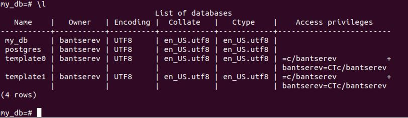

## Домашнее задание к занятию "Домашнее задание к занятию "7.1. Инфраструктура как код"

__1.	Задача 1. Выбор инструментов.__

__Легенда__

__Через час совещание, на котором менеджер расскажет о новом проекте. Начать работу над которым надо будет уже сегодня. На данный момент известно, что это будет сервис, который ваша компания будет предоставлять внешним заказчикам. Первое время, скорее всего, будет один внешний клиент, со временем внешних клиентов станет больше.
Так же по разговорам в компании есть вероятность, что техническое задание еще не четкое, что приведет к большому количеству небольших релизов, тестирований интеграций, откатов, доработок, то есть скучно не будет.
Вам, как девопс инженеру, будет необходимо принять решение об инструментах для организации инфраструктуры. На данный момент в вашей компании уже используются следующие инструменты:__

__•	остатки Сloud Formation,__

__•	некоторые образы сделаны при помощи Packer,__

__•	год назад начали активно использовать Terraform,__

__•	разработчики привыкли использовать Docker,__

__•	уже есть большая база Kubernetes конфигураций,__

__•	для автоматизации процессов используется Teamcity,__

__•	также есть совсем немного Ansible скриптов,__

__•	и ряд bash скриптов для упрощения рутинных задач.__

__Для этого в рамках совещания надо будет выяснить подробности о проекте, что бы в итоге определиться с инструментами:__

__1.	Какой тип инфраструктуры будем использовать для этого проекта: изменяемый или не изменяемый?__

__2.	Будет ли центральный сервер для управления инфраструктурой?__

__3.	Будут ли агенты на серверах?__

__4.	Будут ли использованы средства для управления конфигурацией или инициализации ресурсов?__

__В связи с тем, что проект стартует уже сегодня, в рамках совещания надо будет определиться со всеми этими вопросами.__

__В результате задачи необходимо:__

__1.	Ответить на четыре вопроса представленных в разделе "Легенда".__

__2.	Какие инструменты из уже используемых вы хотели бы использовать для нового проекта?__

__3.	Хотите ли рассмотреть возможность внедрения новых инструментов для этого проекта?__

__Если для ответа на эти вопросы недостаточно информации, то напишите, какие моменты – уточните на совещании.__

__Решение:__

*Общие мысли*

Для начала надо определиться, с типом инфраструктуры – облачная или собственная. Предполагаем, что облачная. Остается определить облачного провайдера. Тип инфраструктуры предлагается – неизменяемый (Immutable Infrastructure). Т.к. используем парадигму IaC, легче пересобирать ВМ из образов по соответствующему описанию кода инфраструктуры. Это позволит обеспечить повторяемость окружения, неизменяемость окружения,отсутствие configuration drift (а у нас планируется увеличение количества клиентов), независимость от внешних источников, идентичные окружения для stage/prod/dev (что позволит разрабатывать, выпускать и выкатывать релизы с одним и тем же образом). Для реализации принципов IaaC, всю инфраструктуру будем хранить в системе контроля версий – её можно рецензировать и откатывать.

При работе с неизменяемой инфраструктурой выберем следующий стэк инструментов:

1.	Packer — для создания образов виртуальных машин на базе разных облачных провайдеров.
2.	Terraform — позволяет описать необходимые инфраструктурные ресурсы нужного облачного провайдера и, используя этот манифест, приводит конфигурацию облака к описанному в конфиге.
3.	Ansible — для управления конфигурацией, настройки окружения, установки в ВМ Docker.
4.	Docker – в качестве системы контейнеризации.
5.	Kubernetes - среда для работы контейнеров.
6.	Gitlab CI/CD — для автоматизации процессов, CI/CD.

*Ответы на вопросы:*

1.1)	Какой тип инфраструктуры будем использовать для этого проекта: изменяемый или не изменяемый?

- Неизменяемый (комментарии выше).

1.2)	Будет ли центральный сервер для управления инфраструктурой

- Нет, не требуются. 

1.3)	Будут ли агенты на серверах?

- Нет, будем использовать Terraform, Ansible, агенты не требуются. 

1.4)	Будут ли использованы средства для управления конфигурацией или инициализации ресурсов?

- Для управления конфигурацией – Ansible
- Для инициализации ресурсов – Terraform

1.5)	Какие инструменты из уже используемых вы хотели бы использовать для нового проекта?

•	Packer — для создания образов;

•	Terraform - для инициализации ресурсов;

•	Ansible - для управления конфигурацией;

•	Docker - в качестве системы контейнеризации для проекта;

•	Kubernetes - среда для работы контейнеров;

•	Gitlab CI/CD - для автоматизации процессов, CI/CD;

1.6)	Хотите ли рассмотреть возможность внедрения новых инструментов для этого проекта?

- Использование GitLab CI/CD для решения вопросов автоматизации
- В проекте нужно предусмотреть систему мониторинга. Например, Zabbix или Prometheus + Graphana.

1.7)	Какой вопрос бы задал на совещании?

- Сразу ли будем тестировать в облачной инфрсатруктуре, чтобы там обкатать продаваемый сервис, понять, сколько ресурсов ему требуется, чтобы потом принять решение, как выгоднее провести масштабирование на остальных клиентов – оставить в облаке или в собственном ЦОДе развернуть платформу виртуализации?
- Какого обслачного провайдера выберем? Сколько у нас денег на OPEX на предпроект?
- Также поднял бы вопрос о мониторинге – насколько критичен простой сервиса для бизнеса клиента. К началу внедрения и поддержки надо реализовать мониторинг, требуется выбрать
_________________________________

__2.	Задача 2. Установка терраформ.__

__Официальный сайт: https://www.terraform.io/__

__Установите терраформ при помощи менеджера пакетов используемого в вашей операционной системе. В виде результата этой задачи приложите вывод команды  terraform --version.__

__Решение: __

Установим Terraform из официального репозитория. Выполним команду в оболочке терминала, чтобы добавить ключ GPG для Terraform в нашу систему:
```
curl -fsSL https://apt.releases.hashicorp.com/gpg | sudo apt-key add -
```
Затем выполняем команду, чтобы загрузить Terraform с веб-сайта Hashicorp:
```
sudo apt-add-repository "deb [arch=$(dpkg --print-architecture)] https://apt.releases.hashicorp.com $(lsb_release -cs) main"
```
После добавления репозитория устанавливаем Terraform, выполнив следующую команду:
```
sudo apt update
sudo apt install terraform
```
Проверим версию Terraform terraform -v
 
_________________________________

__3.	Задача 3. Поддержка легаси кода.__

__В какой-то момент вы обновили терраформ до новой версии, например с 0.12 до 0.13. А код одного из проектов настолько устарел, что не может работать с версией 0.13. В связи с этим необходимо сделать так, чтобы вы могли одновременно использовать последнюю версию терраформа установленную при помощи штатного менеджера пакетов и устаревшую версию 0.12.__

__В виде результата этой задачи приложите вывод --version двух версий терраформа доступных на вашем компьютере или виртуальной машине.__

__Решение:__

Скачаем и распакуем устаревшую версию Terraform 0.12.0 в рабочую папку:
```
artem@ubuntu:~/Netology_7_1_IaaC$ sudo wget https://releases.hashicorp.com/terraform/0.12.0/terraform_0.12.0_linux_amd64.zip
--2022-07-27 03:58:00--  https://releases.hashicorp.com/terraform/0.12.0/terraform_0.12.0_linux_amd64.zip
Распознаётся releases.hashicorp.com (releases.hashicorp.com)… 146.75.114.49
Подключение к releases.hashicorp.com (releases.hashicorp.com)|146.75.114.49|:443... соединение установлено.
HTTP-запрос отправлен. Ожидание ответа… 200 OK
Длина: 14907580 (14M) [application/zip]
Сохранение в: «terraform_0.12.0_linux_amd64.zip»
terraform_0.12.0_linux_amd64.zip 100%[=======================================================>]  14,22M  2,49MB/s    за 7,2s    
2022-07-27 03:58:09 (1,96 MB/s) - «terraform_0.12.0_linux_amd64.zip» сохранён [14907580/14907580]
```
Извлечем:
```
artem@ubuntu:~/Netology_7_1_IaaC$ unzip terraform_0.12.0_linux_amd64.zip
Archive:  terraform_0.12.0_linux_amd64.zip
error:  cannot create terraform
        Permission denied
artem@ubuntu:~/Netology_7_1_IaaC$ sudo unzip terraform_0.12.0_linux_amd64.zip
Archive:  terraform_0.12.0_linux_amd64.zip
  inflating: terraform  
```
Проверим:
artem@ubuntu:~/Netology_7_1_IaaC$ ls -lha
итого 58M
drwxr-xr-x  2 root  root  4,0K июл 27 03:58 .
drwxr-xr-x 32 artem artem 4,0K июл 27 03:57 ..
-rwxrwxr-x  1 root  root   44M мая 22  2019 terraform
-rw-r--r--  1 root  root   15M мая  9 09:38 terraform_0.12.0_linux_amd64.zip

Воспользуемся созданием символьные ссылки на две версии программы:
```
artem@ubuntu:~/Netology_7_1_IaaC$ sudo ln -s /usr/bin/terraform /usr/bin/terraform_1.2.5
artem@ubuntu:~/Netology_7_1_IaaC$ sudo ln -s ~/Netology_7_1_IaaC/terraform /usr/bin/terraform_0.12.0
```
Проверим:
```
artem@ubuntu:~/Netology_7_1_IaaC$ terraform_1.2.5 -v
Terraform v1.2.5
on linux_amd64

artem@ubuntu:~/Netology_7_1_IaaC$ terraform_0.12.0 -v
Terraform v0.12.0
artem@ubuntu:~/Netology_7_1_IaaC
```
