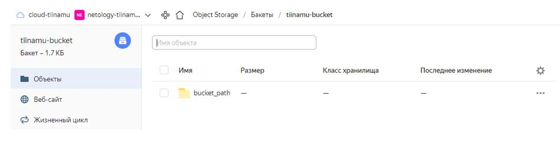
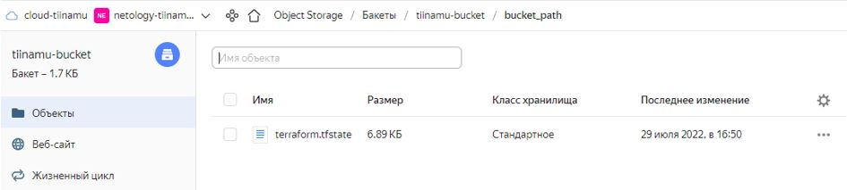
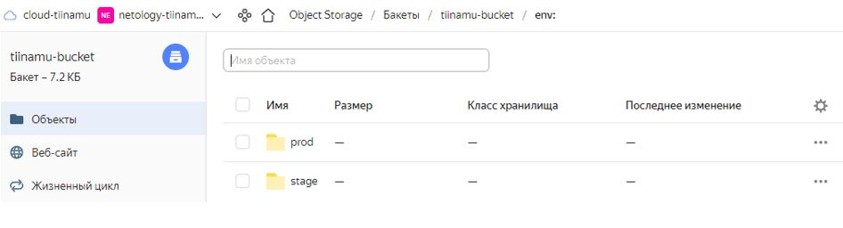
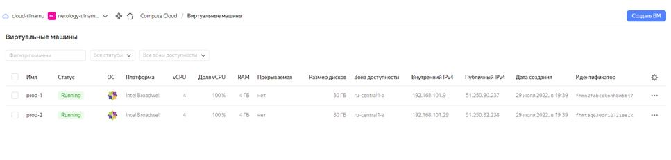
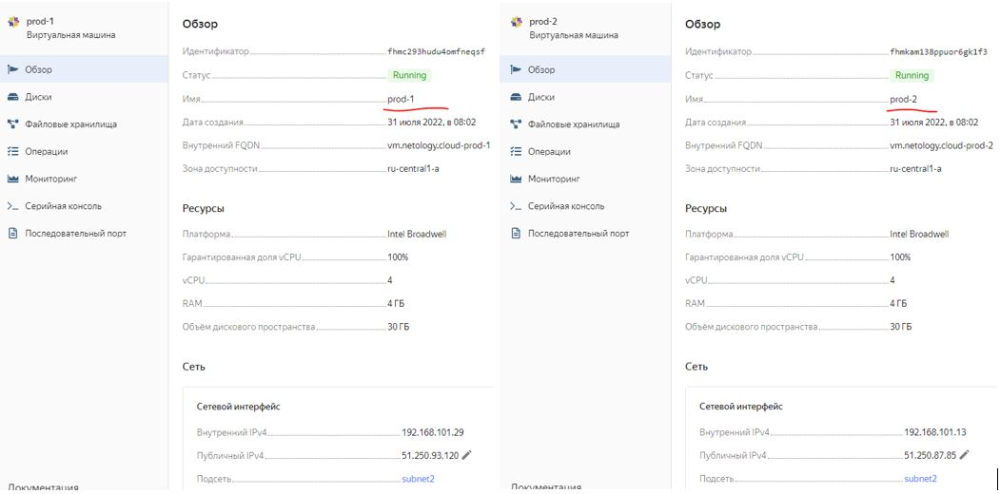
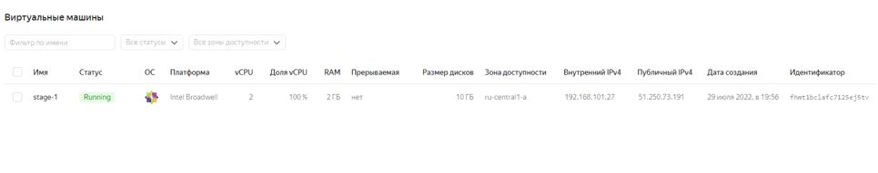

## Домашнее задание к занятию "7.3. Основы и принцип работы Терраформ"

__1.	Задача 1__

__Создадим бэкэнд в S3 (необязательно, но крайне желательно).__

__Если в рамках предыдущего задания у вас уже есть аккаунт AWS, то давайте продолжим знакомство со взаимодействием терраформа и aws.__

__1.	Создайте s3 бакет, iam роль и пользователя от которого будет работать терраформ. Можно создать отдельного пользователя, а можно использовать созданного в рамках предыдущего задания, просто добавьте ему необходимы права, как описано https://www.terraform.io/language/settings/backends/s3 .__

__2.	Зарегистрируйте бэкэнд в терраформ проекте как описано по ссылке выше.__

__Решение:__

Для того, чтобы не пользоваться консолью Yandex Cloud при создании bucket-а, я создал еще один проект terraform-а, чтобы через него создать бакет.

Путь до нового проекта:
```
artem@ubuntu:~/Netology_7_3_test/terraform$
```
Посмотрим, кому какие роли назначены на каталог netology-tiinamu-new
```
artem@ubuntu:~/Netology_7_3_Terraform/terraform$ yc resource-manager folder list-access-bindings netology-tiinamu-new
+---------+----------------+-----------------------+
| ROLE ID |  SUBJECT TYPE  |      SUBJECT ID       |
+---------+----------------+-----------------------+
| editor  | system         | allAuthenticatedUsers |
| editor  | serviceAccount | aje10prv6nj8qjr5roku  |
| admin   | system         | allAuthenticatedUsers |
+---------+----------------+-----------------------+
```
Посмотрим на сервисные учетные записи:
```
artem@ubuntu:~/Netology_7_3_Terraform/terraform$ yc iam service-account list
+----------------------+----------+
|          ID          |   NAME   |
+----------------------+----------+
| aje10prv6nj8qjr5roku | my-robot |
+----------------------+----------+
```
Для сервисной учеутной записи *my-robot* получим значения *access-key* и *secret_key*, чтобы потом применить их в *main.tf* при создании бакета:
```
artem@ubuntu:~/Netology_7_3_Terraform/terraform$ yc iam access-key create --service-account-name my-robot
access_key:
  id: ajessoov9fp8d9d2ag15
  service_account_id: aje10prv6nj8qjr5roku
  created_at: "2022-07-28T19:57:52.087942940Z"
  key_id: YCAJEe1qfB6ng9cSWti6Q0wzD
secret: YCM1LJ8lBvph0T4j43juSJu0FBdJk1tuXOg0-UDv

There is a new yc version '0.93.0' available. Current version: '0.91.0'.
See release notes at https://cloud.yandex.ru/docs/cli/release-notes
You can install it by running the following command in your shell:
	$ yc components update
```
Подготовим .tf-файл. Содержание файла *main.tf*:
```
provider "yandex" {
  cloud_id  = "b1g4u3sfpchj6i21hp7f"
  folder_id = "b1gjl0488dbj7totafg8"
  zone      = "ru-central1-a"
  service_account_key_file = "key.json"
}

resource "yandex_storage_bucket" "test" {
  access_key = "YCAJEe1qfB6ng9cSWti6Q0wzD"
  secret_key = "YCM1LJ8lBvph0T4j43juSJu0FBdJk1tuXOg0-UDv"
  bucket = "tiinamu-bucket"
}
```
Запустим тестовый проект terraform:
```
artem@ubuntu:~/Netology_7_3_test/terraform$ sudo terraform init
artem@ubuntu:~/Netology_7_3_test/terraform$ sudo terraform plan
artem@ubuntu:~/Netology_7_3_test/terraform$ sudo terraform apply
```
Видим, что в YC создался бакет (пустой)

Далее переходим во вновь созданный рабочий проект 
```
artem@ubuntu:~/Netology_7_3_Terraform/terraform$
```
Меняем имена сети и подсети на, добавляя двойку в суффикс, чтобы имена не пересекались с сетью и подсетью, используемые в проекте под бакет:

Сожержимое файла network.tf
```
# Network
resource "yandex_vpc_network" "default" {
  name = "net2"
}

resource "yandex_vpc_subnet" "default" {
  name = "subnet2"
  zone           = "ru-central1-a"
  network_id     = "${yandex_vpc_network.default.id}"
  v4_cidr_blocks = ["192.168.101.0/24"]
}
```
Подготовим .tf-файл. Содержание файла *main.tf*:
```
artem@ubuntu:~/Netology_7_3_Terraform/terraform$ cat nano main.tf 

provider "yandex" {
  cloud_id  = "b1g4u3sfpchj6i21hp7f"
  folder_id = "b1gjl0488dbj7totafg8"
  zone      = "ru-central1-a"
  service_account_key_file = "key.json"
}

terraform {
  backend "s3" {
    endpoint   = "storage.yandexcloud.net"
    bucket     = "tiinamu-bucket"
    region     = "ru-central1"
    key        = "bucket_path/terraform.tfstate"
    access_key = "YCAJEe1qfB6ng9cSWti6Q0wzD"
    secret_key = "YCM1LJ8lBvph0T4j43juSJu0FBdJk1tuXOg0-UDv"

    skip_region_validation      = true
    skip_credentials_validation = true
  }
}

resource "yandex_compute_image" "image" {
  source_family = "centos-8"
}

resource "yandex_compute_instance" "vm1" {
  name                      = "vm1"
  zone                      = "ru-central1-a"
  hostname                  = "vm1.netology.cloud"
  allow_stopping_for_update = true

  resources {
    cores  = 2
    memory = 2
  }

  boot_disk {
    initialize_params {
      image_id    = "${yandex_compute_image.image.id}"
      name        = "root-vm1"
      type        = "network-nvme"
      size        = "30"
    }
  }

  network_interface {
    subnet_id = "${yandex_vpc_subnet.default.id}"
    nat       = true
  }

  metadata = {
    ssh-keys = "centos:${file("/home/artem/.ssh/id_rsa.pub")}"
  }

}
```

Зарегистрируем бэкэнд в терраформ проекте

Запустим рабочий проект terraform:
```
artem@ubuntu:~/Netology_7_3_Terraform/terraform$ sudo terraform init
artem@ubuntu:~/Netology_7_3_Terraform/terraform$ sudo terraform plan
artem@ubuntu:~/Netology_7_3_Terraform/terraform$ sudo terraform apply
```

Видим, что в YC в ранее созданный бакет поместился стейт – terraform.tfstate
  

  

__Задача 2. Инициализируем проект и создаем воркспейсы.__

__1.	Выполните terraform init:__

o	если был создан бэкэнд в S3, то терраформ создат файл стейтов в S3 и запись в таблице dynamodb.
o	иначе будет создан локальный файл со стейтами.
__2.	Создайте два воркспейса stage и prod.__

__3.	В уже созданный aws_instance добавьте зависимость типа инстанса от вокспейса, что бы в разных ворскспейсах использовались разные instance_type.__

__4.	Добавим count. Для stage должен создаться один экземпляр ec2, а для prod два.__

__5.	Создайте рядом еще один aws_instance, но теперь определите их количество при помощи for_each, а не count.__

__6.	Что бы при изменении типа инстанса не возникло ситуации, когда не будет ни одного инстанса добавьте параметр жизненного цикла create_before_destroy = true в один из рессурсов aws_instance.__

__7.	При желании поэкспериментируйте с другими параметрами и рессурсами.__

__В виде результата работы пришлите:__
•	Вывод команды terraform workspace list.
•	Вывод команды terraform plan для воркспейса prod.

__Решение:__

Создадим два worspace - *prod* и *stage*:
```
artem@ubuntu:~/Netology_7_3_Terraform/terraform$ sudo terraform workspace new prod
artem@ubuntu:~/Netology_7_3_Terraform/terraform$ sudo terraform workspace new stage
```
Проверим:
```
artem@ubuntu:~/Netology_7_3_Terraform/terraform$ terraform workspace list
  default
  prod
* stage
```
Проверим переключение между workspace-ами:
```
artem@ubuntu:~/Netology_7_3_Terraform/terraform$ terraform workspace select prod:
  default
* prod
  Stage
```

В YC при этом появились соответствующие каталоги в бакете со стейтами внутри (terraform.tfstate):
  

Теперь посмотрим, как можно автоматизировать разворачивание ВМ через workspace-ы:

Допишем файл *main.tf* с count-ом для создания требуемого количества экземпляров ВМ в инстансе в зависимости от выбранного *workspace*.
```
artem@ubuntu:~/Netology_7_3_Terraform/terraform$ cat main.tf 
provider "yandex" {
  cloud_id  = "b1g4u3sfpchj6i21hp7f"
  folder_id = "b1gjl0488dbj7totafg8"
  zone      = "ru-central1-a"
  service_account_key_file = "key.json"
}

locals {
  instance_name = "${terraform.workspace}-instance1" 
  
  instance_type_count = {
     stage = 1
     prod  = 2
  }

  cores = {
    stage = 2
    prod  = 4
  }
  
  memory = {
    stage = 2
    prod  = 4  
  }

  disk_size = {
    stage = 10
    prod  = 30
  }
}

terraform {
  backend "s3" {
    endpoint   = "storage.yandexcloud.net"
    bucket     = "tiinamu-bucket"
    region     = "ru-central1"
    key        = "bucket_path/terraform.tfstate"
    access_key = "YCAJEe1qfB6ng9cSWti6Q0wzD"
    secret_key = "YCM1LJ8lBvph0T4j43juSJu0FBdJk1tuXOg0-UDv"

    skip_region_validation      = true
    skip_credentials_validation = true
  }
}

resource "yandex_compute_image" "image" {
  source_family = "centos-8"
}

resource "yandex_compute_instance" "count_vm" {
  count                     = local.instance_type_count[terraform.workspace]
  name                      = "${terraform.workspace}-${count.index+1}"
  zone                      = "ru-central1-a"
  hostname                  = "vm.netology.cloud-${terraform.workspace}-${count.index+1}"
  allow_stopping_for_update = true

  resources {
    cores  = local.cores[terraform.workspace]
    memory = local.memory[terraform.workspace]
  }

  boot_disk {
    initialize_params {
      image_id    = "${yandex_compute_image.image.id}"
      name        = "root-${terraform.workspace}-${count.index+1}"
      type        = "network-nvme"
      size        = local.disk_size[terraform.workspace]
    }
  }

  network_interface {
    subnet_id = "${yandex_vpc_subnet.default.id}"
    nat       = true
  }

  metadata = {
    ssh-keys = "centos:${file("/home/artem/.ssh/id_rsa.pub")}"
  }
}
```
Выберем *workspase prod*:
```
artem@ubuntu:~/Netology_7_3_Terraform/terraform$ sudo terraform workspace select prod
```
Проверим:
```
artem@ubuntu:~/Netology_7_3_Terraform/terraform$ terraform workspace list
  default
* prod
  Stage
```
Запустим рабочий проект terraform:
```
artem@ubuntu:~/Netology_7_3_Terraform/terraform$ sudo terraform init
artem@ubuntu:~/Netology_7_3_Terraform/terraform$ sudo terraform plan
artem@ubuntu:~/Netology_7_3_Terraform/terraform$ sudo terraform apply
```
Посмотрим в Облаке:
  
  

Выберем *workspase stage*:
```
artem@ubuntu:~/Netology_7_3_Terraform/terraform$ sudo terraform workspace select stage
```
Проверим:
```
artem@ubuntu:~/Netology_7_3_Terraform/terraform$ sudo terraform workspace list
  default
  prod
* stage
```
Запустим рабочий проект terraform:
```
artem@ubuntu:~/Netology_7_3_Terraform/terraform$ sudo terraform init
artem@ubuntu:~/Netology_7_3_Terraform/terraform$ sudo terraform plan
artem@ubuntu:~/Netology_7_3_Terraform/terraform$ sudo terraform apply
```
 

 

Вывод *terraform plan* для *prod* (c использованием *count*)
```
artem@ubuntu:~/Netology_7_3_Terraform/terraform$ sudo terraform plan

Terraform used the selected providers to generate the following execution plan. Resource actions are indicated with the following symbols:
  + create

Terraform will perform the following actions:

  # yandex_compute_image.image will be created
  + resource "yandex_compute_image" "image" {
      + created_at      = (known after apply)
      + folder_id       = (known after apply)
      + id              = (known after apply)
      + min_disk_size   = (known after apply)
      + os_type         = (known after apply)
      + pooled          = (known after apply)
      + product_ids     = (known after apply)
      + size            = (known after apply)
      + source_disk     = (known after apply)
      + source_family   = "centos-8"
      + source_image    = (known after apply)
      + source_snapshot = (known after apply)
      + source_url      = (known after apply)
      + status          = (known after apply)
    }

  # yandex_compute_instance.count_vm[0] will be created
  + resource "yandex_compute_instance" "count_vm" {
      + allow_stopping_for_update = true
      + created_at                = (known after apply)
      + folder_id                 = (known after apply)
      + fqdn                      = (known after apply)
      + hostname                  = "vm.netology.cloud-prod-1"
      + id                        = (known after apply)
      + metadata                  = {
          + "ssh-keys" = <<-EOT
                centos:ssh-rsa AAAAB3NzaC1yc2EAAAADAQABAAABgQCiczfAD4mqrE1Qolxag4LH+ADEaBCvWVhg83cmxEi9AWWKIiFJH2XFhGJTeBb1uEso9hBcekEOBcYRnthNcjWq0bHXtvv2rIOrbSTBHD6MyV/ChTkotdB7NXCccaSKONtv89VCyqGBdodHsX58AWLln47bB1ewU8V5wJnJp1I5ZpeIidJvRTTbGEASZFmvnO3/KqqgGuisTKmRRjvaGOFb5rJJAYRgrupONpwJDKjTVD8XMmlSMs/mIztJ/CawHZkIqZ/4NxAIhPNuvn8l8SykEXM/QdqIjSTqDxTehHcwNbw8T+xyof6aXt+3pbaDvU00TnUFdtKD51mh7bRRzchyRO6FH8pUFRiVJYGkE4MHn9w2/mA31nVf0DuOtjR9ciH7/P/Wtr9IVsF8YN9df82D8cNnv97c4wZma6I/GT5Qgoe0cs8l3KaPHOVRtKyM1xISxqI4+qROmDHM+pdp2mr0pR2ikndBEZrHE3xxHSLBX0RZe+brCRD68FFO1MWC/Ns= artem@ubuntu
            EOT
        }
      + name                      = "prod-1"
      + network_acceleration_type = "standard"
      + platform_id               = "standard-v1"
      + service_account_id        = (known after apply)
      + status                    = (known after apply)
      + zone                      = "ru-central1-a"

      + boot_disk {
          + auto_delete = true
          + device_name = (known after apply)
          + disk_id     = (known after apply)
          + mode        = (known after apply)

          + initialize_params {
              + block_size  = (known after apply)
              + description = (known after apply)
              + image_id    = (known after apply)
              + name        = "root-prod-1"
              + size        = 30
              + snapshot_id = (known after apply)
              + type        = "network-nvme"
            }
        }

      + network_interface {
          + index              = (known after apply)
          + ip_address         = (known after apply)
          + ipv4               = true
          + ipv6               = (known after apply)
          + ipv6_address       = (known after apply)
          + mac_address        = (known after apply)
          + nat                = true
          + nat_ip_address     = (known after apply)
          + nat_ip_version     = (known after apply)
          + security_group_ids = (known after apply)
          + subnet_id          = (known after apply)
        }

      + placement_policy {
          + host_affinity_rules = (known after apply)
          + placement_group_id  = (known after apply)
        }

      + resources {
          + core_fraction = 100
          + cores         = 4
          + memory        = 4
        }

      + scheduling_policy {
          + preemptible = (known after apply)
        }
    }

  # yandex_compute_instance.count_vm[1] will be created
  + resource "yandex_compute_instance" "count_vm" {
      + allow_stopping_for_update = true
      + created_at                = (known after apply)
      + folder_id                 = (known after apply)
      + fqdn                      = (known after apply)
      + hostname                  = "vm.netology.cloud-prod-2"
      + id                        = (known after apply)
      + metadata                  = {
          + "ssh-keys" = <<-EOT
                centos:ssh-rsa AAAAB3NzaC1yc2EAAAADAQABAAABgQCiczfAD4mqrE1Qolxag4LH+ADEaBCvWVhg83cmxEi9AWWKIiFJH2XFhGJTeBb1uEso9hBcekEOBcYRnthNcjWq0bHXtvv2rIOrbSTBHD6MyV/ChTkotdB7NXCccaSKONtv89VCyqGBdodHsX58AWLln47bB1ewU8V5wJnJp1I5ZpeIidJvRTTbGEASZFmvnO3/KqqgGuisTKmRRjvaGOFb5rJJAYRgrupONpwJDKjTVD8XMmlSMs/mIztJ/CawHZkIqZ/4NxAIhPNuvn8l8SykEXM/QdqIjSTqDxTehHcwNbw8T+xyof6aXt+3pbaDvU00TnUFdtKD51mh7bRRzchyRO6FH8pUFRiVJYGkE4MHn9w2/mA31nVf0DuOtjR9ciH7/P/Wtr9IVsF8YN9df82D8cNnv97c4wZma6I/GT5Qgoe0cs8l3KaPHOVRtKyM1xISxqI4+qROmDHM+pdp2mr0pR2ikndBEZrHE3xxHSLBX0RZe+brCRD68FFO1MWC/Ns= artem@ubuntu
            EOT
        }
      + name                      = "prod-2"
      + network_acceleration_type = "standard"
      + platform_id               = "standard-v1"
      + service_account_id        = (known after apply)
      + status                    = (known after apply)
      + zone                      = "ru-central1-a"

      + boot_disk {
          + auto_delete = true
          + device_name = (known after apply)
          + disk_id     = (known after apply)
          + mode        = (known after apply)

          + initialize_params {
              + block_size  = (known after apply)
              + description = (known after apply)
              + image_id    = (known after apply)
              + name        = "root-prod-2"
              + size        = 30
              + snapshot_id = (known after apply)
              + type        = "network-nvme"
            }
        }

      + network_interface {
          + index              = (known after apply)
          + ip_address         = (known after apply)
          + ipv4               = true
          + ipv6               = (known after apply)
          + ipv6_address       = (known after apply)
          + mac_address        = (known after apply)
          + nat                = true
          + nat_ip_address     = (known after apply)
          + nat_ip_version     = (known after apply)
          + security_group_ids = (known after apply)
          + subnet_id          = (known after apply)
        }

      + placement_policy {
          + host_affinity_rules = (known after apply)
          + placement_group_id  = (known after apply)
        }

      + resources {
          + core_fraction = 100
          + cores         = 4
          + memory        = 4
        }

      + scheduling_policy {
          + preemptible = (known after apply)
        }
    }

  # yandex_vpc_network.default will be created
  + resource "yandex_vpc_network" "default" {
      + created_at                = (known after apply)
      + default_security_group_id = (known after apply)
      + folder_id                 = (known after apply)
      + id                        = (known after apply)
      + labels                    = (known after apply)
      + name                      = "net2"
      + subnet_ids                = (known after apply)
    }

  # yandex_vpc_subnet.default will be created
  + resource "yandex_vpc_subnet" "default" {
      + created_at     = (known after apply)
      + folder_id      = (known after apply)
      + id             = (known after apply)
      + labels         = (known after apply)
      + name           = "subnet2"
      + network_id     = (known after apply)
      + v4_cidr_blocks = [
          + "192.168.101.0/24",
        ]
      + v6_cidr_blocks = (known after apply)
      + zone           = "ru-central1-a"
    }

Plan: 5 to add, 0 to change, 0 to destroy.

─────────────────────────────────────────────────────────────────────────────────────────────────────────────────────────────────────────────────────────

Note: You didn't use the -out option to save this plan, so Terraform can't guarantee to take exactly these actions if you run "terraform apply" now.
```

Теперь всё тоже самое, но вместо *count* – используем *for_each*.

Переделаем файл *main.tf* с *for_each*:
```
provider "yandex" {
  cloud_id  = "b1g4u3sfpchj6i21hp7f"
  folder_id = "b1gjl0488dbj7totafg8"
  zone      = "ru-central1-a"
  service_account_key_file = "key.json"
}

locals {
  instance_name = "${terraform.workspace}-instance1" 
  
  instance_type_count = {
     stage = 1
     prod  = 2
  }

  cores = {
    stage = 2
    prod  = 4
  }
  
  memory = {
    stage = 2
    prod  = 4  
  }

  disk_size = {
    stage = 10
    prod  = 30
  }

  instance_type_for_each = {
    stage = toset(["1"]),
    prod  = toset(["1", "2"])
  }

}

terraform {
  backend "s3" {
    endpoint   = "storage.yandexcloud.net"
    bucket     = "tiinamu-bucket"
    region     = "ru-central1"
    key        = "bucket_path/terraform.tfstate"
    access_key = "YCAJEe1qfB6ng9cSWti6Q0wzD"
    secret_key = "YCM1LJ8lBvph0T4j43juSJu0FBdJk1tuXOg0-UDv"

    skip_region_validation      = true
    skip_credentials_validation = true
  }
}

resource "yandex_compute_image" "image" {
  source_family = "centos-8"
}

#создадим второй инстанс, в котором будет использоваться for-each
resource "yandex_compute_instance" "for_each_vm" {
  for_each                  = local.instance_type_for_each[terraform.workspace]
  name                      = "${terraform.workspace}-${each.key}"
  zone                      = "ru-central1-a"
  hostname                  = "vm.netology.cloud-${terraform.workspace}-${each.key}"
  allow_stopping_for_update = true

  lifecycle {
    create_before_destroy = true
  }

  resources {
    cores  = local.cores[terraform.workspace]
    memory = local.memory[terraform.workspace]
  }

  boot_disk {
    initialize_params {
      image_id    = "${yandex_compute_image.image.id}"
      name        = "root-${terraform.workspace}-${each.key}"
      type        = "network-nvme"
      size        = local.disk_size[terraform.workspace]
    }
  }

  network_interface {
    subnet_id = "${yandex_vpc_subnet.default.id}"
    nat       = true
  }

  metadata = {
    ssh-keys = "centos:${file("/home/artem/.ssh/id_rsa.pub")}"
  }

}
```

Результаты с *for_each* будут идентичными:
 
