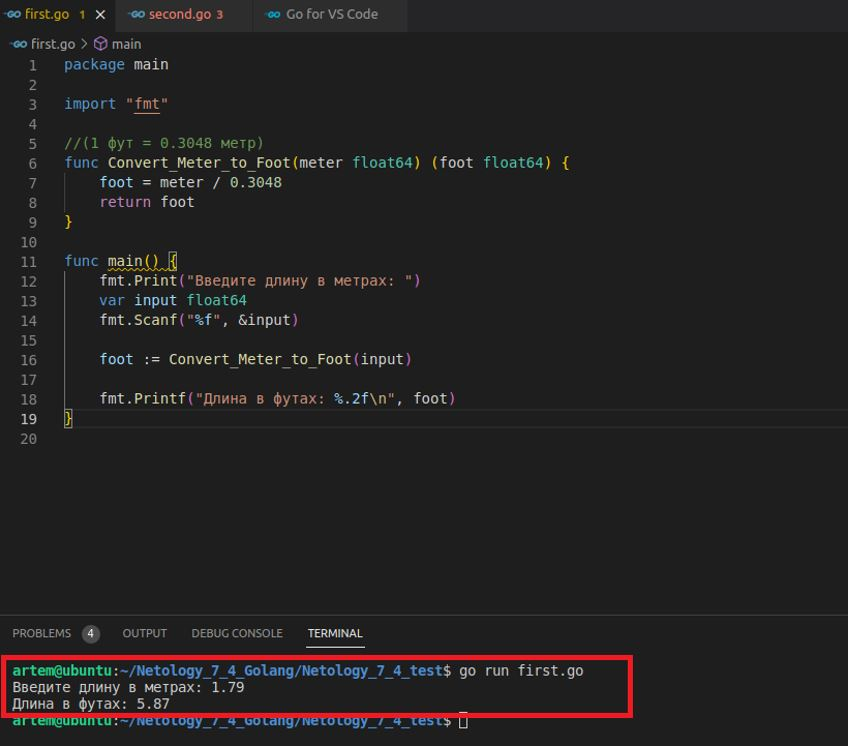
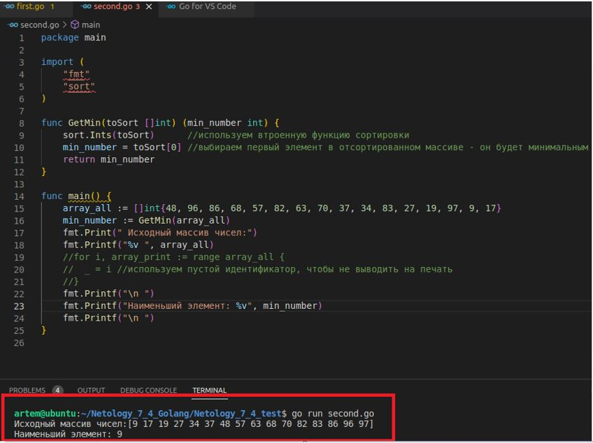
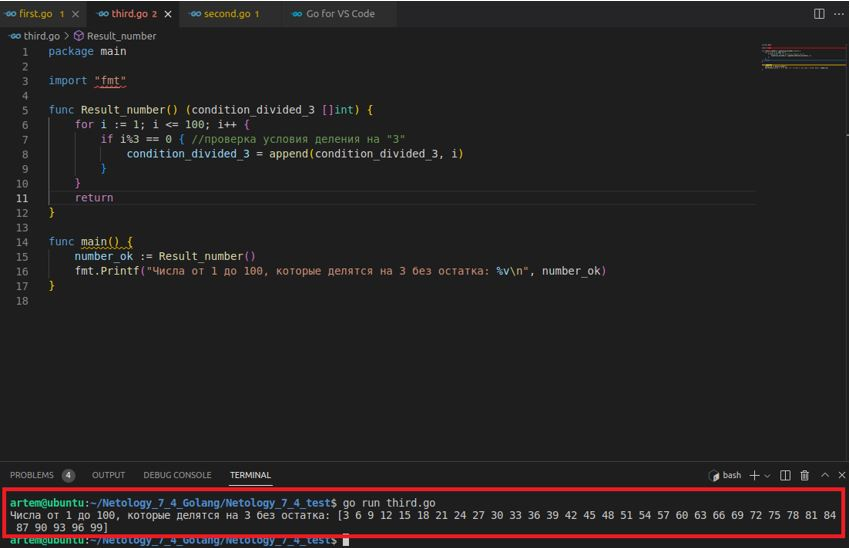

## Домашнее задание к занятию "7.4. Основы golang"

__1.	Задача 1__

__С golang в рамках курса, мы будем работать не много, поэтому можно использовать любой IDE. Но рекомендуем ознакомиться с GoLand.__

__1.	Задача 1. Установите golang.__

1)	Воспользуйтесь инструкций с официального сайта: https://golang.org/.
2)	Так же для тестирования кода можно использовать песочницу: https://play.golang.org/.

Решение:

Устанавливаем:
```
artem@ubuntu:~/Netology_7_4_Golang$ sudo apt update
artem@ubuntu:~/Netology_7_4_Golang$ sudo apt upgrade
artem@ubuntu:~/Netology_7_4_Golang$ sudo apt install golang
artem@ubuntu:~/Netology_7_4_Golang$ go version
go version go1.13.8 linux/amd64
```
Добавляем папку */usr/local/go/bin* в переменную окружения *PATH*:
```
export PATH=$PATH:/usr/local/go/bin
```
В Pycharm бесплатнх плагинов не нашел, ставим VSCode.

__2.	Задача 2. Знакомство с gotour.__

У Golang есть обучающая интерактивная консоль https://tour.golang.org/. Рекомендуется изучить максимальное количество примеров. В консоли уже написан необходимый код, осталось только с ним ознакомиться и поэкспериментировать как написано в инструкции в левой части экрана.

Решение:

Выполнено.

__3.	Задача 3. Написание кода.__

__Цель этого задания закрепить знания о базовом синтаксисе языка. Можно использовать редактор кода на своем компьютере, либо использовать песочницу: https://play.golang.org/.__

__3.1	Напишите программу для перевода метров в футы (1 фут = 0.3048 метр). Можно запросить исходные данные у пользователя, а можно статически задать в коде. Для взаимодействия с пользователем можно использовать функцию Scanf:__

Решение:
```
package main

import "fmt"

//(1 фут = 0.3048 метр)
func Convert_Meter_to_Foot(meter float64) (foot float64) {
	foot = meter / 0.3048
	return foot
}

func main() {
	fmt.Print("Введите длину в метрах: ")
	var input float64
	fmt.Scanf("%f", &input)

	foot := Convert_Meter_to_Foot(input)

	fmt.Printf("Длина в футах: %.2f\n", foot)
}
```
Вывод:

 

__3.2	Напишите программу, которая выводит числа от 1 до 100, которые делятся на 3. То есть (3, 6, 9, …).__

__В виде решения ссылку на код или сам код.__

Решение:
```
package main

import (
	"fmt"
	"sort"
)

func GetMin(toSort []int) (min_number int) {
	sort.Ints(toSort)                            //используем втроенную функцию сортировки
	min_number = toSort[0]                       //выбираем первый элемент в отсортированном массиве - он будет минимальным
	return min_number
}

func main() {
	array_all := []int{48, 96, 86, 68, 57, 82, 63, 70, 37, 34, 83, 27, 19, 97, 9, 17}
	min_number := GetMin(array_all)
	fmt.Print(" Исходный массив чисел:")
	fmt.Printf("%v ", array_all)
	fmt.Printf("\n ")
	fmt.Printf("Наименьший элемент: %v", min_number)
	fmt.Printf("\n ")
}
```
Вывод:

 

__3.3	Напишите программу, которая выводит числа от 1 до 100, которые делятся на 3. То есть (3, 6, 9, …).__

Решение:
```
package main

import "fmt"

func Result_number() (condition_divided_3 []int) {
	for i := 1; i <= 100; i++ {
		if i%3 == 0 {                                                //проверка условия деления на "3"
			condition_divided_3 = append(condition_divided_3, i)
		}
	}
	return
}

func main() {
	number_ok := Result_number()
	fmt.Printf("Числа от 1 до 100, которые делятся на 3 без остатка: %v\n", number_ok)
}
```
Вывод:

 

__Задача 4. Протестировать код (не обязательно).__

__Создайте тесты для функций из предыдущего задания.__
