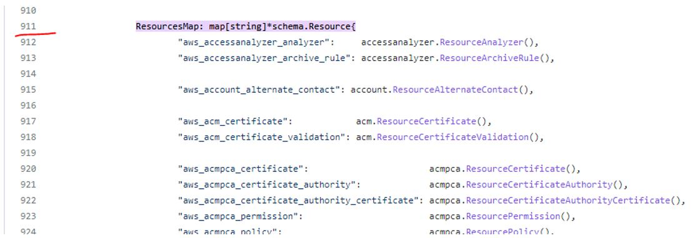
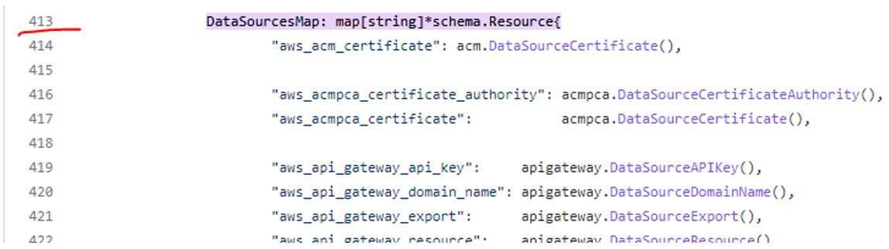
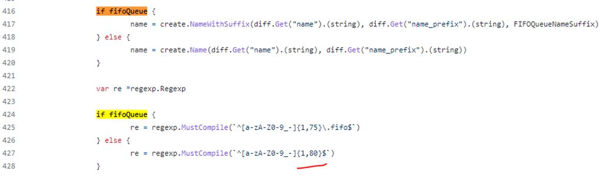

## Домашнее задание к занятию "7.6. Написание собственных провайдеров для Terraform"

__Бывает, что__

•	общедоступная документация по терраформ ресурсам не всегда достоверна
•	в документации не хватает каких-нибудь правил валидации или неточно описаны параметры
•	понадобиться использовать провайдер без официальной документации
•	может возникнуть необходимость написать свой провайдер для системы используемой в ваших проектах.

__1.	Задача 1__

__Давайте потренируемся читать исходный код AWS провайдера, который можно склонировать от сюда: https://github.com/hashicorp/terraform-provider-aws.git. Просто найдите нужные ресурсы в исходном коде и ответы на вопросы станут понятны.__

__1.	Найдите, где перечислены все доступные resource и data_source, приложите ссылку на эти строки в коде на гитхабе.__

Решение

Найдём в клонированном репозитории файл provider.go :
```
artem@ubuntu:~/Netology_7_5_Providers_Terraform/terraform-provider-aws$ find . -name  provider.go
./internal/provider/provider.go
./internal/provider/fwprovider/provider.go
./.ci/providerlint/vendor/github.com/hashicorp/terraform-plugin-log/internal/logging/provider.go
./.ci/providerlint/vendor/github.com/hashicorp/terraform-plugin-log/tflog/provider.go
./.ci/providerlint/vendor/github.com/hashicorp/terraform-plugin-go/internal/logging/provider.go
./.ci/providerlint/vendor/github.com/hashicorp/terraform-plugin-go/tfprotov6/internal/toproto/provider.go
./.ci/providerlint/vendor/github.com/hashicorp/terraform-plugin-go/tfprotov6/internal/fromproto/provider.go
./.ci/providerlint/vendor/github.com/hashicorp/terraform-plugin-go/tfprotov6/provider.go
./.ci/providerlint/vendor/github.com/hashicorp/terraform-plugin-go/tfprotov5/internal/toproto/provider.go
./.ci/providerlint/vendor/github.com/hashicorp/terraform-plugin-go/tfprotov5/internal/fromproto/provider.go
./.ci/providerlint/vendor/github.com/hashicorp/terraform-plugin-go/tfprotov5/provider.go
./.ci/providerlint/vendor/github.com/hashicorp/terraform-registry-address/provider.go
./.ci/providerlint/vendor/github.com/hashicorp/terraform-plugin-sdk/v2/helper/schema/provider.go
```
В выводе cat этого файла найдём ресурсы:
```
artem@ubuntu:~/Netology_7_5_Providers_Terraform/terraform-provider-aws/internal/provider$ cat provider.go | grep -n Resources
...
911:		ResourcesMap: map[string]*schema.Resource{
...
```
Ответ: начиная со строки 911 идет описание блока Resource:

 

Ссылка на строку в git-е:

https://github.com/hashicorp/terraform-provider-aws/blob/main/internal/provider/provider.go#:~:text=ResourcesMap%3A%20map%5Bstring%5D*schema.Resource%7B 

В выводе cat этого файла найдём DataSource:
```
artem@ubuntu:~/Netology_7_5_Providers_Terraform/terraform-provider-aws/internal/provider$ cat provider.go | grep -n DataSource
413:		DataSourcesMap: map[string]*schema.Resource{
```

Ответ: начиная со строки 413 идет описание блока DataSource:

 

Ссылка на строку в git-е:

https://github.com/hashicorp/terraform-provider-aws/blob/main/internal/provider/provider.go#:~:text=DataSourcesMap%3A%20map%5Bstring%5D*schema.Resource%7B

__2.	Для создания очереди сообщений SQS используется ресурс aws_sqs_queue у которого есть параметр name.__
o	С каким другим параметром конфликтует name? Приложите строчку кода, в которой это указано.

Ответ: перейдем в 

https://github.com/hashicorp/terraform-provider-aws/blob/main/internal/service/sqs/queue.go 

Параметр name конфликтует с параметром name_prefix :
```
		"name": {
			Type:          schema.TypeString,
			Optional:      true,
			Computed:      true,
			ForceNew:      true,
			ConflictsWith: []string{"name_prefix"},
		},
		"name_prefix": {
			Type:          schema.TypeString,
			Optional:      true,
			Computed:      true,
			ForceNew:      true,
			ConflictsWith: []string{"name"},
		},
```
o	Какая максимальная длина имени?
o	Какому регулярному выражению должно подчиняться имя?

Ответ: максимальная длина имени – 80, регулярные выражения ниже:



Т.е. имя должно быть из маленьких/заглавных латинских букв, нижнего подчеркивания, минуса, с расширением (75 символов), либо без расширения (80 символов).
______________________________

__Задача 2. (Не обязательно)__

__В рамках вебинара и презентации мы разобрали как создать свой собственный провайдер на примере кофемашины. Также вот официальная документация о создании провайдера: https://learn.hashicorp.com/collections/terraform/providers.__
1.	Проделайте все шаги создания провайдера.
2.	В виде результата приложение ссылку на исходный код.
3.	Попробуйте скомпилировать провайдер, если получится то приложите снимок экрана с командой и результатом компиляции.
