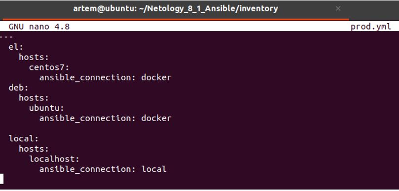

## Домашнее задание к занятию 8.1 "Введение в Ansible"

__Подготовка к выполнению__

1)	Установите ansible версии 2.10 или выше.

Решение:

Выше 2.9 не ставится:
```
Следующие пакеты имеют неудовлетворённые зависимости:
 gm2-10-x86-64-linux-gnu:i386 : Зависит: g++-10-x86-64-linux-gnu:i386 (>= 10) но он не будет установлен
                                Зависит: libgm2-10-dev-amd64-cross:i386 (>= 10) но он не может быть установлен
```

Вывод ansible --version:

 

2)	Создайте свой собственный публичный репозиторий на github с произвольным именем.

Ответ: создан ранее.

3)	Скачайте playbook из репозитория с домашним заданием и перенесите его в свой репозиторий.

Ответ: выполнено.

__1.	Попробуйте запустить playbook на окружении из test.yml, зафиксируйте какое значение имеет факт some_fact для указанного хоста при выполнении playbook'a.__

Решение:
```
artem@ubuntu:~/Netology_8_1_Ansible$ sudo ansible-playbook -i inventory/test.yml site.yml

PLAY [Print os facts] ***********************************************************************************************************

TASK [Gathering Facts] **********************************************************************************************************
ok: [localhost]

TASK [Print OS] *****************************************************************************************************************
ok: [localhost] => {
    "msg": "Ubuntu"
}

TASK [Print fact] ***************************************************************************************************************
ok: [localhost] => {
    "msg": 12
}

PLAY RECAP **********************************************************************************************************************
localhost                  : ok=3    changed=0    unreachable=0    failed=0    skipped=0    rescued=0    ignored=0   
```
Ответ: Имеет значение 12.

__2. Найдите файл с переменными (group_vars) в котором задаётся найденное в первом пункте значение и поменяйте его на 'all default fact'.__

Решение:

В group_vars/all/examp.yml исправили some_fact: 12 на some_fact: "all default fact"

__3. Воспользуйтесь подготовленным (используется docker) или создайте собственное окружение для проведения дальнейших испытаний.__

Решение: подготовим окружение на базе *centos* и *Ubuntu*

3.1) Создаем *docker-compose*-файл для подготовки образов и развертывания контейнеров:
```
docker-compose.yml

version: '3'
services:
  centos7:
    image: pycontribs/centos:7
    container_name: centos7
    restart: unless-stopped
    entrypoint: "sleep infinity"

  ubuntu:
    image: pycontribs/ubuntu
    container_name: ubuntu
    restart: unless-stopped
    entrypoint: "sleep infinity"
```

3.2) Проверяем, что создались образы:
```
artem@ubuntu:~/Netology_8_1_Ansible$ sudo docker-compose images
Container      Repository        Tag       Image Id       Size  
----------------------------------------------------------------
centos7     pycontribs/centos   7        bafa54e44377   487.6 MB
ubuntu      pycontribs/ubuntu   latest   42a4e3b21923   663.8 MB
```

3.3) Поднимаем контейнеры:
```
artem@ubuntu:~/Netology_8_1_Ansible$ sudo docker-compose up
```

3.4) Проверяем контейнеры:
```
artem@ubuntu:~/Netology_8_1_Ansible$ sudo docker-compose ps
 Name        Command       State   Ports
----------------------------------------
centos7   sleep infinity   Up           
ubuntu    sleep infinity   Up  
```

__4. Проведите запуск playbook на окружении из prod.yml. Зафиксируйте полученные значения some_fact для каждого из managed host.__

4.1) Запускаем, если не запущены, контейнеры:
```
artem@ubuntu:~/Netology_8_1_Ansible$ sudo docker-compose up
Starting ubuntu  ... done
Starting centos7 ... done
Attaching to ubuntu, centos7
```

4.2) Выполняем playbook:
```
artem@ubuntu:~/Netology_8_1_Ansible$ sudo ansible-playbook -i inventory/prod.yml site.yml

PLAY [Print os facts] ***********************************************************************************************************

TASK [Gathering Facts] **********************************************************************************************************
[DEPRECATION WARNING]: Distribution Ubuntu 18.04 on host ubuntu should use /usr/bin/python3, but is using /usr/bin/python for 
backward compatibility with prior Ansible releases. A future Ansible release will default to using the discovered platform 
python for this host. See https://docs.ansible.com/ansible/2.9/reference_appendices/interpreter_discovery.html for more 
information. This feature will be removed in version 2.12. Deprecation warnings can be disabled by setting 
deprecation_warnings=False in ansible.cfg.
ok: [ubuntu]
ok: [centos7]

TASK [Print OS] *****************************************************************************************************************
ok: [centos7] => {
    "msg": "CentOS"
}
ok: [ubuntu] => {
    "msg": "Ubuntu"
}

TASK [Print fact] ***************************************************************************************************************
ok: [centos7] => {
    "msg": "deb"
}
ok: [ubuntu] => {
    "msg": "deb"
}

PLAY RECAP **********************************************************************************************************************
centos7                    : ok=3    changed=0    unreachable=0    failed=0    skipped=0    rescued=0    ignored=0   
ubuntu                     : ok=3    changed=0    unreachable=0    failed=0    skipped=0    rescued=0    ignored=0   
```
Ответ: Имеет значение "msg": "deb" для каждого хоста

__5. Добавьте факты в group_vars каждой из групп хостов так, чтобы для some_fact получились следующие значения: для deb - 'deb default fact', для el - 'el default fact'.__

Ответ: 
-	в *group_vars/deb/examp.yml* исправим *some_fact: "deb"* на *some_fact: "deb default fact"*,
-	в *group_vars/el/examp.yml* исправим *some_fact: "el"* на *some_fact: "el default fact"*

__6. Повторите запуск playbook на окружении prod.yml. Убедитесь, что выдаются корректные значения для всех хостов.__

Запускаем Playbook:
```
artem@ubuntu:~/Netology_8_1_Ansible$ sudo ansible-playbook -i inventory/prod.yml site.yml

PLAY [Print os facts] ************************************************************************************************************************

TASK [Gathering Facts] ***********************************************************************************************************************
[DEPRECATION WARNING]: Distribution Ubuntu 18.04 on host ubuntu should use /usr/bin/python3, but is using /usr/bin/python for backward 
compatibility with prior Ansible releases. A future Ansible release will default to using the discovered platform python for this host. See 
https://docs.ansible.com/ansible/2.9/reference_appendices/interpreter_discovery.html for more information. This feature will be removed in 
version 2.12. Deprecation warnings can be disabled by setting deprecation_warnings=False in ansible.cfg.
ok: [ubuntu]
ok: [centos7]

TASK [Print OS] ******************************************************************************************************************************
ok: [centos7] => {
    "msg": "CentOS"
}
ok: [ubuntu] => {
    "msg": "Ubuntu"
}

TASK [Print fact] ****************************************************************************************************************************
ok: [centos7] => {
    "msg": "el default fact"
}
ok: [ubuntu] => {
    "msg": "deb default fact"
}

PLAY RECAP ***********************************************************************************************************************************
centos7                    : ok=3    changed=0    unreachable=0    failed=0    skipped=0    rescued=0    ignored=0   
ubuntu                     : ok=3    changed=0    unreachable=0    failed=0    skipped=0    rescued=0    ignored=0
```
Ответ: выдаются корректные значения для всех хостов.

__7. При помощи ansible-vault зашифруйте факты в group_vars/deb и group_vars/el с паролем netology.__

Решение:
```
artem@ubuntu:~/Netology_8_1_Ansible$ sudo ansible-vault encrypt group_vars/deb/examp.yml
New Vault password: 
Confirm New Vault password: 
Encryption successful
artem@ubuntu:~/Netology_8_1_Ansible$ sudo ansible-vault encrypt group_vars/el/examp.yml
New Vault password: 
Confirm New Vault password: 
Encryption successful
```

__8. Запустите playbook на окружении prod.yml. При запуске ansible должен запросить у вас пароль. Убедитесь в работоспособности.__

8.1) Проверим сначала без запроса пароля:
```
artem@ubuntu:~/Netology_8_1_Ansible$ sudo ansible-playbook -i inventory/prod.yml site.yml

PLAY [Print os facts] ************************************************************************************************************************
ERROR! Attempting to decrypt but no vault secrets found
```

8.2)  Проверим c запросом пароля:
```
artem@ubuntu:~/Netology_8_1_Ansible$ sudo ansible-playbook -i inventory/prod.yml site.yml --ask-vault-pass
Vault password: 

PLAY [Print os facts] ************************************************************************************************************************

TASK [Gathering Facts] ***********************************************************************************************************************
[DEPRECATION WARNING]: Distribution Ubuntu 18.04 on host ubuntu should use /usr/bin/python3, but is using /usr/bin/python for backward 
compatibility with prior Ansible releases. A future Ansible release will default to using the discovered platform python for this host. See 
https://docs.ansible.com/ansible/2.9/reference_appendices/interpreter_discovery.html for more information. This feature will be removed in 
version 2.12. Deprecation warnings can be disabled by setting deprecation_warnings=False in ansible.cfg.
ok: [ubuntu]
ok: [centos7]

TASK [Print OS] ******************************************************************************************************************************
ok: [centos7] => {
    "msg": "CentOS"
}
ok: [ubuntu] => {
    "msg": "Ubuntu"
}

TASK [Print fact] ****************************************************************************************************************************
ok: [centos7] => {
    "msg": "el default fact"
}
ok: [ubuntu] => {
    "msg": "deb default fact"
}

PLAY RECAP ***********************************************************************************************************************************
centos7                    : ok=3    changed=0    unreachable=0    failed=0    skipped=0    rescued=0    ignored=0   
ubuntu                     : ok=3    changed=0    unreachable=0    failed=0    skipped=0    rescued=0    ignored=0  
```

__9. Посмотрите при помощи ansible-doc список плагинов для подключения. Выберите подходящий для работы на control node.__
```
artem@ubuntu:~/Netology_8_1_Ansible$ ansible-doc -t connection -l
buildah      Interact with an existing buildah container                                                                                 
chroot       Interact with local chroot                                                                                                  
docker       Run tasks in docker containers                                                                                              
funcd        Use funcd to connect to target                                                                                              
httpapi      Use httpapi to run command on network appliances                                                                            
iocage       Run tasks in iocage jails                                                                                                   
jail         Run tasks in jails                                                                                                          
kubectl      Execute tasks in pods running on Kubernetes                                                                                 
libvirt_lxc  Run tasks in lxc containers via libvirt                                                                                     
local        execute on controller                                                                                                       
lxc          Run tasks in lxc containers via lxc python library                                                                          
lxd          Run tasks in lxc containers via lxc CLI                                                                                     
napalm       Provides persistent connection using NAPALM                                                                                 
netconf      Provides a persistent connection using the netconf protocol                                                                 
network_cli  Use network_cli to run command on network appliances                                                                        
oc           Execute tasks in pods running on OpenShift                                                                                  
paramiko_ssh Run tasks via python ssh (paramiko)                                                                                         
persistent   Use a persistent unix socket for connection                                                                                 
podman       Interact with an existing podman container                                                                                  
psrp         Run tasks over Microsoft PowerShell Remoting Protocol                                                                       
qubes        Interact with an existing QubesOS AppVM                                                                                     
saltstack    Allow ansible to piggyback on salt minions                                                                                  
ssh          connect via ssh client binary                                                                                               
vmware_tools Execute tasks inside a VM via VMware Tools                                                                                  
winrm        Run tasks over Microsoft's WinRM                                                                                            
zone         Run tasks in a zone instance
```
Ответ: подходящий плагин для работы на control node – local (execute on controller)

__10. В prod.yml добавьте новую группу хостов с именем local, в ней разместите localhost с необходимым типом подключения.__
```
artem@ubuntu:~/Netology_8_1_Ansible/inventory$ cat prod.yml 
---
  el:
    hosts:
      centos7:
        ansible_connection: docker
  deb:
    hosts:
      ubuntu:
        ansible_connection: docker

  local:
    hosts:
      localhost:
        ansible_connection: local
```
 

__11. Запустите playbook на окружении prod.yml. При запуске ansible должен запросить у вас пароль. Убедитесь что факты some_fact для каждого из хостов определены из верных group_vars.__

Ответ: для localhost факт подставился из group_vars/all, для centos7 факт подставился из group_vars/deb, для Ubuntu факт подставился из group_vars/el.

Вывод запуска playbook-а:
```
artem@ubuntu:~/Netology_8_1_Ansible$ sudo ansible-playbook -i inventory/prod.yml site.yml --ask-vault-pass
Vault password: 

PLAY [Print os facts] ************************************************************************************************************************

TASK [Gathering Facts] ***********************************************************************************************************************
ok: [localhost]
[DEPRECATION WARNING]: Distribution Ubuntu 18.04 on host ubuntu should use /usr/bin/python3, but is using /usr/bin/python for backward 
compatibility with prior Ansible releases. A future Ansible release will default to using the discovered platform python for this host. See 
https://docs.ansible.com/ansible/2.9/reference_appendices/interpreter_discovery.html for more information. This feature will be removed in 
version 2.12. Deprecation warnings can be disabled by setting deprecation_warnings=False in ansible.cfg.
ok: [ubuntu]
ok: [centos7]

TASK [Print OS] ******************************************************************************************************************************
ok: [localhost] => {
    "msg": "Ubuntu"
}
ok: [ubuntu] => {
    "msg": "Ubuntu"
}
ok: [centos7] => {
    "msg": "CentOS"
}

TASK [Print fact] ****************************************************************************************************************************
ok: [localhost] => {
    "msg": 12
}
ok: [centos7] => {
    "msg": "el default fact"
}
ok: [ubuntu] => {
    "msg": "deb default fact"
}

PLAY RECAP ***********************************************************************************************************************************
centos7                    : ok=3    changed=0    unreachable=0    failed=0    skipped=0    rescued=0    ignored=0   
localhost                  : ok=3    changed=0    unreachable=0    failed=0    skipped=0    rescued=0    ignored=0   
ubuntu                     : ok=3    changed=0    unreachable=0    failed=0    skipped=0    rescued=0    ignored=0
```
