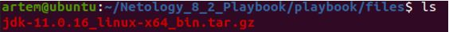

## Домашнее задание к занятию 8.1 "Работа с Playbook"

__Подготовка к выполнению__

__1.	Создайте свой собственный (или используйте старый) публичный репозиторий на github с произвольным именем.__

Решение: используем существующий.

__2.	Скачайте playbook (https://github.com/netology-code/mnt-homeworks/tree/master/08-ansible-02-playbook/playbook.git)  из репозитория с домашним заданием и перенесите его в свой репозиторий.__

Решение: выполнено.

__3.	Подготовьте хосты в соотвествии с группами из предподготовленного playbook.__

Решение: подготовим docker-compose-файл:
```
version: '3'
services:
  elastic:
    image: pycontribs/ubuntu
    container_name: elastic
    restart: unless-stopped
    entrypoint: "sleep infinity"

  kibana:
    image: pycontribs/ubuntu
    container_name: kibana
    restart: unless-stopped
    entrypoint: "sleep infinity"
```
 
_____________________________________________

__4.	Скачайте дистрибутив java (https://www.oracle.com/java/technologies/downloads/#java11)  и положите его в директорию playbook/files/.__

Решение:

Скачаем дистрибутив jdk-11.0.16_linux-x64_bin.tar.gz с указанного выше сайта и полжим в папку files:



Изменим файл vars.yml, указав актуальную версию дистрибутива:
```
artem@ubuntu:~/Netology_8_2_Playbook/playbook/group_vars/all$ cat vars.yml 
---
java_jdk_version: 11.0.16
java_oracle_jdk_package: jdk-11.0.16_linux-x64_bin.tar.gz
```

__Основная часть__

__1.	Приготовьте свой собственный inventory файл prod.yml.__

Решение: подготовим свой inventory-файл с указанием на подключение к docker-контейнерам:
```
---
  elasticsearch:
    hosts:
      elastic:
        ansible_connection: docker
  kibana:
    hosts:
      kibana:
        ansible_connection: docker
```

__2.	Допишите playbook: нужно сделать ещё один play, который устанавливает и настраивает kibana.__

Решение: вывод сожержимого playbook с добавленным Play kibana:
```
artem@ubuntu:~/Netology_8_2_Playbook/playbook$ cat site.yml 
---
- name: Install Java
  hosts: all
  tasks:
    - name: Set facts for Java 11 vars
      set_fact:
        java_home: "/opt/jdk/{{ java_jdk_version }}"
      tags: java
    - name: Upload .tar.gz file containing binaries from local storage
      copy:
        src: "{{ java_oracle_jdk_package }}"
        dest: "/tmp/jdk-{{ java_jdk_version }}.tar.gz"
      register: download_java_binaries
      until: download_java_binaries is succeeded
      tags: java
    - name: Ensure installation dir exists
      become: true
      file:
        state: directory
        path: "{{ java_home }}"
      tags: java
    - name: Extract java in the installation directory
      become: true
      unarchive:
        copy: false
        src: "/tmp/jdk-{{ java_jdk_version }}.tar.gz"
        dest: "{{ java_home }}"
        extra_opts: [--strip-components=1]
        creates: "{{ java_home }}/bin/java"
      tags:
        - java
      when: not ansible_check_mode
    - name: Export environment variables
      become: true
      template:
        src: jdk.sh.j2
        dest: /etc/profile.d/jdk.sh
      tags: java
- name: Install Elasticsearch
  hosts: elasticsearch
  tasks:
    - name: Upload tar.gz Elasticsearch from remote URL
      get_url:
        url: "https://artifacts.elastic.co/downloads/elasticsearch/elasticsearch-{{ elastic_version }}-linux-x86_64.tar.gz"
        dest: "/tmp/elasticsearch-{{ elastic_version }}-linux-x86_64.tar.gz"
        mode: 0755
        timeout: 60
        force: true
        validate_certs: false
      register: get_elastic
      until: get_elastic is succeeded
      tags: elastic
    - name: Create directrory for Elasticsearch
      file:
        state: directory
        path: "{{ elastic_home }}"
      tags: elastic
    - name: Extract Elasticsearch in the installation directory
      become: true
      unarchive:
        copy: false
        src: "/tmp/elasticsearch-{{ elastic_version }}-linux-x86_64.tar.gz"
        dest: "{{ elastic_home }}"
        extra_opts: [--strip-components=1]
        creates: "{{ elastic_home }}/bin/elasticsearch"
      tags:
        - elastic
      when: not ansible_check_mode
    - name: Set environment Elastic
      become: true
      template:
        src: templates/elk.sh.j2
        dest: /etc/profile.d/elk.sh
      tags: elastic
#ДЗ 8-2 2)Допишите playbook: нужно сделать ещё один play, который устанавливает и настраивает kibana.
- name: Install Kibana
  hosts: kibana
  tasks:
    - name: Upload tar.gz Kibana from remote URL
      get_url:
        url: "https://artifacts.elastic.co/downloads/kibana/kibana-{{ kibana_version }}-linux-x86_64.tar.gz"
        dest: "/tmp/kibana-{{ kibana_version }}-linux-x86_64.tar.gz"
        mode: 0755
        timeout: 60
        force: true
        validate_certs: false
      register: get_kibana
      until: get_kibana is succeeded
      tags: kibana
    - name: Create directrory for Kibana ({{ kibana_home }})
      file:
        path: "{{ kibana_home }}"
        state: directory
      tags: kibana
    - name: Extract Kibana in the installation directory
      become: true
      unarchive:
        copy: false
        src: "/tmp/kibana-{{ kibana_version }}-linux-x86_64.tar.gz"
        dest: "{{ kibana_home }}"
        extra_opts: [--strip-components=1]
        creates: "{{ kibana_home }}/bin/kibana"
      tags:
        - kibana
      when: not ansible_check_mode
    - name: Set environment Kibana
      become: true
      template:
        src: templates/kib.sh.j2
        dest: /etc/profile.d/kib.sh
      tags: kibana
```

__3.	При создании tasks рекомендую использовать модули: get_url, template, unarchive, file.__

Ответ: выполнено

__4.	Tasks должны: скачать нужной версии дистрибутив, выполнить распаковку в выбранную директорию, сгенерировать конфигурацию с параметрами.__

Ответ: выполнено

__5.	Запустите ansible-lint site.yml и исправьте ошибки, если они есть.__

Ответ: исправлены ошибки – отступы

__6. Попробуйте запустить playbook на этом окружении с флагом --check.__

Решение: запускаем на окружении prod с флагом --check:
```
artem@ubuntu:~/Netology_8_2_Playbook/playbook$ sudo ansible-playbook -i ./inventory/prod.yml site.yml --check
[WARNING]: Found both group and host with same name: kibana

PLAY [Install Java] ***********************************************************************************************************************************

TASK [Gathering Facts] ********************************************************************************************************************************
[DEPRECATION WARNING]: Distribution Ubuntu 18.04 on host kibana should use /usr/bin/python3, but is using /usr/bin/python for backward compatibility 
with prior Ansible releases. A future Ansible release will default to using the discovered platform python for this host. See 
https://docs.ansible.com/ansible/2.9/reference_appendices/interpreter_discovery.html for more information. This feature will be removed in version 
2.12. Deprecation warnings can be disabled by setting deprecation_warnings=False in ansible.cfg.
ok: [kibana]
[DEPRECATION WARNING]: Distribution Ubuntu 18.04 on host elastic should use /usr/bin/python3, but is using /usr/bin/python for backward compatibility 
with prior Ansible releases. A future Ansible release will default to using the discovered platform python for this host. See 
https://docs.ansible.com/ansible/2.9/reference_appendices/interpreter_discovery.html for more information. This feature will be removed in version 
2.12. Deprecation warnings can be disabled by setting deprecation_warnings=False in ansible.cfg.
ok: [elastic]

TASK [Set facts for Java 11 vars] *********************************************************************************************************************
ok: [elastic]
ok: [kibana]

TASK [Upload .tar.gz file containing binaries from local storage] *************************************************************************************
changed: [kibana]
changed: [elastic]

TASK [Ensure installation dir exists] *****************************************************************************************************************
changed: [elastic]
changed: [kibana]

TASK [Extract java in the installation directory] *****************************************************************************************************
skipping: [elastic]
skipping: [kibana]

TASK [Export environment variables] *******************************************************************************************************************
changed: [elastic]
changed: [kibana]

PLAY [Install Elasticsearch] **************************************************************************************************************************

TASK [Gathering Facts] ********************************************************************************************************************************
ok: [elastic]

TASK [Upload tar.gz Elasticsearch from remote URL] ****************************************************************************************************
changed: [elastic]

TASK [Create directrory for Elasticsearch] ************************************************************************************************************
changed: [elastic]

TASK [Extract Elasticsearch in the installation directory] ********************************************************************************************
skipping: [elastic]

TASK [Set environment Elastic] ************************************************************************************************************************
changed: [elastic]

PLAY [Install Kibana] *********************************************************************************************************************************

TASK [Gathering Facts] ********************************************************************************************************************************
ok: [kibana]

TASK [Upload tar.gz Kibana from remote URL] ***********************************************************************************************************
changed: [kibana]

TASK [Create directrory for Kibana (/opt/kibana/7.16.3)] **********************************************************************************************
changed: [kibana]

TASK [Extract Kibana in the installation directory] ***************************************************************************************************
skipping: [kibana]

TASK [Set environment Kibana] *************************************************************************************************************************
changed: [kibana]

PLAY RECAP ********************************************************************************************************************************************
elastic                    : ok=9    changed=6    unreachable=0    failed=0    skipped=2    rescued=0    ignored=0   
kibana                     : ok=9    changed=6    unreachable=0    failed=0    skipped=2    rescued=0    ignored=0  
6.	Запустите playbook на prod.yml окружении с флагом --diff. Убедитесь, что изменения на системе произведены.
Решение: запускаем на окружении prod с флагом –diff:

artem@ubuntu:~/Netology_8_2_Playbook/playbook$ sudo ansible-playbook -i ./inventory/prod.yml site.yml --diff
[WARNING]: Found both group and host with same name: kibana

PLAY [Install Java] ***********************************************************************************************************************************

TASK [Gathering Facts] ********************************************************************************************************************************
[DEPRECATION WARNING]: Distribution Ubuntu 18.04 on host kibana should use /usr/bin/python3, but is using /usr/bin/python for backward compatibility 
with prior Ansible releases. A future Ansible release will default to using the discovered platform python for this host. See 
https://docs.ansible.com/ansible/2.9/reference_appendices/interpreter_discovery.html for more information. This feature will be removed in version 
2.12. Deprecation warnings can be disabled by setting deprecation_warnings=False in ansible.cfg.
ok: [kibana]
[DEPRECATION WARNING]: Distribution Ubuntu 18.04 on host elastic should use /usr/bin/python3, but is using /usr/bin/python for backward compatibility 
with prior Ansible releases. A future Ansible release will default to using the discovered platform python for this host. See 
https://docs.ansible.com/ansible/2.9/reference_appendices/interpreter_discovery.html for more information. This feature will be removed in version 
2.12. Deprecation warnings can be disabled by setting deprecation_warnings=False in ansible.cfg.
ok: [elastic]

TASK [Set facts for Java 11 vars] *********************************************************************************************************************
ok: [elastic]
ok: [kibana]

TASK [Upload .tar.gz file containing binaries from local storage] *************************************************************************************
diff skipped: source file size is greater than 104448
changed: [kibana]
diff skipped: source file size is greater than 104448
changed: [elastic]

TASK [Ensure installation dir exists] *****************************************************************************************************************
--- before
+++ after
@@ -1,4 +1,4 @@
 {
     "path": "/opt/jdk/11.0.16",
-    "state": "absent"
+    "state": "directory"
 }

changed: [elastic]
--- before
+++ after
@@ -1,4 +1,4 @@
 {
     "path": "/opt/jdk/11.0.16",
-    "state": "absent"
+    "state": "directory"
 }

changed: [kibana]

TASK [Extract java in the installation directory] *****************************************************************************************************
changed: [kibana]
changed: [elastic]

TASK [Export environment variables] *******************************************************************************************************************
--- before
+++ after: /root/.ansible/tmp/ansible-local-95275vot1o77f/tmp9t2y2jhm/jdk.sh.j2
@@ -0,0 +1,5 @@
+# Warning: This file is Ansible Managed, manual changes will be overwritten on next playbook run.
+#!/usr/bin/env bash
+
+export JAVA_HOME=/opt/jdk/11.0.16
+export PATH=$PATH:$JAVA_HOME/bin
\ No newline at end of file

changed: [kibana]
--- before
+++ after: /root/.ansible/tmp/ansible-local-95275vot1o77f/tmphgsc5gwl/jdk.sh.j2
@@ -0,0 +1,5 @@
+# Warning: This file is Ansible Managed, manual changes will be overwritten on next playbook run.
+#!/usr/bin/env bash
+
+export JAVA_HOME=/opt/jdk/11.0.16
+export PATH=$PATH:$JAVA_HOME/bin
\ No newline at end of file

changed: [elastic]

PLAY [Install Elasticsearch] **************************************************************************************************************************

TASK [Gathering Facts] ********************************************************************************************************************************
ok: [elastic]

TASK [Upload tar.gz Elasticsearch from remote URL] ****************************************************************************************************
changed: [elastic]

TASK [Create directrory for Elasticsearch] ************************************************************************************************************
--- before
+++ after
@@ -1,4 +1,4 @@
 {
     "path": "/opt/elastic/7.10.1",
-    "state": "absent"
+    "state": "directory"
 }

changed: [elastic]

TASK [Extract Elasticsearch in the installation directory] ********************************************************************************************
changed: [elastic]

TASK [Set environment Elastic] ************************************************************************************************************************
--- before
+++ after: /root/.ansible/tmp/ansible-local-95275vot1o77f/tmpmofv4x6b/elk.sh.j2
@@ -0,0 +1,5 @@
+# Warning: This file is Ansible Managed, manual changes will be overwritten on next playbook run.
+#!/usr/bin/env bash
+
+export ES_HOME=/opt/elastic/7.10.1
+export PATH=$PATH:$ES_HOME/bin
\ No newline at end of file

changed: [elastic]

PLAY [Install Kibana] *********************************************************************************************************************************

TASK [Gathering Facts] ********************************************************************************************************************************
ok: [kibana]

TASK [Upload tar.gz Kibana from remote URL] ***********************************************************************************************************
changed: [kibana]

TASK [Create directrory for Kibana (/opt/kibana/7.16.3)] **********************************************************************************************
--- before
+++ after
@@ -1,4 +1,4 @@
 {
     "path": "/opt/kibana/7.16.3",
-    "state": "absent"
+    "state": "directory"
 }

changed: [kibana]

TASK [Extract Kibana in the installation directory] ***************************************************************************************************
changed: [kibana]

TASK [Set environment Kibana] *************************************************************************************************************************
--- before
+++ after: /root/.ansible/tmp/ansible-local-95275vot1o77f/tmp7fdew33c/kib.sh.j2
@@ -0,0 +1,6 @@
+
+# Warning: This file is Ansible Managed, manual changes will be overwritten on next playbook run.
+#!/usr/bin/env bash
+
+export KB_HOME=/opt/kibana/7.16.3
+export PATH=$PATH:$KB_HOME/bin

changed: [kibana]

PLAY RECAP ********************************************************************************************************************************************
elastic                    : ok=11   changed=8    unreachable=0    failed=0    skipped=0    rescued=0    ignored=0   
kibana                     : ok=11   changed=8    unreachable=0    failed=0    skipped=0    rescued=0    ignored=0  
```

__7.	Повторно запустите playbook с флагом --diff и убедитесь, что playbook идемпотентен.__

Решение: повторно запускаем на окружении prod с флагом –diff и смотрим, есть ли изменения:
```
artem@ubuntu:~/Netology_8_2_Playbook/playbook$ sudo ansible-playbook -i ./inventory/prod.yml site.yml --diff
[sudo] пароль для artem: 
[WARNING]: Found both group and host with same name: kibana

PLAY [Install Java] ***********************************************************************************************************************************

TASK [Gathering Facts] ********************************************************************************************************************************
[DEPRECATION WARNING]: Distribution Ubuntu 18.04 on host kibana should use /usr/bin/python3, but is using /usr/bin/python for backward compatibility 
with prior Ansible releases. A future Ansible release will default to using the discovered platform python for this host. See 
https://docs.ansible.com/ansible/2.9/reference_appendices/interpreter_discovery.html for more information. This feature will be removed in version 
2.12. Deprecation warnings can be disabled by setting deprecation_warnings=False in ansible.cfg.
ok: [kibana]
[DEPRECATION WARNING]: Distribution Ubuntu 18.04 on host elastic should use /usr/bin/python3, but is using /usr/bin/python for backward compatibility 
with prior Ansible releases. A future Ansible release will default to using the discovered platform python for this host. See 
https://docs.ansible.com/ansible/2.9/reference_appendices/interpreter_discovery.html for more information. This feature will be removed in version 
2.12. Deprecation warnings can be disabled by setting deprecation_warnings=False in ansible.cfg.
ok: [elastic]

TASK [Set facts for Java 11 vars] *********************************************************************************************************************
ok: [elastic]
ok: [kibana]

TASK [Upload .tar.gz file containing binaries from local storage] *************************************************************************************
ok: [kibana]
ok: [elastic]

TASK [Ensure installation dir exists] *****************************************************************************************************************
ok: [elastic]
ok: [kibana]

TASK [Extract java in the installation directory] *****************************************************************************************************
skipping: [elastic]
skipping: [kibana]

TASK [Export environment variables] *******************************************************************************************************************
ok: [elastic]
ok: [kibana]

PLAY [Install Elasticsearch] **************************************************************************************************************************

TASK [Gathering Facts] ********************************************************************************************************************************
ok: [elastic]

TASK [Upload tar.gz Elasticsearch from remote URL] ****************************************************************************************************
ok: [elastic]

TASK [Create directrory for Elasticsearch] ************************************************************************************************************
ok: [elastic]

TASK [Extract Elasticsearch in the installation directory] ********************************************************************************************
skipping: [elastic]

TASK [Set environment Elastic] ************************************************************************************************************************
ok: [elastic]

PLAY [Install Kibana] *********************************************************************************************************************************

TASK [Gathering Facts] ********************************************************************************************************************************
ok: [kibana]

TASK [Upload tar.gz Kibana from remote URL] ***********************************************************************************************************
ok: [kibana]

TASK [Create directrory for Kibana (/opt/kibana/7.16.3)] **********************************************************************************************
ok: [kibana]

TASK [Extract Kibana in the installation directory] ***************************************************************************************************
skipping: [kibana]

TASK [Set environment Kibana] *************************************************************************************************************************
ok: [kibana]

PLAY RECAP ********************************************************************************************************************************************
elastic                    : ok=9    changed=0    unreachable=0    failed=0    skipped=2    rescued=0    ignored=0   
kibana                     : ok=9    changed=0    unreachable=0    failed=0    skipped=2    rescued=0    ignored=0   
```
Ответ: как видим, изменений нет, changed=0

__8.	Подготовьте README.md файл по своему playbook. В нём должно быть описано: что делает playbook, какие у него есть параметры и теги.__

Ответ: выполнено

__9.	Готовый playbook выложите в свой репозиторий, в ответ предоставьте ссылку на него.__

Ответ: выполнено

__Необязательная часть__
1.	Приготовьте дополнительный хост для установки logstash.
2.	Пропишите данный хост в prod.yml в новую группу logstash.
3.	Дополните playbook ещё одним play, который будет исполнять установку logstash только на выделенный для него хост.
4.	Все переменные для нового play определите в отдельный файл group_vars/logstash/vars.yml.
5.	Logstash конфиг должен конфигурироваться в части ссылки на elasticsearch (можно взять, например его IP из facts или определить через vars).
6.	Дополните README.md, протестируйте playbook, выложите новую версию в github. В ответ предоставьте ссылку на репозиторий.

  


