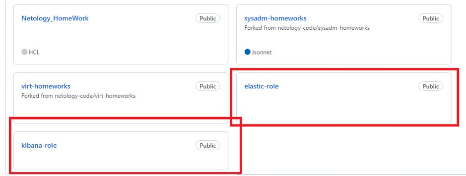
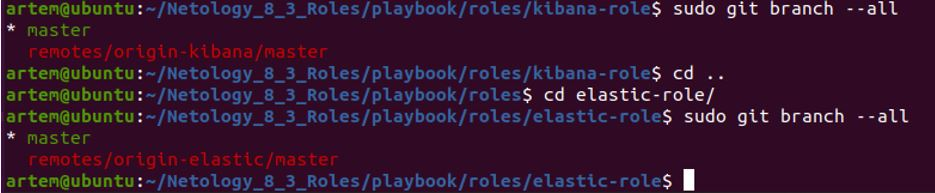
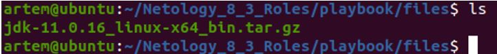
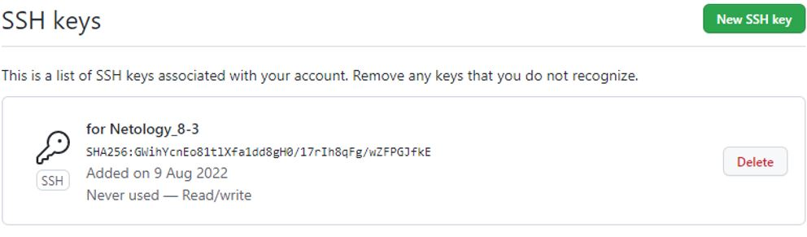

## Домашнее задание к занятию 8.3 "Работа с Roles"

__Подготовка к выполнению__

__1.	Создайте два пустых публичных репозитория в любом своём проекте: elastic-role и kibana-role.__

Создадим два публичных репозитория elastic-role и kibana-role на GitHub-е:

Решение:

 

Подключимся к репозиторию elastic-role и запушим туда тестовый файл:
```
artem@ubuntu:~/Netology_8_3_Roles/playbook/roles/elastic-role$ sudo git init
Инициализирован пустой репозиторий Git в /home/artem/Netology_8_3_Roles/playbook/roles/elastic-role/.git/

artem@ubuntu:~/Netology_8_3_Roles/playbook/roles/elastic-role$ sudo git branch --all

artem@ubuntu:~/Netology_8_3_Roles/playbook/roles/elastic-role$ echo "# elastic-role" >> README_elastic.md

artem@ubuntu:~/Netology_8_3_Roles/playbook/roles/elastic-role$ sudo git add README_elastic.md

artem@ubuntu:~/Netology_8_3_Roles/playbook/roles/elastic-role$ sudo git commit -m "first commit on repo elastic-role"
[master (корневой коммит) 861212d] first commit on repo elastic-role
 1 file changed, 1 insertion(+)
 create mode 100644 README_elastic.md

artem@ubuntu:~/Netology_8_3_Roles/playbook/roles/elastic-role$ sudo git remote add origin-elastic https://github.com/Tiinamu/elastic-role.git
artem@ubuntu:~/Netology_8_3_Roles/playbook/roles/elastic-role$ sudo git branch --all
* master

artem@ubuntu:~/Netology_8_3_Roles/playbook/roles/elastic-role$ sudo git push -u origin-elastic master
Username for 'https://github.com': Tiinamu
Password for 'https://Tiinamu@github.com': 
Перечисление объектов: 3, готово.
Подсчет объектов: 100% (3/3), готово.
Запись объектов: 100% (3/3), 250 байтов | 250.00 КиБ/с, готово.
Всего 3 (изменения 0), повторно использовано 0 (изменения 0)
To https://github.com/Tiinamu/elastic-role.git
 * [new branch]      master -> master
Ветка «master» отслеживает внешнюю ветку «master» из «origin-elastic».
artem@ubuntu:~/Netology_8_3_Roles/playbook/roles/elastic-role$
```
Подключимся к репозиторию kibana-role и запушим туда тестовый файл:
```
artem@ubuntu:~/Netology_8_3_Roles/playbook/roles/kibana-role$ sudo git init
Инициализирован пустой репозиторий Git в /home/artem/Netology_8_3_Roles/playbook/roles/kibana-role/.git/

artem@ubuntu:~/Netology_8_3_Roles/playbook/roles/kibana-role$ sudo git branch --all

artem@ubuntu:~/Netology_8_3_Roles/playbook/roles/kibana-role$ echo "# kibana-role" >> README_kibana.md

artem@ubuntu:~/Netology_8_3_Roles/playbook/roles/kibana-role$ sudo git add README_kibana.md

artem@ubuntu:~/Netology_8_3_Roles/playbook/roles/kibana-role$ sudo git commit -m "first commit on repo kibana-role"
[master (корневой коммит) 861212d] first commit on repo kibana-role
 1 file changed, 1 insertion(+)
 create mode 100644 README_kibana.md

artem@ubuntu:~/Netology_8_3_Roles/playbook/roles/kibana-role$ sudo git remote add origin-kibana https://github.com/Tiinamu/kibana-role.git
artem@ubuntu:~/Netology_8_3_Roles/playbook/roles/kibana-role$ sudo git branch --all
* master

artem@ubuntu:~/Netology_8_3_Roles/playbook/roles/kibana-role$ sudo git push -u origin-kibana master
Username for 'https://github.com': Tiinamu
Password for 'https://Tiinamu@github.com': 
Перечисление объектов: 3, готово.
Подсчет объектов: 100% (3/3), готово.
Запись объектов: 100% (3/3), 250 байтов | 250.00 КиБ/с, готово.
Всего 3 (изменения 0), повторно использовано 0 (изменения 0)
To https://github.com/Tiinamu/kibana-role.git
 * [new branch]      master -> master
Ветка «master» отслеживает внешнюю ветку «master» из «origin-kibana».
artem@ubuntu:~/Netology_8_3_Roles/playbook/roles/kibana-role$
```
Проверим, как подключились репозитории:
```
artem@ubuntu:~/Netology_8_3_Roles/playbook/roles/kibana-role$ sudo git branch --all
* master
  remotes/origin-kibana/master
artem@ubuntu:~/Netology_8_3_Roles/playbook/roles/kibana-role$ cd ..
artem@ubuntu:~/Netology_8_3_Roles/playbook/roles$ cd elastic-role/
artem@ubuntu:~/Netology_8_3_Roles/playbook/roles/elastic-role$ sudo git branch --all
* master
  remotes/origin-elastic/master
```
 

__2.	Скачайте role из репозитория с домашним заданием и перенесите его в свой репозиторий elastic-role.__

Скачаем в локальный репозиторий elastic-role:
```
artem@ubuntu:~/Netology_8_3_Roles/playbook/roles/elastic-role/roles$ sudo svn checkout https://github.com/netology-code/mnt-homeworks/trunk/08-ansible-03-role

A    08-ansible-03-role/README.md
A    08-ansible-03-role/roles
A    08-ansible-03-role/roles/.travis.yml
A    08-ansible-03-role/roles/.yamllint
A    08-ansible-03-role/roles/README.md
A    08-ansible-03-role/roles/defaults
A    08-ansible-03-role/roles/defaults/main.yml
A    08-ansible-03-role/roles/handlers
A    08-ansible-03-role/roles/handlers/main.yml
A    08-ansible-03-role/roles/meta
A    08-ansible-03-role/roles/meta/main.yml
A    08-ansible-03-role/roles/molecule
A    08-ansible-03-role/roles/molecule/default
A    08-ansible-03-role/roles/molecule/default/converge.yml
A    08-ansible-03-role/roles/molecule/default/molecule.yml
A    08-ansible-03-role/roles/molecule/default/verify.yml
A    08-ansible-03-role/roles/tasks
A    08-ansible-03-role/roles/tasks/main.yml
A    08-ansible-03-role/roles/templates
A    08-ansible-03-role/roles/templates/elk.sh.j2
A    08-ansible-03-role/roles/tests
A    08-ansible-03-role/roles/tests/inventory
A    08-ansible-03-role/roles/tests/test.yml
A    08-ansible-03-role/roles/vars
A    08-ansible-03-role/roles/vars/main.yml
Checked out revision 182.
```

Перенесем в репозиторий elastic-role:
```
artem@ubuntu:~/Netology_8_3_Roles/playbook/roles/elastic-role$ sudo git branch --all
* master
  remotes/origin-elastic/master
artem@ubuntu:~/Netology_8_3_Roles/playbook/roles/elastic-role$ sudo git add roles/
artem@ubuntu:~/Netology_8_3_Roles/playbook/roles/elastic-role$ sudo git commit -m "perenosim roles v repo"
[master 651353e] perenosim roles v repo
 13 files changed, 215 insertions(+)
 create mode 100644 roles/README.md
 create mode 100644 roles/README_8-3.md
 create mode 100644 roles/defaults/main.yml
 create mode 100644 roles/handlers/main.yml
 create mode 100644 roles/meta/main.yml
 create mode 100644 roles/molecule/default/converge.yml
 create mode 100644 roles/molecule/default/molecule.yml
 create mode 100644 roles/molecule/default/verify.yml
 create mode 100644 roles/tasks/main.yml
 create mode 100644 roles/templates/elk.sh.j2
 create mode 100644 roles/tests/inventory
 create mode 100644 roles/tests/test.yml
 create mode 100644 roles/vars/main.yml
artem@ubuntu:~/Netology_8_3_Roles/playbook/roles/elastic-role$ sudo git push -u origin-elastic master
Username for 'https://github.com': Tiinamu
Password for 'https://Tiinamu@github.com': 
Перечисление объектов: 26, готово.
Подсчет объектов: 100% (26/26), готово.
При сжатии изменений используется до 2 потоков
Сжатие объектов: 100% (15/15), готово.
Запись объектов: 100% (25/25), 5.23 КиБ | 1.31 МиБ/с, готово.
Всего 25 (изменения 0), повторно использовано 0 (изменения 0)
To https://github.com/Tiinamu/elastic-role.git
   861212d..651353e  master -> master
Ветка «master» отслеживает внешнюю ветку «master» из «origin-elastic».
```

__3.	Скачайте дистрибутив java и положите его в директорию playbook/files/.__

 

__4.	Установите molecule: pip3 install molecule__
```
artem@ubuntu:~/Netology_8_3_Roles$ sudo pip3 install molecule
artem@ubuntu:~/Netology_8_3_Roles/playbook/roles/elastic-role$ pip3 install molecule-docker
```

__5.	Добавьте публичную часть своего ключа к своему профилю в github.__

Выполнено:
```
https://github.com/settings/keys 
```
 

__Основная часть__

__Наша основная цель - разбить наш playbook на отдельные roles. Задача: сделать roles для elastic, kibana и написать playbook для использования этих ролей. Ожидаемый результат: существуют два ваших репозитория с roles и один репозиторий с playbook.__

__1.	Создали в playbook файл requirements.yml и заполнили его следующим содержимым:__
```
---
  - src: git@github.com:netology-code/mnt-homeworks-ansible.git
    scm: git
    version: "1.0.1"
    name: java 
```

__2.	При помощи ansible-galaxy скачали себе эту роль. Запустили molecule test:__
```
artem@ubuntu:~/Netology_8_3_Roles$/playbook/java$ molecule test
INFO     default scenario test matrix: dependency, lint, cleanup, destroy, syntax, create, prepare, converge, idempotence, side_effect, verify, cleanup, destroy
INFO     Performing prerun...
WARNING  Computed fully qualified role name of java does not follow current galaxy requirements.
Please edit meta/main.yml and assure we can correctly determine full role name:

galaxy_info:
role_name: my_name  # if absent directory name hosting role is used instead
namespace: my_galaxy_namespace  # if absent, author is used instead

Namespace: https://galaxy.ansible.com/docs/contributing/namespaces.html#galaxy-namespace-limitations
Role: https://galaxy.ansible.com/docs/contributing/creating_role.html#role-names

As an alternative, you can add 'role-name' to either skip_list or warn_list.

INFO     Using ../../../../../.cache/roles/java symlink to current repository in order to enable Ansible to find the role using its expected full name.


<skip some data>

TASK [Delete docker network(s)] ****************************************************************************************************************

PLAY RECAP *************************************************************************************************************************************
localhost                  : ok=2    changed=2    unreachable=0    failed=0    skipped=1    rescued=0    ignored=0

INFO     Pruning extra files from scenario ephemeral directory
```
__3.	Перешли в каталог с ролью elastic-role и создали сценарий тестирования по умолчаню при помощи molecule init scenario --driver-name docker:__
```
artem@ubuntu:~/Netology_8_3_Roles/playbook/roles/elastic-role$ molecule init scenario -d docker
INFO     Initializing new scenario default...
INFO     Initialized scenario in /home/artem/Netology_8_3_Roles/playbook/roles/elastic-role/molecule/default successfully.
```
__4.	Добавили несколько разных дистрибутивов (centos:8, centos:7, ubuntu:latest) для инстансов и протестировали роль:__
```
artem@ubuntu:~/Netology_8_3_Roles/playbook/roles/elastic-role$ molecule test
INFO     default scenario test matrix: dependency, lint, cleanup, destroy, syntax, create, prepare, converge, idempotence, side_effect, verify, cleanup, destroy
INFO     Performing prerun...
WARNING  Computed fully qualified role name of 08_elastic-role does not follow current galaxy requirements.
Please edit meta/main.yml and assure we can correctly determine full role name:


<skip some data>

PLAY [Converge] ********************************************************************************************************************************

TASK [Gathering Facts] *************************************************************************************************************************
ok: [ubuntu]
ok: [centos8]
ok: [centos7]


<skip some data>

PLAY RECAP *************************************************************************************************************************************
centos7                    : ok=5    changed=4    unreachable=0    failed=0    skipped=0    rescued=0    ignored=0
centos8                    : ok=5    changed=4    unreachable=0    failed=0    skipped=0    rescued=0    ignored=0
ubuntu                     : ok=5    changed=4    unreachable=0    failed=0    skipped=0    rescued=0    ignored=0


<skip some data>

PLAY RECAP *************************************************************************************************************************************
localhost                  : ok=2    changed=2    unreachable=0    failed=0    skipped=1    rescued=0    ignored=0

INFO     Pruning extra files from scenario ephemeral directory
```
__5.	Создадим новый каталог с ролью при помощи molecule init role --driver-name docker kibana-role:__

С помощью команды molecule init role --driver-name docker kibana-role роль не создалась. Создал её с помощью ansible-galaxy init kibana-role и воссоздал недостающие директории.
```
artem@ubuntu:~/Netology_8_3_Roles/playbook/roles$ sudo ansible-galaxy init kibana-role
- Role kibana-role was created successfully
```
__6.	На основе tasks из playbook заполнили новую role. Разнесли переменные между vars и default. Проведём тестирование на разных дистрибитивах (centos:7, centos:8, ubuntu):__

```
artem@ubuntu:~/Netology_8_3_Roles/playbook/roles/kibana-role$ molecule test 
INFO     default scenario test matrix: dependency, lint, cleanup, destroy, syntax, create, prepare, converge, idempotence, side_effect, verify, cleanup, destroy
INFO     Performing prerun...
WARNING  Computed fully qualified role name of kibana-role does not follow current galaxy requirements.
Please edit meta/main.yml and assure we can correctly determine full role name:


<skip some data>

PLAY [Converge] ********************************************************************************************************************************

TASK [Gathering Facts] *************************************************************************************************************************
ok: [centos7]
ok: [centos8]
ok: [ubuntu]

TASK [Include kibana-role] ******************************************************************************************************************

TASK [kibana-role : Upload tar.gz Kibana from remote URL] ***********************************************************************************
changed: [centos8]
changed: [ubuntu]
changed: [centos7]

TASK [kibana-role : Create directrory for Kibana (/opt/kibana/7.12.0)] **********************************************************************
changed: [centos7]
changed: [ubuntu]
changed: [centos8]

TASK [kibana-role : Extract Kibana in the installation directory] ***************************************************************************
changed: [ubuntu]
changed: [centos8]
changed: [centos7]

TASK [kibana-role : Set environment Kibana] *************************************************************************************************
changed: [ubuntu]
changed: [centos7]
changed: [centos8]

PLAY RECAP *************************************************************************************************************************************
centos7                    : ok=5    changed=4    unreachable=0    failed=0    skipped=0    rescued=0    ignored=0
centos8                    : ok=5    changed=4    unreachable=0    failed=0    skipped=0    rescued=0    ignored=0
ubuntu                     : ok=5    changed=4    unreachable=0    failed=0    skipped=0    rescued=0    ignored=0


<skip some data>


INFO     Idempotence completed successfully.
INFO     Running default > side_effect
WARNING  Skipping, side effect playbook not configured.
INFO     Running default > verify
INFO     Running Ansible Verifier

PLAY [Verify] **********************************************************************************************************************************

TASK [Example assertion] ***********************************************************************************************************************
ok: [centos8] => {
    "changed": false,
    "msg": "All assertions passed"
}
ok: [centos7] => {
    "changed": false,
    "msg": "All assertions passed"
}
ok: [ubuntu] => {
    "changed": false,
    "msg": "All assertions passed"
}

PLAY RECAP *************************************************************************************************************************************
centos7                    : ok=1    changed=0    unreachable=0    failed=0    skipped=0    rescued=0    ignored=0
centos8                    : ok=1    changed=0    unreachable=0    failed=0    skipped=0    rescued=0    ignored=0
ubuntu                     : ok=1    changed=0    unreachable=0    failed=0    skipped=0    rescued=0    ignored=0

INFO     Verifier completed successfully.
INFO     Running default > cleanup
WARNING  Skipping, cleanup playbook not configured.
INFO     Running default > destroy

PLAY [Destroy] *********************************************************************************************************************************

TASK [Destroy molecule instance(s)] ************************************************************************************************************
changed: [localhost] => (item=centos8)
changed: [localhost] => (item=centos7)
changed: [localhost] => (item=ubuntu)

TASK [Wait for instance(s) deletion to complete] ***********************************************************************************************
FAILED - RETRYING: Wait for instance(s) deletion to complete (300 retries left).
FAILED - RETRYING: Wait for instance(s) deletion to complete (299 retries left).
FAILED - RETRYING: Wait for instance(s) deletion to complete (298 retries left).
changed: [localhost] => (item={'started': 1, 'finished': 0, 'ansible_job_id': '914470093308.30872', 'results_file': '/home/root/.ansible_async/914470093308.30872', 'changed': True, 'failed': False, 'item': {'image': 'docker.io/pycontribs/centos:8', 'name': 'centos8', 'pre_build_image': True}, 'ansible_loop_var': 'item'})
changed: [localhost] => (item={'started': 1, 'finished': 0, 'ansible_job_id': '68492617354.95147', 'results_file': '/home/root/.ansible_async/68492617354.95147', 'changed': True, 'failed': False, 'item': {'image': 'docker.io/pycontribs/centos:7', 'name': 'centos7', 'pre_build_image': True}, 'ansible_loop_var': 'item'})
changed: [localhost] => (item={'started': 1, 'finished': 0, 'ansible_job_id': '306199254871.55368', 'results_file': '/home/root/.ansible_async/306199254871.55368', 'changed': True, 'failed': False, 'item': {'image': 'docker.io/pycontribs/ubuntu:latest', 'name': 'ubuntu', 'pre_build_image': True}, 'ansible_loop_var': 'item'})

TASK [Delete docker network(s)] ****************************************************************************************************************

PLAY RECAP *************************************************************************************************************************************
localhost                  : ok=2    changed=2    unreachable=0    failed=0    skipped=1    rescued=0    ignored=0

INFO     Pruning extra files from scenario ephemeral directory
```

__7.	Выложили все roles в репозитории.__

Выполнено.

__8.	Добавили roles в requirements.yml в playbook:__
```
---
  - src: git@github.com:Tiinamu/kibana-role.git
    scm: git
    version: "1.0.1"
    name: kibana-role
  - src: git@github.com:Tiinamu/elastic-role.git
    scm: git
    version: "1.0.1"
    name: elastic-role
  - src: git@github.com:netology-code/mnt-homeworks-ansible.git
#  - src: https://github.com/netology-code/mnt-homeworks-ansible.git
    scm: git
    version: "1.0.1"
    name: java
```

__9.	Переработали playbook на использование roles.__
```
---
- hosts: all
#  roles:
#  - java-role
- hosts: elasticsearch
  roles:
  - elastic-role
- hosts: kibana
  roles:
  - kibana-role
```

__10.	Выложили playbook в репозиторий.__

Выполнено

__11.	Ссылки на оба репозитория с roles и одну ссылку на репозиторий с playbook:__

Репозиторий с elastic-role: https://github.com/Tiinamu/elastic-role.git 
Репозиторий с kibana-role: https://github.com/Tiinamu/kibana-role.git 
Репозиторий с playbook: https://github.com/Tiinamu/playbook.git 
