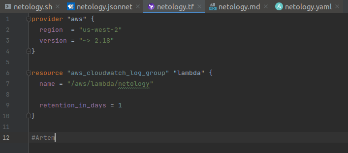
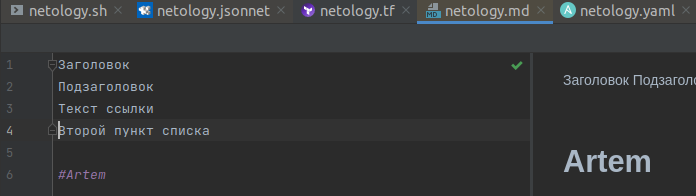
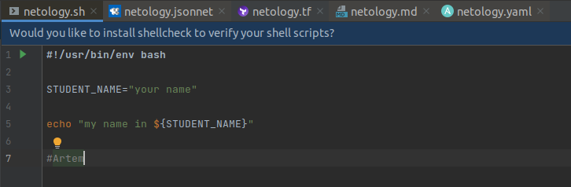
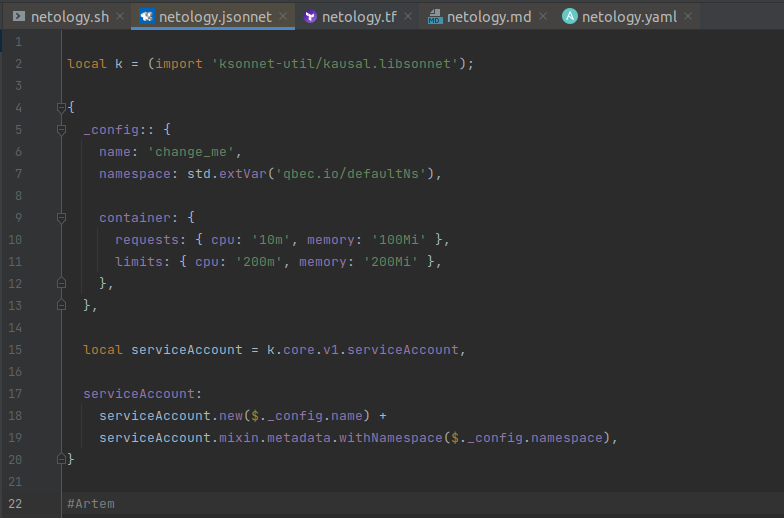

# Netology_HomeWork

## Задание №1

Скриншот Terraform:

________________________

Скриншот yaml:

________________________

Скриншот MarkDown:

________________________

Скриншот Bash:

________________________

Скриншот Jsonnet:

________________________

## Задание №2

Вводные:
Вам необходимо описать процесс решения задачи в соответствии с жизненным циклом разработки программного обеспечения. Использование какого-либо конкретного метода разработки не обязательно. Для решения главное - прописать по пунктам шаги решения задачи (релизации в конечный результат) с участием менеджера, разработчика (или команды разработчиков), тестировщика (или команды тестировщиков) и себя как DevOps-инженера.

Решение:
Руководитель проекта (далее - РП) совместно с бизнес-аналитиком производят декомпозицию требований Заказчика. Далее задача поступает в команду разработчиков (через тим-лида при глубокой декомпозиции). Далее разработчики после круга согласования трудозатрат через РП приступают к реализации разработки новой функциональности - это происходит в рамках спринта. Разработчик пишет код в своей среде разработки, потом подливает базовую ветку в ветку спринта и создает запрос на слияние (мерж-реквест). Тим-лид проводит код-ревью и "Утверждает". Далее задача попдает в QA на прохождение функциональных тестов. Далее QA пишет запрос на релиз (релиз-реквест) и ставит статус "Протестировано". Далее происходит оповещение DevOps-инженера о готовности к деплою. DevOps-иженер деплоит на стейдж (предпродуктив), где проверяется работоспособность релиза на окружении стейджа. Затем РП получает обратную связь от Заказчика, что Система работает и согласовывает с Заказчиком время накатки релиза на продакшн. Затем DevOps-Инженер деплоит на Продуктив, проводя при необходимости процедуры миграции (либо заранее готовит окружение актуальное на продуктиве).

## Модуль "Система контроля версий"

Благодаря файлу Terraform/.gitignore будут проигнорированы сущности, котороые условно можно
разделить на 3 группы:
1. Конкретные файлы (имена указаны без звёздочек, с расширением)
2. Набор файлов (указаны со свёздочкой либо в имени, либо в расширении)
3. Игнорирование директории /.terraform и файлов внутри неё, где бы она ни находились (т.к. указаны две звёздочки)

## Модуль "Основы Git"
Ссылки на три репозитория ниже.

1. https://github.com/Tiinamu/Netology_HomeWork/
2. https://gitlab.com/Tiinamu/netology_homework/
3. https://bitbucket.org/tiinamu/netology_homework/

## Домашнее задание к занятию «2.3. Ветвления в Git»

Ссылка на итоговый граф по результатам выполнения ДЗ:
https://github.com/Tiinamu/Netology_HomeWork/network

## Домашнее задание к занятию «3.1. Работа в терминале (лекция 1)» 

1. Установите средство виртуализации Oracle VirtualBox.

________________________
 
2. Установите средство автоматизации Hashicorp Vagrant.

 
3. Подготовьте удобный для дальнейшей работы терминал.

 
4. С помощью базового файла конфигурации запустите Ubuntu 20.04 в VirtualBox посредством Vagrant.
Выполнено.
5. Ознакомьтесь с графическим интерфейсом VirtualBox, посмотрите как выглядит виртуаль-ная машина, которую создал для вас Vagrant, какие аппаратные ресурсы ей выделены. Какие ресурсы выделены по-умолчанию?

 
6. Ознакомьтесь с возможностями конфигурации VirtualBox через Vagrantfile: документация. Как добавить оперативной памяти или ресурсов процессора виртуальной машине?
На выключенной машине произвести настройки:

 
7. Команда vagrant ssh из директории, в которой содержится Vagrantfile, позволит вам ока-заться внутри виртуальной машины без каких-либо дополнительных настроек. Попрактикуйтесь в выполнении обсуждаемых команд в терминале Ubuntu.

 
8. Ознакомиться с разделами man bash, почитать о настройках самого bash:
•	какой переменной можно задать длину журнала history, и на какой строчке manual это описывается?
•	что делает директива ignoreboth в bash?
Количество хранимых команд определяется двумя переменными: HISTSIZE и HISTFILESIZE. Первая определяет количество команд, хранимых в памяти, вторая — в файле. 
Посмотрим текущие значения:

Выставим новые значения:

Проверим изменения:

При выводе через man bash эти команды находятся здесь:
 

У переменной HISTCONTROL есть несколько параметров, среди которых:
-	ignorespace - не сохранять команды начинающиеся с пробела, 
-	ignoredups - не сохранять команду, если такая уже имеется в истории
-	ignoreboth  - сокращение для ignorespace и ignoredups

9. В каких сценариях использования применимы скобки {} и на какой строчке man bash это описано?
Фигурные скобки являются RESERVED WORDS. Среди прочего есть такие зарезервированные слова:
! case  coproc  do done elif else esac fi for function if in select then until while { } time [[ ]]В 
При выводе через man bash эта информация находится здесь:
 

10. С учётом ответа на предыдущий вопрос, как создать однократным вызовом touch 100000 файлов? Получится ли аналогичным образом создать 300000? Если нет, то почему?
Воспроизвести N-ое количество повторяющих действий можно с помощью зарезервированных символов {}, например, вот так:
touch {000001..100000}.md
11. В man bash поищите по /\[\[. Что делает конструкция [[ -d /tmp ]]
При поиске в man bash находим, что
-	 [[ выражение ]] Возвращает статус 0 или 1 в зависимости от вычисления выражения условного выражения.
-  

Т.о. конструкция [[ -d /tmp ]] возвращает 1, если директория tmp имеется и возвращает 0, если такового нет.

12. Основываясь на знаниях о просмотре текущих (например, PATH) и установке новых переменных, командах, которые мы рассматривали, добейтесь в выводе type -a bash в виртуальной машине наличия первым пунктом в списке:
bash is /tmp/new_path_directory/bash
bash is /usr/local/bin/bash
bash is /bin/bash
(прочие строки могут отличаться содержимым и порядком) В качестве ответа приведите команды, которые позволили вам добиться указанного вывода или соответствующие скриншо-ты.
Проверяем вывод команды type -a bash:

Создаем директорию в корне:

Копируем файл bash:

Проверяем, что есть в $PATH, видим, что не хватает пути /tmp/new_path_dir/ (1)
2. Добавляем /tmp/new_path_dir/ в $PATH (2)
3. Проверяем, что /tmp/new_path_dir/ добавился (3)
4. Проверяем вывод команды type -a bash, видим, что всё корректно и локация исполняемого файла добавилась (4)

13. Чем отличается планирование команд с помощью batch и at?
Команда at принимает дату и время ( runtime ), когда вы хотите выполнить задание, как параметр командной строки, и команду, которая должна быть выполнена из стандартного ввода.
Команда batch или его псевдоним at -b планирует задания и выполняет их в пакетной очереди, если позволяет уровень загрузки системы. По умолчанию задания выполняются, когда средняя загрузка системы ниже 1,5.

14. Завершите работу виртуальной машины чтобы не расходовать ресурсы компьютера и/или батарею ноутбука.
Виртуальная машина выключена:

