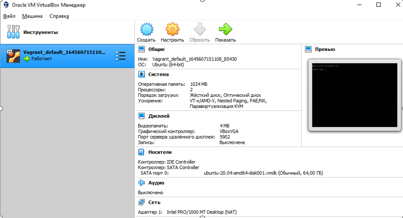
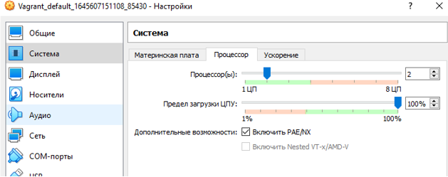
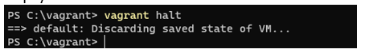

# Netology_HomeWork

## Задание №1

Скриншот Terraform:

________________________

Скриншот yaml:

________________________

Скриншот MarkDown:

________________________

Скриншот Bash:

________________________

Скриншот Jsonnet:

________________________

## Задание №2

Вводные:
Вам необходимо описать процесс решения задачи в соответствии с жизненным циклом разработки программного обеспечения. Использование какого-либо конкретного метода разработки не обязательно. Для решения главное - прописать по пунктам шаги решения задачи (релизации в конечный результат) с участием менеджера, разработчика (или команды разработчиков), тестировщика (или команды тестировщиков) и себя как DevOps-инженера.

Решение:
Руководитель проекта (далее - РП) совместно с бизнес-аналитиком производят декомпозицию требований Заказчика. Далее задача поступает в команду разработчиков (через тим-лида при глубокой декомпозиции). Далее разработчики после круга согласования трудозатрат через РП приступают к реализации разработки новой функциональности - это происходит в рамках спринта. Разработчик пишет код в своей среде разработки, потом подливает базовую ветку в ветку спринта и создает запрос на слияние (мерж-реквест). Тим-лид проводит код-ревью и "Утверждает". Далее задача попдает в QA на прохождение функциональных тестов. Далее QA пишет запрос на релиз (релиз-реквест) и ставит статус "Протестировано". Далее происходит оповещение DevOps-инженера о готовности к деплою. DevOps-иженер деплоит на стейдж (предпродуктив), где проверяется работоспособность релиза на окружении стейджа. Затем РП получает обратную связь от Заказчика, что Система работает и согласовывает с Заказчиком время накатки релиза на продакшн. Затем DevOps-Инженер деплоит на Продуктив, проводя при необходимости процедуры миграции (либо заранее готовит окружение актуальное на продуктиве).

## Модуль "Система контроля версий"

Благодаря файлу Terraform/.gitignore будут проигнорированы сущности, котороые условно можно
разделить на 3 группы:
1. Конкретные файлы (имена указаны без звёздочек, с расширением)
2. Набор файлов (указаны со свёздочкой либо в имени, либо в расширении)
3. Игнорирование директории /.terraform и файлов внутри неё, где бы она ни находились (т.к. указаны две звёздочки)

## Модуль "Основы Git"
Ссылки на три репозитория ниже.

1. https://github.com/Tiinamu/Netology_HomeWork/
2. https://gitlab.com/Tiinamu/netology_homework/
3. https://bitbucket.org/tiinamu/netology_homework/

## Домашнее задание к занятию «2.3. Ветвления в Git»

Ссылка на итоговый граф по результатам выполнения ДЗ:
https://github.com/Tiinamu/Netology_HomeWork/network

## Домашнее задание к занятию «3.1. Работа в терминале (лекция 1)» 

1. Установите средство виртуализации Oracle VirtualBox.

________________________
 
2. Установите средство автоматизации Hashicorp Vagrant.

________________________

3. Подготовьте удобный для дальнейшей работы терминал.

________________________

4. С помощью базового файла конфигурации запустите Ubuntu 20.04 в VirtualBox посредством Vagrant.

Выполнено.
________________________

5. Ознакомьтесь с графическим интерфейсом VirtualBox, посмотрите как выглядит виртуаль-ная машина, которую создал для вас Vagrant, какие аппаратные ресурсы ей выделены. Какие ресурсы выделены по-умолчанию?

________________________

6. Ознакомьтесь с возможностями конфигурации VirtualBox через Vagrantfile: документация. Как добавить оперативной памяти или ресурсов процессора виртуальной машине?
На выключенной машине произвести настройки:

________________________

7. Команда vagrant ssh из директории, в которой содержится Vagrantfile, позволит вам ока-заться внутри виртуальной машины без каких-либо дополнительных настроек. Попрактикуйтесь в выполнении обсуждаемых команд в терминале Ubuntu.

________________________

8. Ознакомиться с разделами man bash, почитать о настройках самого bash:
•	какой переменной можно задать длину журнала history, и на какой строчке manual это описывается?
•	что делает директива ignoreboth в bash?
Количество хранимых команд определяется двумя переменными: HISTSIZE и HISTFILESIZE. Первая определяет количество команд, хранимых в памяти, вторая — в файле. 

Посмотрим текущие значения:

Выставим новые значения:

Проверим изменения:

При выводе через man bash эти команды находятся здесь:

 

У переменной HISTCONTROL есть несколько параметров, среди которых:
-	ignorespace - не сохранять команды начинающиеся с пробела, 
-	ignoredups - не сохранять команду, если такая уже имеется в истории
-	ignoreboth  - сокращение для ignorespace и ignoredups

9. В каких сценариях использования применимы скобки {} и на какой строчке man bash это описано?
Фигурные скобки являются RESERVED WORDS. Среди прочего есть такие зарезервированные слова:
! case  coproc  do done elif else esac fi for function if in select then until while { } time [[ ]]В 
При выводе через man bash эта информация находится здесь:

 

________________________

10. С учётом ответа на предыдущий вопрос, как создать однократным вызовом touch 100000 файлов? Получится ли аналогичным образом создать 300000? Если нет, то почему?

Воспроизвести N-ое количество повторяющих действий можно с помощью зарезервированных символов {}, например, вот так:
touch {000001..100000}.md
________________________

11. В man bash поищите по /\[\[. Что делает конструкция [[ -d /tmp ]]
При поиске в man bash находим, что
-	 [[ выражение ]] Возвращает статус 0 или 1 в зависимости от вычисления выражения условного выражения.
-  

Т.о. конструкция [[ -d /tmp ]] возвращает 1, если директория tmp имеется и возвращает 0, если такового нет.
________________________

12. Основываясь на знаниях о просмотре текущих (например, PATH) и установке новых переменных, командах, которые мы рассматривали, добейтесь в выводе type -a bash в виртуальной машине наличия первым пунктом в списке:
bash is /tmp/new_path_directory/bash
bash is /usr/local/bin/bash
bash is /bin/bash
(прочие строки могут отличаться содержимым и порядком) В качестве ответа приведите команды, которые позволили вам добиться указанного вывода или соответствующие скриншо-ты.

Проверяем вывод команды type -a bash:

Создаем директорию в корне:

Копируем файл bash:

Проверяем, что есть в $PATH, видим, что не хватает пути /tmp/new_path_dir/ (1)
2. Добавляем /tmp/new_path_dir/ в $PATH (2)
3. Проверяем, что /tmp/new_path_dir/ добавился (3)
4. Проверяем вывод команды type -a bash, видим, что всё корректно и локация исполняемого файла добавилась (4)

________________________

13. Чем отличается планирование команд с помощью batch и at?

Команда at принимает дату и время ( runtime ), когда вы хотите выполнить задание, как параметр командной строки, и команду, которая должна быть выполнена из стандартного ввода.
Команда batch или его псевдоним at -b планирует задания и выполняет их в пакетной очереди, если позволяет уровень загрузки системы. По умолчанию задания выполняются, когда средняя загрузка системы ниже 1,5.
________________________

14. Завершите работу виртуальной машины чтобы не расходовать ресурсы компьютера и/или батарею ноутбука.

Виртуальная машина выключена:

________________________

## Домашнее задание к занятию «3.2. Работа в терминале (лекция 2)» 

1. Какого типа команда cd? Попробуйте объяснить, почему она именно такого типа; опишите ход своих мыслей, если считаете что она могла бы быть другого типа.

Данная команда является Встроенной командой оболочки:

В теории, можно было бы рассматривать еще такие типы, как Внешняя команда / исполняемый файл или Функция оболочки.  Если бы команда была внешней, то пришлось бы править $PATH. 
________________________

2.  Какая альтернатива без pipe команде grep <some_string> <some_file> | wc -l? man grep поможет в ответе на этот вопрос. Ознакомьтесь с документом о других подобных не-корректных вариантах использования pipe.

На примере анализа файла .bash_history. 
Через pipe:

Без pipe:

________________________

3.  Какой процесс с PID 1 является родителем для всех процессов в вашей виртуальной ма-шине Ubuntu 20.04?

На виртуальной машине родителем для всех процессов является systemd(1):

________________________

4.  Как будет выглядеть команда, которая перенаправит вывод stderr ls на другую сессию терминала?

Посмотрим выполнение команды на терминале pts2:
ls -lha “error view” 2>/dev/pts/1:

При этом на терминале pts1 отображается:

________________________

5. Получится ли одновременно передать команде файл на stdin и вывести ее stdout в другой файл? Приведите работающий пример.

На примере файлов rtest.md и rtest3.md: 

________________________

6. Получится ли находясь в графическом режиме, вывести данные из PTY в какой-либо из эмуляторов TTY? Сможете ли вы наблюдать выводимые данные?

В качестве эмулятора tty возьмем консоль ВМ, проверим вывод команды ps:

В качестве pty оставим текущий терминал, посмотрим вывод команды ps:

Направим сообщение Proverka pty->tty  с  pts/0 на tty2:

Результат – видим, что сообщение отобразилось на tty2:

________________________

7. Выполните команду bash 5>&1. К чему она приведет? Что будет, если вы выполните echo netology > /proc/$$/fd/5? Почему так происходит?

Командами bash 5>&1, bash 6>&1 можно создать новые дескрипторы, которые можно пронаблюдать здесь:

Дескрипторы 5,6 связаны с псевдотерминалом /dev/pts. Выполнение следующей команды выведет данные в файл дескриптор 5: 

________________________

8. Получится ли в качестве входного потока для pipe использовать только stderr команды, не потеряв при этом отображение stdout на pty? Напоминаем: по умолчанию через pipe пере-дается только stdout команды слева от | на stdin команды справа. Это можно сделать, поме-няв стандартные потоки местами через промежуточный новый дескриптор, который вы научились создавать в предыдущем вопросе.

Сделать можно через промежуточный дескриптор «7»:

________________________

9. Что выведет команда cat /proc/$$/environ? Как еще можно получить аналогичный по со-держанию вывод?

Команда выведет содержимое файла environ – переменные окружения для текущего сеанса в каталоге текущего процесса.
За исключением строки OLDPWD=/proc/4138/fd, вывод аналогичег при вызове команды env.
________________________

10. Используя man, опишите что доступно по адресам /proc/<PID>/cmdline, /proc/<PID>/exe.
 
/proc/<PID>/cmdline: этот файл, доступный только для чтения, содержит полную командную строку для процесса, если только процесс не является зомби: 
 

 
/proc/<PID>/exe: этот файл представляет собой символическую ссылку, содержащую фактический путь к выполняе-мой команде. Эта символическая ссылка может быть разыменована в обычном режиме; попытка открыть ее приве-дет к исполнению. Вы даже можете ввести /proc/[pid]/exe, чтобы запустить другую копию того же исполняемого файла, который запускается процессом [pid]. 
 

________________________
 
11. Узнайте, какую наиболее старшую версию набора инструкций SSE поддерживает ваш процессор с помощью /proc/cpuinfo.

Смотрим результат вывода команды sudo cat /proc/cpuinfo | grep sse – получаем ответ sse4_2:

________________________
 
12. При открытии нового окна терминала и vagrant ssh создается новая сессия и выделяется pty. Это можно подтвердить командой tty, которая упоминалась в лекции 3.2. Однако:
 
vagrant@netology1:~$ ssh localhost 'tty'	
not a tty 
Почитайте, почему так происходит, и как изменить поведение.

По команде man ssh | grep tty я нашел, что, т.к. SSH_TTY не установлен, то и не следует прописывать ‘tty’ в команде. 
 

 
Поэтому, чтобы устранить проблему с not a tty, требуется прописать:

Результат вывода команды следующий:
 

________________________

13. Бывает, что есть необходимость переместить запущенный процесс из одной сессии в другую. Попробуйте сделать это, воспользовавшись reptyr. Например, так можно перенести в screen процесс, который вы запустили по ошибке в обычной SSH-сессии.

Последовательность действий следующая:

•	Запустим длительный процесс, например, top, выведем его в фон CTRL-Z или &
•	Посмотрим номер джоба (running background jobs) через команду jobs
    [1]+ 18586 Stopped (signal) top
•	Возобновим процесс в фоне: bg %1
•	Запустим второй терминал через tmux
•	Перехватим процесс на новый tty: reptyr 18586

Примечание: Значение было выставлено в ноль: kernel.yama.ptrace_scope = 0
________________________
 
14. sudo echo string > /root/new_file не даст выполнить перенаправление под обычным пользователем, так как перенаправлением занимается процесс shell'а, который запущен без sudo под вашим пользователем. Для решения данной проблемы можно использовать конструкцию echo string | sudo tee /root/new_file. Узнайте что делает команда tee и почему в отличие от sudo echo команда с sudo tee будет работать.
 
Команда tee делает вывод одновременно и в файл, указаный в качестве параметра, и в stdout, в данном примере команда получает вывод из stdin, перенаправленный через pipe от stdout команды echo и так как команда запущена от sudo , соотвественно имеет права на запись в файл

## Домашнее задание к занятию «3.3. Операционные системы, лекция 1» 

1. Какой системный вызов делает команда cd? В прошлом ДЗ мы выяснили, что cd не является самостоятельной программой, это shell builtin, поэтому запустить strace непосредственно на cd не получится. Тем не менее, вы можете запустить strace на /bin/bash -c 'cd /tmp'. В этом случае вы увидите полный список системных вызовов, которые делает сам bash при старте. Вам нужно найти тот единственный, который относится именно к cd. Обратите внимание, что strace выдаёт результат своей работы в поток stderr, а не в stdout.

Сначала системный вызов execve выполняет программу, которая передается ему в параметрах (в данном случае это cd ):  
 
execve("/bin/bash", ["/bin/bash", "-c", "cd /tmp"], 0x7ffd468534e0 /* 23 vars */) = 0

Затем в системный вызов stat передается параметр tmp:
 
stat("/tmp", {st_mode=S_IFDIR|S_ISVTX|0777, st_size=4096, ...}) = 0

Затем системный вызов меняет каталог, выполняя ожидаемое действие команды:
 
chdir("/tmp")                           = 0
________________________

2. Попробуйте использовать команду file на объекты разных типов на файловой системе. Например:
vagrant@netology1:~$ file /dev/tty
/dev/tty: character special (5/0)

vagrant@netology1:~$ file /dev/sda
/dev/sda: block special (8/0)

vagrant@netology1:~$ file /bin/bash
/bin/bash: ELF 64-bit LSB shared object, x86-64

Используя strace выясните, где находится база данных file на основании которой она делает свои догадки.
 
С помощью команды strace file /dev/sda 2>&1 | grep open  вычислим все строки с попаданием “open”, т.к. подразумеваем, что базу данных надо найти и открыть:
 

 
Далее пробежимся командой cat по всем файлам и проверим совпадения по выводу character special, block special, LSB shared object:
cat /lib/x86_64-linux-gnu/libmagic.so.1 | grep -a "block special"
cat /usr/share/misc/magic.mgc | grep -a "LSB"

Файлов, удовлетворяющих условию – два – /lib/x86_64-linux-gnu/libmagic.so.1 и usr/share/misc/magic.mgc. 
________________________
 
3. Предположим, приложение пишет лог в текстовый файл. Этот файл оказался удален (deleted в lsof), однако возможности сигналом сказать приложению переоткрыть файлы или просто перезапустить приложение – нет. Так как приложение продолжает писать в удаленный файл, место на диске постепенно заканчивается. Основываясь на знаниях о перенаправ-лении потоков предложите способ обнуления открытого удаленного файла (чтобы освободить место на файловой системе).
 
Запустим команду echo в бесконечном цикле с предусловием:
 

 
Далее проверим в lsof наличие процесса с выполнением этой команды и удалим файл tt, куда производится запись. При этом при следующем запуске lsof появится пометка (deleted), но сам файл продолжит расти.
 

 
Перенаправим поток команды (на скрине выше видим, что это третий файл дескриптор) в никуда:
Можно было бы в него скопировать пустоту, но это временная мера:
cp /dev/null /proc/18586/fd/3  
т.к. файл растет онлайн, направим поток STDOUT с него в никуда:
~$ /proc/18586/fd/3  >/dev/null
________________________
 
4. Занимают ли зомби-процессы какие-то ресурсы в ОС (CPU, RAM, IO)?
 
Создадим файл с кодом С:
#include <stdio.h>
#include <stdlib.h>
#include <sys/types.h>
#include <sys/wait.h>
#include <unistd.h>
#include <errno.h>
 
int main ()
{
  pid_t child_pid;
  int child_status;
 
  child_pid = fork ();
  if (child_pid > 0) {
    // parent process will sleep for 30 seconds and exit, without a call to wait()
    fprintf(stderr,"parent process - %d\n", getpid());    
    sleep(30); 
    exit(0);
  }
  else if (child_pid == 0) {
    // child process will exit immediately
    fprintf(stderr,"child process - %d\n", getpid());
    exit(0);    
  }
  else if (child_pid == -1) {
    // fork() error
    perror("fork() call failed");    
    exit (-1);
  }
  else {
    // this should not happen
    fprintf(stderr, "unknown return value of %d from fork() call", child_pid);
    exit (-2);
  }
  return 0;
}

Сохраняем файл под именем zombie.c, компилируем с помощью gcc:

 
Запускаем, видим результат:

 
Проверяем – видим, что потребления ресурсов нет:

 
________________________
 
5. В iovisor BCC есть утилита opensnoop:

root@vagrant:~# dpkg -L bpfcc-tools | grep sbin/opensnoop
/usr/sbin/opensnoop-bpfcc

На какие файлы вы увидели вызовы группы open за первую секунду работы утилиты? Вос-пользуйтесь пакетом bpfcc-tools для Ubuntu 20.04. Дополнительные сведения по установке.

 
________________________
 
6. Какой системный вызов использует uname -a? Приведите цитату из man по этому системному вызову, где описывается альтернативное местоположение в /proc, где можно узнать версию ядра и релиз ОС.
 
Через man 2 uname находим:
 

 
________________________
 
7. Чем отличается последовательность команд через ; и через && в bash? Например:
 
~# test -d /tmp/some_dir; echo Hi

Hi

~# test -d /tmp/some_dir && echo Hi

~#
 
Есть ли смысл использовать в bash &&, если применить set -e?

 
Последовательность команд через && - команды соединены условным оператором И
Последовательность команд через ; - команды соединены разделителем команд

Оператор ; выполняет несколько команд одновременно последовательно и обеспечивает вывод без зависимости от успеха и отказа других команд, в отличие от &&, где вторая команда выполняется только после успешной первой команды.
Set -e - прерывает сессию при любом ненулевом значении исполняемых команд кроме последней.

Применять &&  вместе с set -e- не имеет смысла.
 
________________________

8. Из каких опций состоит режим bash set -euxo pipefail и почему его хорошо было бы использовать в сценариях?
 

-e  Exit immediately if a command exits with a non-zero status.
 
-u  Treat unset variables as an error when substituting.
 
-x  Print commands and their arguments as they are executed.
 
-o option-name
 
          Set the variable corresponding to option-name:
              allexport    same as -a
              braceexpand  same as -B
              emacs        use an emacs-style line editing interface
              errexit      same as -e
              errtrace     same as -E
              functrace    same as -T
              hashall      same as -h
              histexpand   same as -H
              history      enable command history
              ignoreeof    the shell will not exit upon reading EOF
              interactive-comments
                           allow comments to appear in interactive commands
              keyword      same as -k
              monitor      same as -m
              noclobber    same as -C
              noexec       same as -n
              noglob       same as -f
              nolog        currently accepted but ignored
              notify       same as -b
 ________________________
 
 9. Используя -o stat для ps, определите, какой наиболее часто встречающийся статус у про-цессов в системе. В man ps ознакомьтесь (/PROCESS STATE CODES) что значат дополнитель-ные к основной заглавной буквы статуса процессов. Его можно не учитывать при расчете (считать S, Ss или Ssl равнозначными).
 
Выгрузим все значения stat в файл:

Выполним операцию wc для всех видов stat:
 

 
Получим:
S – 57 
I – 45 
Ss – 20 
Ssl – 7
Затем идут Rm R+, Z и др.

Т.о. самыми частыми являются процессы, ожидающие завершения (S) и бездействующие (I).

 
Затем идут Rm R+, Z и др.

Т.о. самыми частыми являются процессы, ожидающие завершения (S) и бездействующие (I).

 ________________________
