# Netology_HomeWork

## Задание №1

Скриншот Terraform:


________________________

Скриншот yaml:


________________________

Скриншот MarkDown:


________________________

Скриншот Bash:


________________________

Скриншот Jsonnet:


________________________


## Задание №2

Вводные:
Вам необходимо описать процесс решения задачи в соответствии с жизненным циклом разработки программного обеспечения. Использование какого-либо конкретного метода разработки не обязательно. Для решения главное - прописать по пунктам шаги решения задачи (релизации в конечный результат) с участием менеджера, разработчика (или команды разработчиков), тестировщика (или команды тестировщиков) и себя как DevOps-инженера.

Решение:
Руководитель проекта (далее - РП) совместно с бизнес-аналитиком производят декомпозицию требований Заказчика. Далее задача поступает в команду разработчиков (через тим-лида при глубокой декомпозиции). Далее разработчики после круга согласования трудозатрат через РП приступают к реализации разработки новой функциональности - это происходит в рамках спринта. Разработчик пишет код в своей среде разработки, потом подливает базовую ветку в ветку спринта и создает запрос на слияние (мерж-реквест). Тим-лид проводит код-ревью и "Утверждает". Далее задача попдает в QA на прохождение функциональных тестов. Далее QA пишет запрос на релиз (релиз-реквест) и ставит статус "Протестировано". Далее происходит оповещение DevOps-инженера о готовности к деплою. DevOps-иженер деплоит на стейдж (предпродуктив), где проверяется работоспособность релиза на окружении стейджа. Затем РП получает обратную связь от Заказчика, что Система работает и согласовывает с Заказчиком время накатки релиза на продакшн. Затем DevOps-Инженер деплоит на Продуктив, проводя при необходимости процедуры миграции (либо заранее готовит окружение актуальное на продуктиве).


## Модуль "Система контроля версий"

Благодаря файлу Terraform/.gitignore будут проигнорированы сущности, котороые условно можно
разделить на 3 группы:
1. Конкретные файлы (имена указаны без звёздочек, с расширением)
2. Набор файлов (указаны со свёздочкой либо в имени, либо в расширении)
3. Игнорирование директории /.terraform и файлов внутри неё, где бы она ни находились (т.к. указаны две звёздочки)


## Модуль "Основы Git"
Ссылки на три репозитория ниже.

1. https://github.com/Tiinamu/Netology_HomeWork/
2. https://gitlab.com/Tiinamu/netology_homework/
3. https://bitbucket.org/tiinamu/netology_homework/

## Домашнее задание к занятию «2.3. Ветвления в Git»

Ссылка на итоговый граф по результатам выполнения ДЗ:
https://github.com/Tiinamu/Netology_HomeWork/network


## Домашнее задание к занятию «3.1. Работа в терминале (лекция 1)» 

1. Установите средство виртуализации Oracle VirtualBox.


________________________
 
2. Установите средство автоматизации Hashicorp Vagrant.


________________________

3. Подготовьте удобный для дальнейшей работы терминал.


________________________

4. С помощью базового файла конфигурации запустите Ubuntu 20.04 в VirtualBox посредством Vagrant.

Выполнено.
________________________

5. Ознакомьтесь с графическим интерфейсом VirtualBox, посмотрите как выглядит виртуаль-ная машина, которую создал для вас Vagrant, какие аппаратные ресурсы ей выделены. Какие ресурсы выделены по-умолчанию?


________________________

6. Ознакомьтесь с возможностями конфигурации VirtualBox через Vagrantfile: документация. Как добавить оперативной памяти или ресурсов процессора виртуальной машине?
На выключенной машине произвести настройки:


________________________

7. Команда vagrant ssh из директории, в которой содержится Vagrantfile, позволит вам ока-заться внутри виртуальной машины без каких-либо дополнительных настроек. Попрактикуйтесь в выполнении обсуждаемых команд в терминале Ubuntu.


________________________

8. Ознакомиться с разделами man bash, почитать о настройках самого bash:
•	какой переменной можно задать длину журнала history, и на какой строчке manual это описывается?
•	что делает директива ignoreboth в bash?
Количество хранимых команд определяется двумя переменными: HISTSIZE и HISTFILESIZE. Первая определяет количество команд, хранимых в памяти, вторая — в файле. 

Посмотрим текущие значения:


Выставим новые значения:


Проверим изменения:


При выводе через man bash эти команды находятся здесь:

 

У переменной HISTCONTROL есть несколько параметров, среди которых:
-	ignorespace - не сохранять команды начинающиеся с пробела, 
-	ignoredups - не сохранять команду, если такая уже имеется в истории
-	ignoreboth  - сокращение для ignorespace и ignoredups

9. В каких сценариях использования применимы скобки {} и на какой строчке man bash это описано?
Фигурные скобки являются RESERVED WORDS. Среди прочего есть такие зарезервированные слова:
! case  coproc  do done elif else esac fi for function if in select then until while { } time [[ ]]В 
При выводе через man bash эта информация находится здесь:

 

________________________

10. С учётом ответа на предыдущий вопрос, как создать однократным вызовом touch 100000 файлов? Получится ли аналогичным образом создать 300000? Если нет, то почему?

Воспроизвести N-ое количество повторяющих действий можно с помощью зарезервированных символов {}, например, вот так:
touch {000001..100000}.md
________________________

11. В man bash поищите по /\[\[. Что делает конструкция [[ -d /tmp ]]
При поиске в man bash находим, что
-	 [[ выражение ]] Возвращает статус 0 или 1 в зависимости от вычисления выражения условного выражения.
-  

Т.о. конструкция [[ -d /tmp ]] возвращает 1, если директория tmp имеется и возвращает 0, если такового нет.
________________________


12. Основываясь на знаниях о просмотре текущих (например, PATH) и установке новых переменных, командах, которые мы рассматривали, добейтесь в выводе type -a bash в виртуальной машине наличия первым пунктом в списке:
bash is /tmp/new_path_directory/bash
bash is /usr/local/bin/bash
bash is /bin/bash
(прочие строки могут отличаться содержимым и порядком) В качестве ответа приведите команды, которые позволили вам добиться указанного вывода или соответствующие скриншо-ты.

Проверяем вывод команды type -a bash:


Создаем директорию в корне:


Копируем файл bash:


Проверяем, что есть в $PATH, видим, что не хватает пути /tmp/new_path_dir/ (1)
2. Добавляем /tmp/new_path_dir/ в $PATH (2)
3. Проверяем, что /tmp/new_path_dir/ добавился (3)
4. Проверяем вывод команды type -a bash, видим, что всё корректно и локация исполняемого файла добавилась (4)

________________________


13. Чем отличается планирование команд с помощью batch и at?

Команда at принимает дату и время ( runtime ), когда вы хотите выполнить задание, как параметр командной строки, и команду, которая должна быть выполнена из стандартного ввода.
Команда batch или его псевдоним at -b планирует задания и выполняет их в пакетной очереди, если позволяет уровень загрузки системы. По умолчанию задания выполняются, когда средняя загрузка системы ниже 1,5.
________________________

14. Завершите работу виртуальной машины чтобы не расходовать ресурсы компьютера и/или батарею ноутбука.

Виртуальная машина выключена:


________________________


## Домашнее задание к занятию «3.2. Работа в терминале (лекция 2)» 

1. Какого типа команда cd? Попробуйте объяснить, почему она именно такого типа; опишите ход своих мыслей, если считаете что она могла бы быть другого типа.

Данная команда является Встроенной командой оболочки:


В теории, можно было бы рассматривать еще такие типы, как Внешняя команда / исполняемый файл или Функция оболочки.  Если бы команда была внешней, то пришлось бы править $PATH. 
________________________

2.  Какая альтернатива без pipe команде grep <some_string> <some_file> | wc -l? man grep поможет в ответе на этот вопрос. Ознакомьтесь с документом о других подобных не-корректных вариантах использования pipe.

На примере анализа файла .bash_history. 
Через pipe:


Без pipe:


________________________

3.  Какой процесс с PID 1 является родителем для всех процессов в вашей виртуальной ма-шине Ubuntu 20.04?

На виртуальной машине родителем для всех процессов является systemd(1):


________________________

4.  Как будет выглядеть команда, которая перенаправит вывод stderr ls на другую сессию терминала?

Посмотрим выполнение команды на терминале pts2:
ls -lha “error view” 2>/dev/pts/1:


При этом на терминале pts1 отображается:


________________________

5. Получится ли одновременно передать команде файл на stdin и вывести ее stdout в другой файл? Приведите работающий пример.

На примере файлов rtest.md и rtest3.md: 


________________________

6. Получится ли находясь в графическом режиме, вывести данные из PTY в какой-либо из эмуляторов TTY? Сможете ли вы наблюдать выводимые данные?

В качестве эмулятора tty возьмем консоль ВМ, проверим вывод команды ps:


В качестве pty оставим текущий терминал, посмотрим вывод команды ps:


Направим сообщение Proverka pty->tty  с  pts/0 на tty2:


Результат – видим, что сообщение отобразилось на tty2:


________________________

7. Выполните команду bash 5>&1. К чему она приведет? Что будет, если вы выполните echo netology > /proc/$$/fd/5? Почему так происходит?

Командами bash 5>&1, bash 6>&1 можно создать новые дескрипторы, которые можно пронаблюдать здесь:


Дескрипторы 5,6 связаны с псевдотерминалом /dev/pts. Выполнение следующей команды выведет данные в файл дескриптор 5: 


________________________

8. Получится ли в качестве входного потока для pipe использовать только stderr команды, не потеряв при этом отображение stdout на pty? Напоминаем: по умолчанию через pipe пере-дается только stdout команды слева от | на stdin команды справа. Это можно сделать, поме-няв стандартные потоки местами через промежуточный новый дескриптор, который вы научились создавать в предыдущем вопросе.

Сделать можно через промежуточный дескриптор «7»:


________________________

9. Что выведет команда cat /proc/$$/environ? Как еще можно получить аналогичный по со-держанию вывод?

Команда выведет содержимое файла environ – переменные окружения для текущего сеанса в каталоге текущего процесса.
За исключением строки OLDPWD=/proc/4138/fd, вывод аналогичег при вызове команды env.
________________________

10. Используя man, опишите что доступно по адресам /proc/<PID>/cmdline, /proc/<PID>/exe.
 
/proc/<PID>/cmdline: этот файл, доступный только для чтения, содержит полную командную строку для процесса, если только процесс не является зомби: 
 

 
/proc/<PID>/exe: этот файл представляет собой символическую ссылку, содержащую фактический путь к выполняе-мой команде. Эта символическая ссылка может быть разыменована в обычном режиме; попытка открыть ее приве-дет к исполнению. Вы даже можете ввести /proc/[pid]/exe, чтобы запустить другую копию того же исполняемого файла, который запускается процессом [pid]. 
 

________________________
 
11. Узнайте, какую наиболее старшую версию набора инструкций SSE поддерживает ваш процессор с помощью /proc/cpuinfo.

Смотрим результат вывода команды sudo cat /proc/cpuinfo | grep sse – получаем ответ sse4_2:


________________________
 
12. При открытии нового окна терминала и vagrant ssh создается новая сессия и выделяется pty. Это можно подтвердить командой tty, которая упоминалась в лекции 3.2. Однако:
 
vagrant@netology1:~$ ssh localhost 'tty'	
not a tty 
Почитайте, почему так происходит, и как изменить поведение.

По команде man ssh | grep tty я нашел, что, т.к. SSH_TTY не установлен, то и не следует прописывать ‘tty’ в команде. 
 

 
Поэтому, чтобы устранить проблему с not a tty, требуется прописать:


Результат вывода команды следующий:
 

________________________

13. Бывает, что есть необходимость переместить запущенный процесс из одной сессии в другую. Попробуйте сделать это, воспользовавшись reptyr. Например, так можно перенести в screen процесс, который вы запустили по ошибке в обычной SSH-сессии.

Последовательность действий следующая:

•	Запустим длительный процесс, например, top, выведем его в фон CTRL-Z или &
•	Посмотрим номер джоба (running background jobs) через команду jobs
    [1]+ 18586 Stopped (signal) top
•	Возобновим процесс в фоне: bg %1
•	Запустим второй терминал через tmux
•	Перехватим процесс на новый tty: reptyr 18586

Примечание: Значение было выставлено в ноль: kernel.yama.ptrace_scope = 0
________________________
 
14. sudo echo string > /root/new_file не даст выполнить перенаправление под обычным пользователем, так как перенаправлением занимается процесс shell'а, который запущен без sudo под вашим пользователем. Для решения данной проблемы можно использовать конструкцию echo string | sudo tee /root/new_file. Узнайте что делает команда tee и почему в отличие от sudo echo команда с sudo tee будет работать.
 
Команда tee делает вывод одновременно и в файл, указаный в качестве параметра, и в stdout, в данном примере команда получает вывод из stdin, перенаправленный через pipe от stdout команды echo и так как команда запущена от sudo , соотвественно имеет права на запись в файл


## Домашнее задание к занятию «3.3. Операционные системы, лекция 1» 

1. Какой системный вызов делает команда cd? В прошлом ДЗ мы выяснили, что cd не является самостоятельной программой, это shell builtin, поэтому запустить strace непосредственно на cd не получится. Тем не менее, вы можете запустить strace на /bin/bash -c 'cd /tmp'. В этом случае вы увидите полный список системных вызовов, которые делает сам bash при старте. Вам нужно найти тот единственный, который относится именно к cd. Обратите внимание, что strace выдаёт результат своей работы в поток stderr, а не в stdout.

Сначала системный вызов execve выполняет программу, которая передается ему в параметрах (в данном случае это cd ):  
 
execve("/bin/bash", ["/bin/bash", "-c", "cd /tmp"], 0x7ffd468534e0 /* 23 vars */) = 0

Затем в системный вызов stat передается параметр tmp:
 
stat("/tmp", {st_mode=S_IFDIR|S_ISVTX|0777, st_size=4096, ...}) = 0

Затем системный вызов меняет каталог, выполняя ожидаемое действие команды:
 
chdir("/tmp")                           = 0
________________________

2. Попробуйте использовать команду file на объекты разных типов на файловой системе. Например:
vagrant@netology1:~$ file /dev/tty
/dev/tty: character special (5/0)

vagrant@netology1:~$ file /dev/sda
/dev/sda: block special (8/0)

vagrant@netology1:~$ file /bin/bash
/bin/bash: ELF 64-bit LSB shared object, x86-64

Используя strace выясните, где находится база данных file на основании которой она делает свои догадки.
 
С помощью команды strace file /dev/sda 2>&1 | grep open  вычислим все строки с попаданием “open”, т.к. подразумеваем, что базу данных надо найти и открыть:
 

 
Далее пробежимся командой cat по всем файлам и проверим совпадения по выводу character special, block special, LSB shared object:
cat /lib/x86_64-linux-gnu/libmagic.so.1 | grep -a "block special"
cat /usr/share/misc/magic.mgc | grep -a "LSB"

Файлов, удовлетворяющих условию – два – /lib/x86_64-linux-gnu/libmagic.so.1 и usr/share/misc/magic.mgc. 
________________________
 
3. Предположим, приложение пишет лог в текстовый файл. Этот файл оказался удален (deleted в lsof), однако возможности сигналом сказать приложению переоткрыть файлы или просто перезапустить приложение – нет. Так как приложение продолжает писать в удаленный файл, место на диске постепенно заканчивается. Основываясь на знаниях о перенаправ-лении потоков предложите способ обнуления открытого удаленного файла (чтобы освободить место на файловой системе).
 
Запустим команду echo в бесконечном цикле с предусловием:
 

 
Далее проверим в lsof наличие процесса с выполнением этой команды и удалим файл tt, куда производится запись. При этом при следующем запуске lsof появится пометка (deleted), но сам файл продолжит расти.
 

 
Перенаправим поток команды (на скрине выше видим, что это третий файл дескриптор) в никуда:
Можно было бы в него скопировать пустоту, но это временная мера:
cp /dev/null /proc/18586/fd/3  
т.к. файл растет онлайн, направим поток STDOUT с него в никуда:
~$ cat /proc/18586/fd/3  >/dev/null
________________________
 
4. Занимают ли зомби-процессы какие-то ресурсы в ОС (CPU, RAM, IO)?
 
Создадим файл с кодом С:
#include <stdio.h>
#include <stdlib.h>
#include <sys/types.h>
#include <sys/wait.h>
#include <unistd.h>
#include <errno.h>
 
int main ()
{
  pid_t child_pid;
  int child_status;
 
  child_pid = fork ();
  if (child_pid > 0) {
    // parent process will sleep for 30 seconds and exit, without a call to wait()
    fprintf(stderr,"parent process - %d\n", getpid());    
    sleep(30); 
    exit(0);
  }
  else if (child_pid == 0) {
    // child process will exit immediately
    fprintf(stderr,"child process - %d\n", getpid());
    exit(0);    
  }
  else if (child_pid == -1) {
    // fork() error
    perror("fork() call failed");    
    exit (-1);
  }
  else {
    // this should not happen
    fprintf(stderr, "unknown return value of %d from fork() call", child_pid);
    exit (-2);
  }
  return 0;
}

Сохраняем файл под именем zombie.c, компилируем с помощью gcc:


 
Запускаем, видим результат:


 
Проверяем – видим, что потребления ресурсов нет:


 
________________________
 
5. В iovisor BCC есть утилита opensnoop:

root@vagrant:~# dpkg -L bpfcc-tools | grep sbin/opensnoop
/usr/sbin/opensnoop-bpfcc

На какие файлы вы увидели вызовы группы open за первую секунду работы утилиты? Вос-пользуйтесь пакетом bpfcc-tools для Ubuntu 20.04. Дополнительные сведения по установке.


 
________________________
 
6. Какой системный вызов использует uname -a? Приведите цитату из man по этому системному вызову, где описывается альтернативное местоположение в /proc, где можно узнать версию ядра и релиз ОС.
 
Через man 2 uname находим:
 

 
________________________
 
7. Чем отличается последовательность команд через ; и через && в bash? Например:
 
~# test -d /tmp/some_dir; echo Hi

Hi

~# test -d /tmp/some_dir && echo Hi

~#
 
Есть ли смысл использовать в bash &&, если применить set -e?

 
Последовательность команд через && - команды соединены условным оператором И
Последовательность команд через ; - команды соединены разделителем команд

Оператор ; выполняет несколько команд одновременно последовательно и обеспечивает вывод без зависимости от успеха и отказа других команд, в отличие от &&, где вторая команда выполняется только после успешной первой команды.
Set -e - прерывает сессию при любом ненулевом значении исполняемых команд кроме последней.

Применять &&  вместе с set -e- не имеет смысла.
 
________________________

8. Из каких опций состоит режим bash set -euxo pipefail и почему его хорошо было бы использовать в сценариях?
 


-e  Exit immediately if a command exits with a non-zero status.
 
-u  Treat unset variables as an error when substituting.
 
-x  Print commands and their arguments as they are executed.
 
-o option-name
 
          Set the variable corresponding to option-name:
              allexport    same as -a
              braceexpand  same as -B
              emacs        use an emacs-style line editing interface
              errexit      same as -e
              errtrace     same as -E
              functrace    same as -T
              hashall      same as -h
              histexpand   same as -H
              history      enable command history
              ignoreeof    the shell will not exit upon reading EOF
              interactive-comments
                           allow comments to appear in interactive commands
              keyword      same as -k
              monitor      same as -m
              noclobber    same as -C
              noexec       same as -n
              noglob       same as -f
              nolog        currently accepted but ignored
              notify       same as -b
 ________________________
 
 9. Используя -o stat для ps, определите, какой наиболее часто встречающийся статус у про-цессов в системе. В man ps ознакомьтесь (/PROCESS STATE CODES) что значат дополнитель-ные к основной заглавной буквы статуса процессов. Его можно не учитывать при расчете (считать S, Ss или Ssl равнозначными).
 
Выгрузим все значения stat в файл:


Выполним операцию wc для всех видов stat:
 

 
Получим:
S – 57 
I – 45 
Ss – 20 
Ssl – 7
Затем идут Rm R+, Z и др.

Т.о. самыми частыми являются процессы, ожидающие завершения (S) и бездействующие (I).


 
Затем идут Rm R+, Z и др.

Т.о. самыми частыми являются процессы, ожидающие завершения (S) и бездействующие (I).

 ________________________

 
 ## Домашнее задание к занятию «3.4. Операционные системы, лекция 2» 

1.	На лекции мы познакомились с node_exporter. В демонстрации его исполняемый файл запускался в background. Этого достаточно для демо, но не для настоящей production-системы, где процессы должны находиться под внешним управлением. Используя знания из лекции по systemd, создайте самостоятельно простой unit-файл для node_exporter:
o	поместите его в автозагрузку,
o	предусмотрите возможность добавления опций к запускаемому процессу через внешний файл (посмотрите, например, на systemctl cat cron),
o	удостоверьтесь, что с помощью systemctl процесс корректно стартует, завершается, а после перезагрузки автоматически поднимается.

Скачиваем node_exporter в домашнюю папку: 
wget  https://github.com/prometheus/node_exporter/releases/download/v1.3.1/node_exporter-1.3.1.linux-amd64.tar.gz
Распаковываем в домашнюю папку:
tar -xzvf node_exporter-1.3.1.linux-amd64.tar.gz

Подготавливаем Unit-файл, размещаем его в директории /etc/systemd/system. Заполняем основные разделы – Unit, Ser-vice, Install:
[Unit]
Description=MONITORING LINUX HOST METRICS WITH THE NODE EXPORTER
Documentation=https://github.com/prometheus/node_exporter/blob/master/README.md
[Service]
EnvironmentFile=-/etc/default/node_exporter
ExecStart=/bin/bash -c /home/vagrant/node_exporter-1.3.1.linux-amd64/node_exporter
[Install]
WantedBy=multi-user.target


 
Последовательно производим:
vagrant@vagrant:/etc/systemd/system$ sudo systemctl daemon-reload (перезапуск демона сервисов), 
vagrant@vagrant:/etc/systemd/system$ sudo systemctl start node_exporter (Старт сервиса)
vagrant@vagrant:/etc/systemd/system$ sudo systemctl enable node_exporter (Добавление сервиса в автозагрузку)

Далее проверяем статус сервиса:
vagrant@vagrant:/etc/systemd/system$ sudo systemctl status node_exporter


Видим, что сервис запустился:


 
curl -s localhost:9100/metrics 2>/dev/null | grep node_filesystem_avail_bytes | grep mapper
 

 
________________________
 
2. Ознакомьтесь с опциями node_exporter и выводом /metrics по умолчанию. Приведите несколько опций, которые вы бы выбрали для базового мониторинга хоста по CPU, памяти, диску и сети.

По CPU:

Среди прочих полезных метрик:

node_cpu_seconds_total:


 
По ОЗУ:
 
Среди прочих полезных метрик:

process_virtual_memory_max_bytes
node_memory_MemTotal_bytes.
node_memory_MemFree_bytes.
node_memory_Cached_bytes.
node_memory_Buffers_bytes.

process_virtual_memory_max_bytes (Максимальный объем доступной виртуальной памяти в байтах)


 
Диск:
 
Среди прочих полезных метрик:

node_disk_info
node_disk_info
node_filesystem_size_bytes.
node_filesystem_avail_bytes.
node_filesystem_free_bytes.
node_disk_read_bytes_total.
node_disk_written_bytes_total.

node_disk_info (информаций по количеству разделов)


 
node_disk_discard_time_seconds_total  (общее количество секунд, затраченных на все отбрасывания)
 

 

Сеть:
 
Среди прочих полезных метрик:
 
node_network_up
node_network_receive_drop_total
node_network_receive_errs_total
node_network_receive_bytes_total
node_network_transmit_bytes_total

node_network_up  (поднятые интерфейсы):


 
________________________
 
3. Установите в свою виртуальную машину Netdata. Воспользуйтесь готовыми пакетами для установки (sudo apt install -y netdata). После успешной установки:
o	в конфигурационном файле /etc/netdata/netdata.conf в секции [web] замените значение с localhost на bind to = 0.0.0.0,
o	добавьте в Vagrantfile проброс порта Netdata на свой локальный компьютер и сделайте vagrant reload:
config.vm.network "forwarded_port", guest: 19999, host: 19999
После успешной перезагрузки в браузере на своем ПК (не в виртуальной машине) вы должны суметь зайти на localhost:19999. Ознакомьтесь с метриками, которые по умолчанию собираются Netdata и с комментариями, которые даны к этим метрикам.

- Устанавливаем Netdata

-- sudo apt install -y netdata:
 

 
-- правим конфигурационный файл /etc/netdata/netdata.conf – добавляем секцию [web]:
 

 

 
- Правим Vagrantfile:

-- установка загрузчика Chocolatey для того, чтобы в дальнейшем установить с помощью него nano для Powershell:

PS C:\Users\Банцерев Артем> set-executionpolicy bypass -scope process -force; iex ((new-object sys-tem.net.webclient).downloadstring('https://chocolatey.org/install.ps1'))
 


-- установка nano для Powershell:

PS C:\Users\Банцерев Артем> choco install nano:


-- правим Vagrantfile, добавляя строку 
config.vm.network "forwarded_port", guest: 19999, host: 19999


 
-- делаем vagrant reload:


-- теперь с хостовой машины доступна страница http://localhost:19999/:

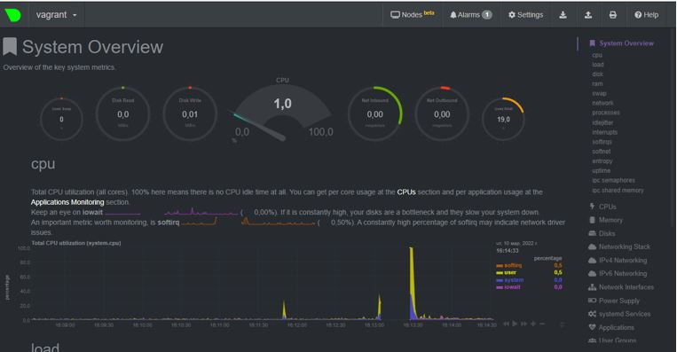
 
________________________
 
4. Можно ли по выводу dmesg понять, осознает ли ОС, что загружена не на настоящем обору-довании, а на системе виртуализации?

Да, в выводе команды присутствует информация о системе виртуализации:


 
________________________
 
5. Как настроен sysctl fs.nr_open на системе по-умолчанию? Узнайте, что означает этот пара-метр. Какой другой существующий лимит не позволит достичь такого числа (ulimit --help)?


 
fs.nr_open  - это максимальное число открытых дескрипторов для системы. 

Смотрим Help:


 
Максимальное количество открытых дескрипторов для жесткого и мягкого лимита ниже:
 

 
________________________
 
6. Запустите любой долгоживущий процесс (не ls, который отработает мгновенно, а, напри-мер, sleep 1h) в отдельном неймспейсе процессов; покажите, что ваш процесс работает под PID 1 через nsenter. Для простоты работайте в данном задании под root (sudo -i). Под обычным пользователем требуются дополнительные опции (--map-root-user) и т.д.

Заходим под рутом, запускаем sleep 1h через unshare, смотрим вывод ps (PID = 1652)


 
Заходим в неймспейс, убеждаемся, что PID = 1:


 
________________________
 
7. Найдите информацию о том, что такое :(){ :|:& };:. Запустите эту команду в своей виртуальной машине Vagrant с Ubuntu 20.04 (это важно, поведение в других ОС не проверялось). Некоторое время все будет "плохо", после чего (минуты) – ОС должна стабилизироваться. Вы-зов dmesg расскажет, какой механизм помог автоматической стабилизации. Как настроен этот механизм по-умолчанию, и как изменить число процессов, которое можно создать в сессии?

После ввода :(){ :|:& };: видим:


 
Что сопровождается загрузкой в 100% CPU:


 
По выводу dmesg видим, что процесс прекращается с помощью механизма fork rejected:
 

 
Выход из зацикливания произошел при превышении параметров по умолчанию, которые моно посмотреть с помощью ulimit -a:
 

 
Регулируя эти лимиты, можно выйти из зацикливания по другим критериям. Число процессов, которые можно создать в сессии, выставляется с помощью ulimit -u.  Так, для 100 процессов надо выставить ulimit -u 100:
 

________________________
 
  ## Домашнее задание к занятию «3.5. Файловые системы»
 
__1.  Узнайте о sparse (разряженных) файлах.__
 
Разреженные – это специальные файлы, которые с бОльшей эффективностью используют файловую систему, они не позволяют ФС занимать свободное дисковое пространство носителя, когда разделы не заполнены. То есть, «пустое ме-сто» будет задействовано только при необходимости. Пустая информация в виде нулей, будет хранится в блоке метадан-ных ФС. Поэтому, разреженные файлы изначально занимают меньший объем носителя, чем их реальный объем. 
(Sparse файл это файл, в котором куски, содержащие нули, на диск не пишутся. )
Для использования sparse-файлов нужно указать ключ --sparse
       --sparse = always - для создания разреженного файла DEST всякий раз, когда файл SOURCE содержит достаточно длин-ную последовательность нулевых байтов. 
       --sparse = never   для запрета создания разреженных файлов. 
________________________
 
__2.  Могут ли файлы, являющиеся жесткой ссылкой на один объект, иметь разные права доступа и владельца? Почему?__
 
Жесткая ссылка – тот же самый файл, с теми же атрибутами, что и оригинальный файл.
Права доступа будут одинаковыми. 

Проверка:
Создадим файл test_link и жесткую ссылку test_link_hard:


 
Посмотрим права:
 

 
Изменим права для test_link c 0664 на 0665 и посмотрим итоговые права в оригинальном файле и жесткой ссылке:
 


Как видим, права поменялись на 0665 и там, и там.
________________________

__3.  Сделайте vagrant destroy на имеющийся инстанс Ubuntu. Замените содержимое Vagrantfile следующим.__
``` 
    Vagrant.configure("2") do |config|
      config.vm.box = "bento/ubuntu-20.04"
      config.vm.provider :virtualbox do |vb|
        lvm_experiments_disk0_path = "/tmp/lvm_experiments_disk0.vmdk"
        lvm_experiments_disk1_path = "/tmp/lvm_experiments_disk1.vmdk"
        vb.customize ['createmedium', '--filename', lvm_experiments_disk0_path, '--size', 2560]
        vb.customize ['createmedium', '--filename', lvm_experiments_disk1_path, '--size', 2560]
        vb.customize ['storageattach', :id, '--storagectl', 'SATA Controller', '--port', 1, '--device', 0, '--type', 'hdd', '--medium', lvm_experiments_disk0_path]
        vb.customize ['storageattach', :id, '--storagectl', 'SATA Controller', '--port', 2, '--device', 0, '--type', 'hdd', '--medium', lvm_experiments_disk1_path]
      end
    end
``` 
Данная конфигурация создаст новую виртуальную машину с двумя дополнительными неразмеченными дисками по 2.5 Гб.
После создания новой виртуальной машины видим, что появилось два неразмеченных дисками по 2,5 ГБ.
 

________________________
 
__4.  Используя fdisk, разбейте первый диск на 2 раздела: 2 Гб, оставшееся пространство.
Используя утилиту fdisk, произведем разметку диска “b” в интерактивном режиме:__

В интерактивном режиме имеются команды ниже:

a - включение или выключения флага boot для раздела;
d - удалить раздел;
F - показать свободное место;
l - вывести список известных типов разделов;
n - создать новый раздел;
p - вывести таблицу разделов;
t - изменение типа раздела;
i - вывести информацию о разделе;
I и O - записать или загрузить разметку в файл сценария sfdisk;
w - записать новую таблицу разделов на диск;
q - выйти без сохранения;
g - создать пустую таблицу разделов GPT;
o - создать пустую таблицу разделов MBR.

Будем использовать n и w


Проверяем разметку:


________________________
 
__5.  Используя sfdisk, перенесите данную таблицу разделов на второй диск.__
 
Скопируем таблицу разделов через опцию dump в файл sda.txt, а затем выгрузим её в /dev/sdc:


 
Проверим разделы на sdc:
 

 
После выключения ВМ, надо поменять VagrantFile на прежний.
________________________
 
__6.  Соберите mdadm RAID1 на паре разделов 2 Гб.__
 
Создаём RAID1 с помощью команды mdadm --create --verbose /dev/md1 -l 1 -n 2 /dev/sd{b1,c1}:


________________________
 
__7.  Соберите mdadm RAID0 на второй паре маленьких разделов.__
 
Создаём RAID0 с помощью команды mdadm --create --verbose /dev/md2 -l 0 -n 2 /dev/sd{b2,c2}:


 
Проверим, что получилось:
 


Также информацию обо всех созданных в системе RAID массивах можно в файле /proc/mdstat:


________________________
 
__8. Создайте 2 независимых PV на получившихся md-устройствах.__

Проверим физические тома LVM с помощью команды pvscan:
 


Инициализируем  тома для работы LVM с помощью команды pvcreate /dev/md1 /dev/md2:
 

 
Проверим физические тома LVM с помощью команды pvscan:
 

________________________
 
__9.  Создайте общую volume-group на этих двух PV.__

Группа томов - это не что иное, как пул памяти, который будет распределен между логическими томами и может состо-ять из нескольких физических разделов. После того как физические разделы инициализированы, можно создать из них группу томов (Volume Group, VG).
vgcreate  volume_group_common1 /dev/md1 /dev/md2
 
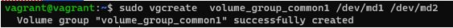
 
Проверим:
 

 

________________________
 
__10.  Создайте LV размером 100 Мб, указав его расположение на PV с RAID0.__
 
lvcreate -L 100M -n logical_volume1 volume_group_common1 /dev/md2


 
Проверяем:
 

 

________________________

__11.  Создайте mkfs.ext4 ФС на получившемся LV.__
 
mkfs.ext4 /dev/ volume_group_common1/ logical_volume1
 


Проверим на текущий момент  список примонтированных разделов, свободное место на них, а также узнать файловую систему Linux:
 

________________________
 
__12.  Смонтируйте этот раздел в любую директорию, например, /tmp/new.__

Создаем папку и монтируем раздел в директорию for_logical_volume1:


 
Проверяем  список примонтированных разделов, свободное место на них, а также узнать файловую систему Linux:
 

________________________
 
__13.  Поместите туда тестовый файл, например wget https://mirror.yandex.ru/ubuntu/ls-lR.gz -O /tmp/new/test.gz.__
 

________________________
 
__14.  Прикрепите вывод lsblk.__
 
Проверяем до pvmove: 
 

________________________
 
__15. Протестируйте целостность файла:__
```
root@vagrant:~# gzip -t /tmp/new/test.gz
root@vagrant:~# echo $?
0
```

________________________
 
__16.  Используя pvmove, переместите содержимое PV с RAID0 на RAID1.__

pvmove -n /dev/ volume_group_common1/logical_volume1 /dev/md2 /dev/md1
 

 
Проверяем после pvmove: 
 

________________________

__17.  Сделайте --fail на устройство в вашем RAID1 md.__

С помощью команды mdadm /dev/md1 --fail /dev/sdb1:


________________________
 
__18.  Подтвердите выводом dmesg, что RAID1 работает в деградированном состоянии.__

Вывод команды dmesg:
 

________________________

__19.  Протестируйте целостность файла, несмотря на "сбойный" диск он должен продолжать быть доступен:__
```
root@vagrant:~# gzip -t /tmp/new/test.gz
root@vagrant:~# echo $?
0
```
Проверка целостности файла – файл доступен, RAID отработал:


________________________
 
__20.  Погасите тестовый хост, vagrant destroy.__

Vagrant destroy
________________________

 ## Домашнее задание к занятию «3.6. Компьютерные сети, лекция 1»

__1.  Работа c HTTP через телнет.__
 
•	Подключитесь утилитой телнет к сайту stackoverflow.com telnet stackoverflow.com 80
•	отправьте HTTP запрос
```
GET /questions HTTP/1.0
HOST: stackoverflow.com
[press enter]
[press enter]
```
•	В ответе укажите полученный HTTP код, что он означает?

Код 301 указывает на то, что страница перемещена постоянно на location: https://stackoverflow.com/questions


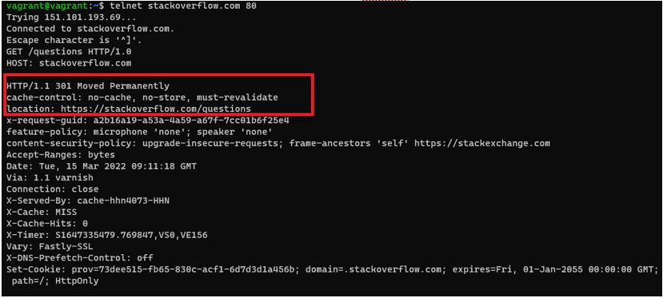
 
Т.о. получается, что мы не можем использовать telnet, потому что этот URL-адрес доступен только для https. Можно ис-пользовать openssl вместо telnet, например, так:
 
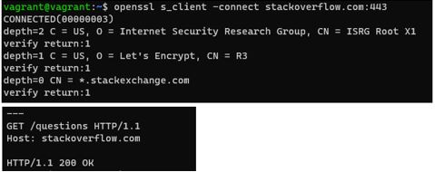
 
При этом вывод HTML-кода будет соответствовать выводу кода из страницы https://stackoverflow.com/questions  по F12:
 
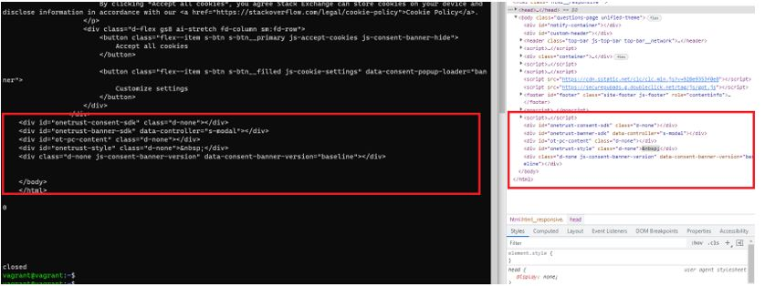
________________________
 
__2.  Повторите задание 1 в браузере, используя консоль разработчика F12.__
 
•	откройте вкладку Network
•	отправьте запрос http://stackoverflow.com
•	найдите первый ответ HTTP сервера, откройте вкладку Headers
•	укажите в ответе полученный HTTP код.
•	проверьте время загрузки страницы, какой запрос обрабатывался дольше всего?
•	приложите скриншот консоли браузера в ответ.

Время загрузки страницы составило 1,34 с.

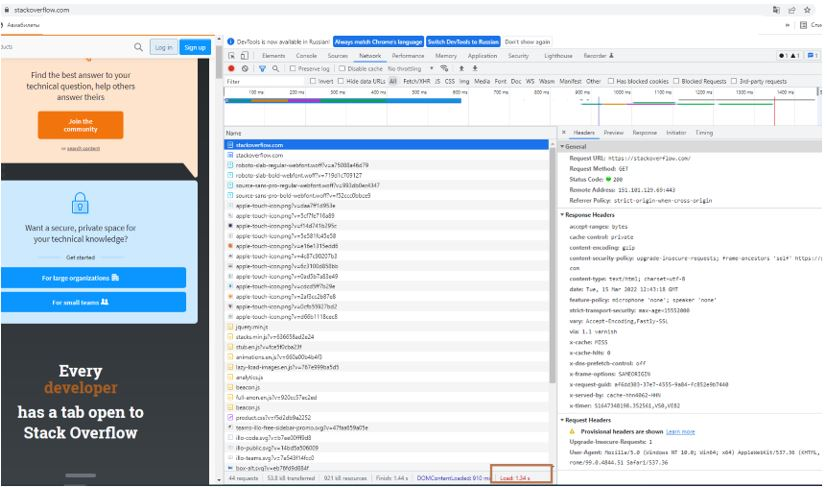
 
Видим перенаправление с Request URL http://stackoverflow.com/ на https://stackoverflow.com/:
 
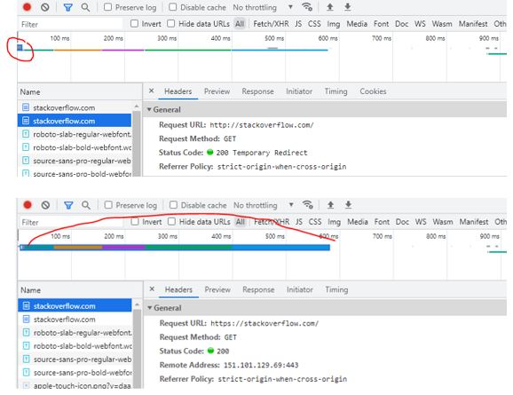
 
Дольше всего обрабатывается запрос загрузки самой страницы ~ 570 мс.

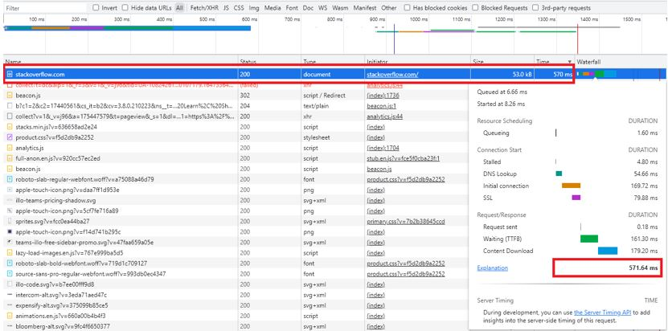
________________________
 
__3.  Какой IP адрес у вас в интернете?__

Для определения внешнего IP-адреса используем команду из-под терминала: 


 
Также доступны следующие команды: 

1. wget -qO- eth0.me
2. wget -qO- ipinfo.io/ip
3. wget -qO- ipecho.net/plain
4. wget -qO- icanhazip.com
5. wget -qO- ipecho.net
6. wget -qO- ident.me
7. wget -qO- myip.gelma.net
________________________
 
__4.  Какому провайдеру принадлежит ваш IP адрес? Какой автономной системе AS? Воспользуй-тесь утилитой whois__

С помощью whois определяем провайдера и пул адресов, из которого выделен нам адрес:
 
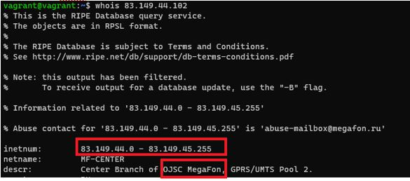

С помощью whois -h whois.radb.net 83.149.44.102 определяем AS провайдера – #13208:
 
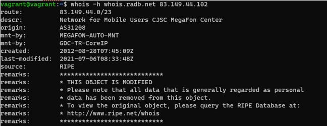
________________________

__5.  Через какие сети проходит пакет, отправленный с вашего компьютера на адрес 8.8.8.8? Через какие AS? Воспользуйтесь утилитой traceroute__

Дополнительно к ключам An добавлен ключ I, чтобы фаерволл не блокировал UDP пакеты (используются ICMP-пакеты вместо UDP-пакетов).
Вывод команды $ sudo traceroute -IAn 8.8.8.8

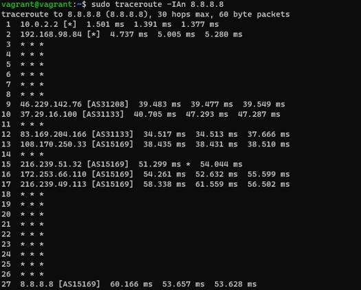
________________________
 
__6.  Повторите задание 5 в утилите mtr. На каком участке наибольшая задержка - delay?__

Вывод команды $ mtr 8.8.8.8 -znrc 1:
 
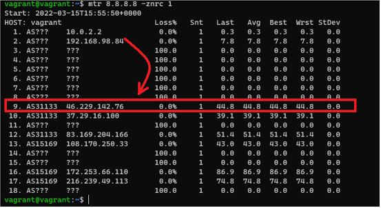
 
Наибольшая задержка между 1-м и 9-м hop-ом. 9-ый hop – BRAS провайдера. Задержка такая объясняется, что до про-вайдера по клиентским сетям достучаться дольше всего, далее по оптике провайдера и межоператорским стыкам таких задержек не бывает.
________________________

__7.  Какие DNS сервера отвечают за доменное имя dns.google? Какие A записи? воспользуйтесь утилитой dig.__

Вывод DNS-серверов и А-записей с помощью команд 
```
$ dig +short NS dns.google
  и
$ dig +short A dns.google:
```

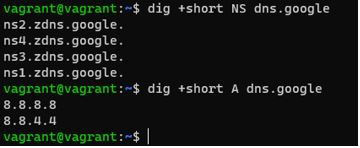
________________________
 
__8.  Проверьте PTR записи для IP адресов из задания 7. Какое доменное имя привязано к IP? воспользуйтесь утилитой dig.__

Вывод PTR-записей с помощью команд
```
 dig -x 8.8.8.8
 и
dig -x 8.8.4.4
```
 
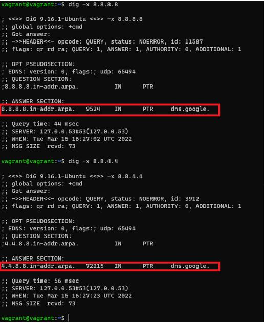

К IP привязано DNS-имя dns.google.
________________________

 ## Домашнее задание к занятию «3.7. Компьютерные сети, лекция 2»
 
__1.  Проверьте список доступных сетевых интерфейсов на вашем компьютере. Какие команды есть для этого в Linux и в Windows?__

В Linuх ifconfig:

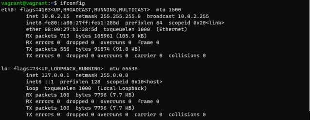
 
В Windows ipconfig:

 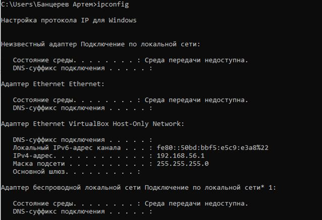
________________________
 
__2.  Какой протокол используется для распознавания соседа по сетевому интерфейсу? Какой па-кет и команды есть в Linux для этого?__
 
Используется пакет sudo apt-get install lldpd, команда lldpctl. Протокол – LLDP (протокол для обмена информацией меж-ду соседними устройствами, позволяет определить к какому порту коммутатора подключен сервер).
 
 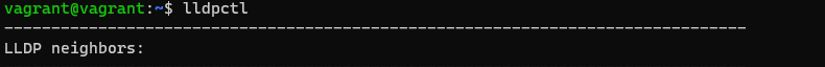
________________________

__3.  Какая технология используется для разделения L2 коммутатора на несколько виртуальных сетей? Какой пакет и команды есть в Linux для этого? Приведите пример конфига.__
 
Используется технология IEEE 802.1q – разделение по VLAN. В Linux есть пакет с одноименным названием vlan.

+ Включение поддержки vlan в Linux:
```
sudo apt-get install vlan
```
+ создадим логический интерфейс 555, 556, привязанные к физическому интерфейсу "eth0", который будет обрабаты-вать пакеты с тегами 555, 556.
```	
vconfig add eth0 555
vconfig add eth0 556
```
+ Ошибки с 8021q module не выскочило, команда sudo modprobe 8021q не потребовалась

+ Повесим ip-адреса на новые интерфейсы "eth0.555" и "eth0.556".
```
sudo ifconfig eth0.555 192.168.88.88 netmask 255.255.255.0 up
sudo ifconfig eth0.556 192.168.88.99 netmask 255.255.255.0 up
```
Вывод команды  ifconfig -a для проверки создания подинтерфесов:

 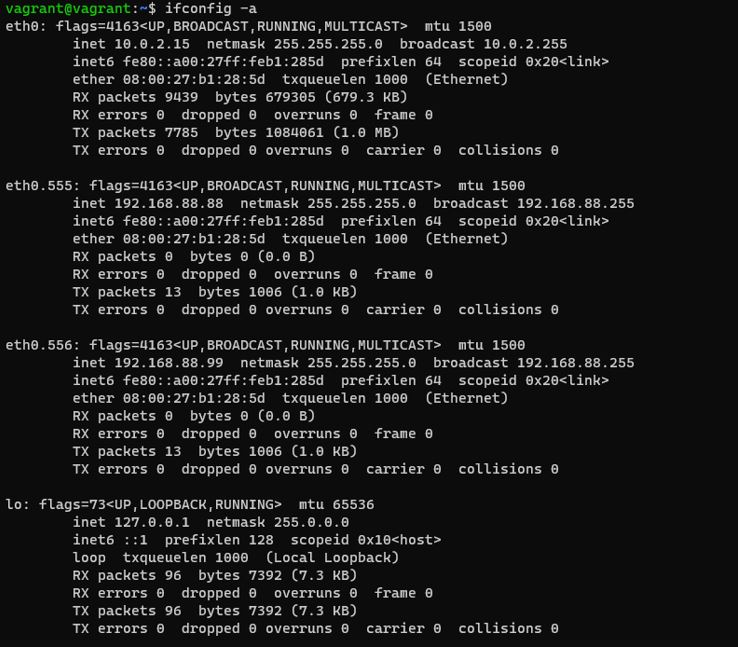
________________________
 
Следует отметить, что после перезагрузки интерфейс "eth0.555" слетит.


Добавление vlan в Linux Ubuntu через файл interfaces

Для того, чтобы интерфейс поднимался каждый раз после перезагрузки системы, его надо добавить в файл "/etc/network/interfaces". Пример содержимого файла interfases:

```
#interface loopback
auto lo
iface lo inet loopback
#Interface eth0 - untagged 
auto eth0
iface eth0 inet static
      address 192.168.10.10
      netmask 255.255.255.0
      gateway 192.168.10.1
      dns-nameservers 8.8.8.8
#Interface eth0.200 - tagged vlan 200
auto eth0.200
iface eth0.200 inet static
      address 192.168.8.10
      netmask 255.255.255.0
#Interface eth1 - untagged 
#auto eth1
#iface eth1 inet dhcp
```
Физический интерфейс "eth0" работает в обычном режиме т.е. все нетегированные (untagged) пакеты обрабатываются на этом интерфейсе.
Логический интерфейс "eth0.555" работает в режиме обработки только тегированных (tagged) пакетов с тегом 555, т.е. принадлежит VLAN555.
По аналогии можно создавать и другие VLAN интерфейсы.

__4.  Какие типы агрегации интерфейсов есть в Linux? Какие опции есть для балансировки нагруз-ки? Приведите пример конфига.__
 
В Linux есть две технологии агрегации (LAG): bonding и teaming.
Типы агрегации bonding:

+ *mode=0 (balance-rr)*
При этом методе объединения трафик распределяется по принципу «карусели»: пакеты по очереди направляются на сетевые карты объединённого интерфейса. Например, если у нас есть физические интерфейсы eth0, eth1, and eth2, объ-единенные в bond0, первый пакет будет отправляться через eth0, второй — через eth1, третий — через eth2, а четвертый снова через eth0 и т.д.
+ *mode=1 (active-backup)*
Когда используется этот метод, активен только один физический интерфейс, а остальные работают как резервные на случай отказа основного.
+ *mode=2 (balance-xor)*
В данном случае объединенный интерфейс определяет, через какую физическую сетевую карту отправить пакеты, в зависимости от MAC-адресов источника и получателя.
+ *mode=3 (broadcast)* 
 Широковещательный режим, все пакеты отправляются через каждый интерфейс. Имеет ограни-ченное применение, но обеспечивает значительную отказоустойчивость.
+ *mode=4 (802.3ad)*
Особый режим объединения. Для него требуется специально настраивать коммутатор, к которому подключен объеди-ненный интерфейс. Реализует стандарты объединения каналов IEEE и обеспечивает как увеличение пропускной спо-собности, так и отказоустойчивость.
+ *mode=5 (balance-tlb)*
Распределение нагрузки при передаче. Входящий трафик обрабатывается в обычном режиме, а при передаче интер-фейс определяется на основе данных о загруженности.
+ *mode=6 (balance-alb)*
Адаптивное распределение нагрузки. Аналогично предыдущему режиму, но с возможностью балансировать также входящую нагрузку.

+ Подгружаем модуль ядра bounding:
# modprobe bonding

+ проверяем:
# lsmod | grep bonding
bonding               147456  0
 
 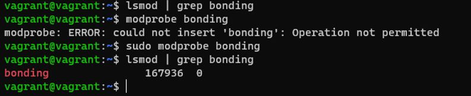

 +  Редактируем настройки сети:
```
# The loopback network interface
auto lo
iface lo inet loopback

# The primary network interface
auto eth0
iface eth0 inet manual
bond-master bond0

auto eth1
iface eth1 inet manual
bond-master bond0

auto bond0
iface bond0 inet static
address 10.200.6.8
gateway 10.200.6.6
netmask 255.255.255.0
network 10.200.6.0
dns-nameservers 10.200.6.6
bond-mode 0
bond-miimon 100
bond-slaves eth0 eth1
 ```
 
*bond-mode 0* — указывает, что мы делаем Round-robin балансировку

# /etc/init.d/networking restart

После рестарта, перелонирования в ifcinfig появится агрегатный интерфейс bond0.
________________________

__5.  Сколько IP адресов в сети с маской /29 ? Сколько /29 подсетей можно получить из сети с маской /24. Приведите несколько примеров /29 подсетей внутри сети 10.10.10.0/24.__
 
IP-адреса можно посчитать по формуле – 2^(32-29) = 2^3 =8, из которых 2 адреса – под сеть и под широковещательный. Итого, для хостов остается 6 адресов.
Также можно воспользоваться утилитой ipcalc:
```
$ sudo apt install ipcalc
$ ipcalc 192.168.1.5 /29
```
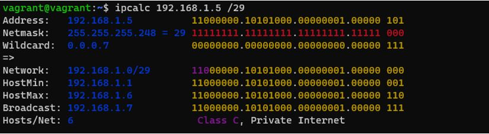
 
Одну подсеть /24 можно разделить на 32 подсети размерностью /29.

Примеры /29-сетей внутри подсети 10.10.10.0/24:
29-я подсеть включает 6 «чистых» адресов, поэтому можем воспользоваться такой командой в ipcalc для автоматиче-ского подсчета первых 3-х из 32-х подсетей /29:
~$ ipcalc 10.10.10.0/24 --s 6 6 6:

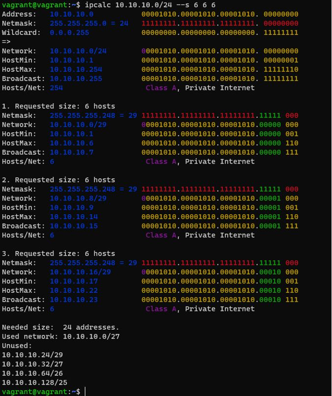
________________________
 
__6.  Задача: вас попросили организовать стык между 2-мя организациями. Диапазоны 10.0.0.0/8, 172.16.0.0/12, 192.168.0.0/16 уже заняты. Из какой подсети допустимо взять частные IP адреса? Маску выберите из расчета максимум 40-50 хостов внутри подсети.__
 
Из частных немаршрутизируемых сетей есть диапазон 100.64.0.0 — 100.127.255.255. Для 50 хостов потребуется мини-мально 52 адреса, ближайшее значение – 64 адреса, ему соответствует 64=2^6  32-6=26  mask = /26
Также можно воспользоваться ipcalc:

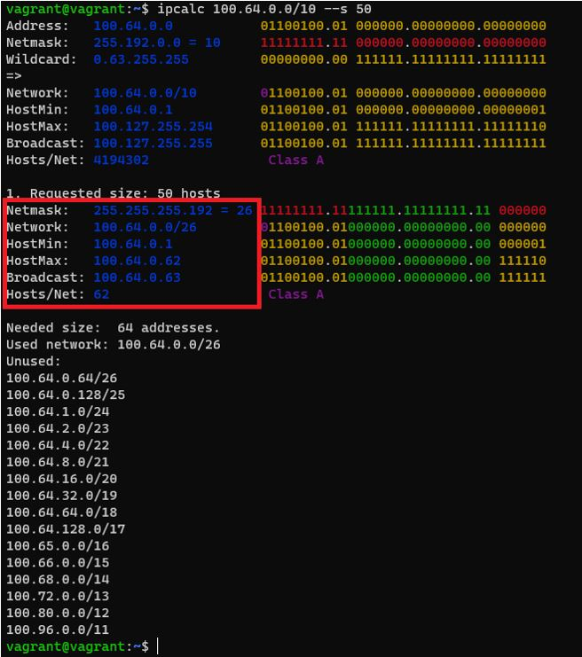
________________________
 
7.  Как проверить ARP таблицу в Linux, Windows? Как очистить ARP кеш полностью? Как из ARP таблицы удалить только один нужный IP?
 
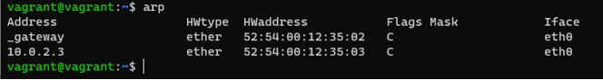
 
+ Проверить таблицу можно так:
Linux: ip neigh, arp -n
Windows: arp -a

+ Очистить кэш так:
Linux: ip neigh flush
Windows: arp -d *

+ Удалить один IP так:
Linux: arp -d <IP>
Windows: arp -d <IP>

________________________
