## Курсовая работа по итогам модуля "DevOps и системное администрирование"

__Задание__

__1.	Создайте виртуальную машину Linux.__

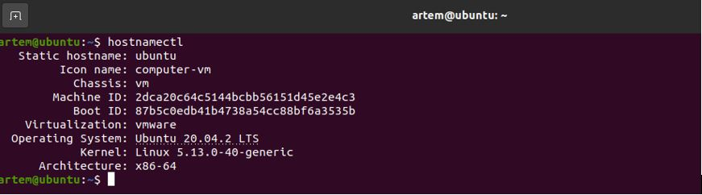
________________________ 

__2.  Установите ufw и разрешите к этой машине сессии на порты 22 и 443, при этом трафик на интерфейсе localhost (lo) должен ходить свободно на все порты.__

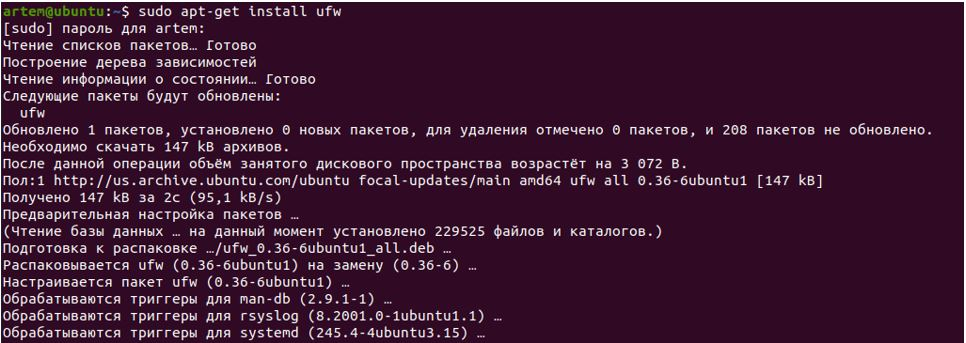
________________________ 

```
sudo ufw allow in on lo from 0.0.0.0/0
```

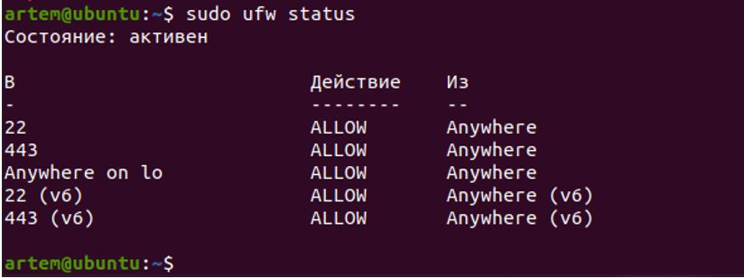

________________________ 

__3.  Установите hashicorp vault (инструкция по ссылке).__

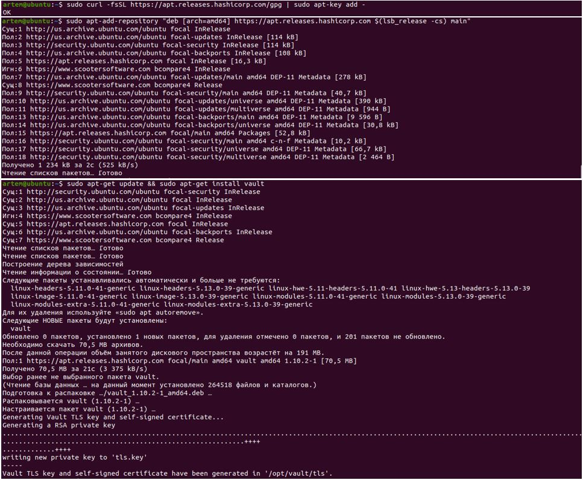

Проверяем: 
```
~ sudo vault
```

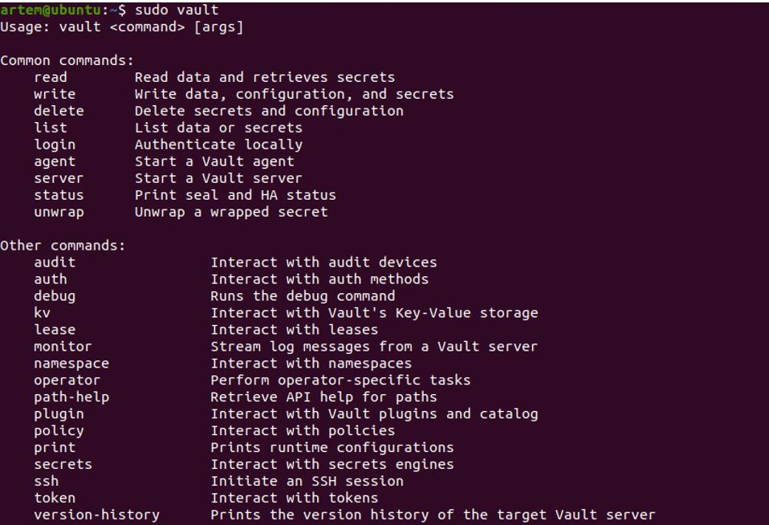
________________________ 

__4.  Cоздайте центр сертификации по инструкции (ссылка) и выпустите сертификат для использования его в настройке веб-сервера nginx (срок жизни сертификата - месяц).__

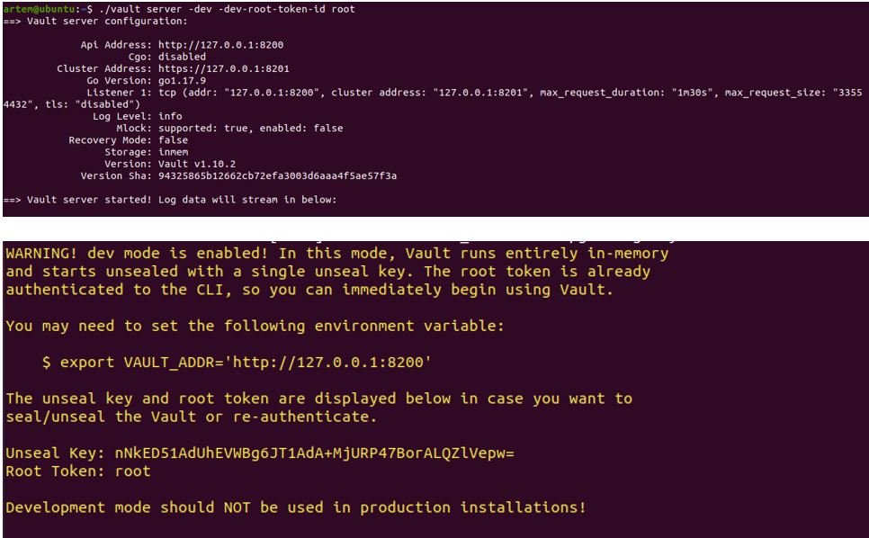

Экспортируем переменную среды для vaultCLI для обращения к серверу Vault:
```
export VAULT_ADDR=http://127.0.0.1:8200
```

Экспортируем переменную среды для vaultCLI для аутентификации на сервере Vault:
```
export VAULT_TOKEN=root
```


Выходит вот такая ошибка:

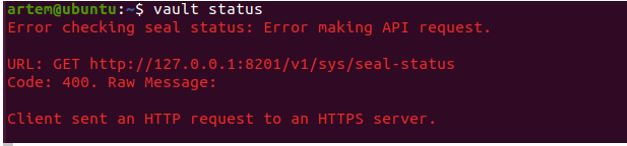

Для решения проблемы открываем файл:
```
sudo nano /etc/vault.d/vault.hcl
```
В нём раскомментируем и правим блоки #HTTP и #HTTPS как указано ниже:

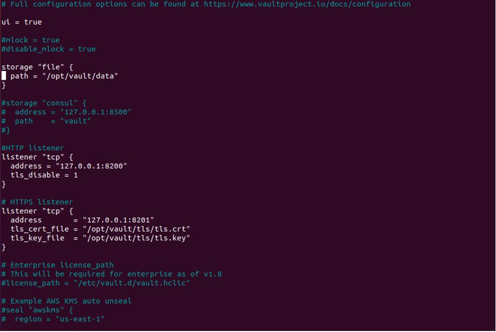

Далее перезапускаем службу vault:
```
~ systemctl restart vault
```
и обновляем системную переменную VAULT_ADDR:
```
~ export VAULT_ADDR=http://127.0.0.1:8200
```

Выводим на экран статус:
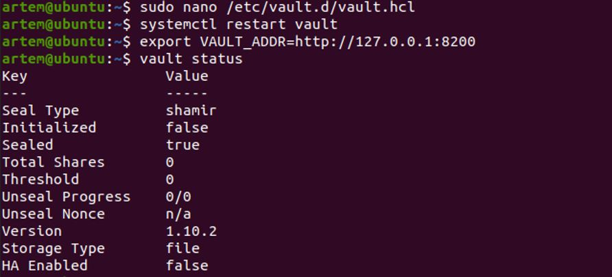

Инициализация, распечатывание и вход. Для начала, нам необходимо инициализировать наш сервер. Это выполняется командой
```
vault operator init

~ vault operator init
Unseal Key 1: mXmqLSOq8EVZu/7Hqbyza/YTOFaVukjU2sTdjhRrG+AF
Unseal Key 2: 5F7fSROwIZGibgVjPoP2HOGgyvhwOlLt8Hdz4KSqvMWp
Unseal Key 3: oLEF5F5pUqElVQjI/tOG270aOHeKBICovSGQpfCW1gkH
Unseal Key 4: FgB31evVJ19xi7ZDeLrAJXQrwAWEv/DWqF3POC9eZKno
Unseal Key 5: JSXfBOgaigX17WQp2Jgbh2rTmMEGWk16/aeX72ict2+g

Initial Root Token: hvs.5Ovg4kbXnUyVohNlRK6z4SLw

Vault initialized with 5 key shares and a key threshold of 3. Please securely
distribute the key shares printed above. When the Vault is re-sealed,
restarted, or stopped, you must supply at least 3 of these keys to unseal it
before it can start servicing requests.

Vault does not store the generated root key. Without at least 3 keys to
reconstruct the root key, Vault will remain permanently sealed!

It is possible to generate new unseal keys, provided you have a quorum of
existing unseal keys shares. See "vault operator rekey" for more information.
```

Команда нам вернет 5 ключей. Любые 3 из них являются ключами для распечатывания сервера (Unseal Key). Также нам будет предоставлен токен для root (Initial Root Token), с помощью которого можно будет войти в систему vault.

Распечатаем наш сервер, введя по очереди 3 команды vault operator unseal. После выполнения каждой команды система будет запрашивать ключ. Необходимо ввести любые 3 из сгенерированных ранее (выделено желтым выше). При правильном вводе ключа, мы будем видеть общую информацию по ключу. А при вводе третьего ключа мы должны увидеть:
```
Sealed          false
```
Это значит, что сервер больше не запечатан и с ним можно работать.

Итак,
```
vault operator unseal
```
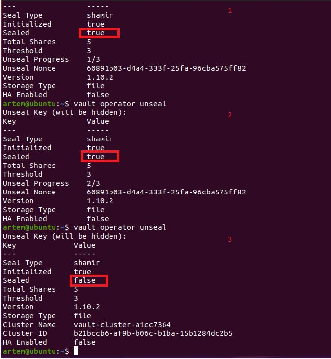

Теперь необходимо залогиниться в систему командой:
```
vault login
```
и ввести ключ root, который мы получили после инициализации.
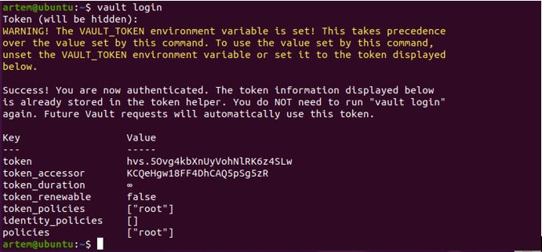

Мы можем выполнять команды для работы с Hashicorp Vault.

*Создание Root CA и Intermediate CA*
```
~ vault secrets enable pki
Success! Enabled the pki secrets engine at: pki/

~ vault secrets tune -max-lease-ttl=8760h pki
Success! Tuned the secrets engine at: pki/

~ vault write -field=certificate pki/root/generate/internal common_name="example.com" ttl=87600h > CA_cert.crt

~ vault write pki/config/urls issuing_certificates="http://127.0.0.1:8200/v1/pki/ca" crl_distribution_points="http://127.0.0.1:8200/v1/pki/crl"
Success! Data written to: pki/config/urls

~ vault secrets enable -path=pki_int pki
Success! Enabled the pki secrets engine at: pki_int/

~ vault secrets tune -max-lease-ttl=8760h pki_int
Success! Tuned the secrets engine at: pki_int/

~ apt install jq

~ vault write -format=json pki_int/intermediate/generate/internal common_name="example.com Intermediate Authority" | jq -r '.data.csr' > pki_intermediate.csr

~ vault write -format=json pki/root/sign-intermediate csr=@pki_intermediate.csr format=pem_bundle ttl="8760h" | jq -r '.data.certificate' > intermediate.cert.pem

~ vault write pki_int/intermediate/set-signed certificate=@intermediate.cert.pem
Success! Data written to: pki_int/intermediate/set-signed

~ vault write pki_int/roles/example-dot-com allowed_domains="example.com" allow_subdomains=true max_ttl="4380h"
Success! Data written to: pki_int/roles/example-dot-com

~ vault list pki_int/roles/
Keys

example-dot-com
```

*Создание сертификатов для devops.example.com:*
```
~ vault write -format=json pki_int/issue/example-dot-com common_name="devops.example.com" ttl=720h > devops.example.com.crt

~ cat devops.example.com.crt
....
"serial_number": "6f:9d:23:86:a8:3d:0d:e8:ac:cb:a3:c7:f6:b3:f9:0b:6a:51:6b:cf"

~ cat devops.example.com.crt | jq -r .data.certificate > devops.example.com.crt.pem

~ cat devops.example.com.crt | jq -r .data.issuing_ca >> devops.example.com.crt.pem

~ cat devops.example.com.crt | jq -r .data.private_key > dvops.example.com.crt.key
```
________________________ 

__5.  Установите корневой сертификат созданного центра сертификации в доверенные в хостовой системе.__
```
~ ln -s /root/CA_cert.crt /usr/local/share/ca-certificates/CA_cert.crt
~ update-ca-certificates
Updating certificates in /etc/ssl/certs...
0 added, 0 removed; done.
Running hooks in /etc/ca-certificates/update.d...
done.
```
________________________ 

__6. Установите nginx.__
```
~ apt install nginx
~ systemctl status nginx
```
● nginx.service - A high performance web server and a reverse proxy server
     Loaded: loaded (/lib/systemd/system/nginx.service; enabled; vendor preset: enabled)
     Active: active (running) since Mon 2022-05-16 07:19:32 PDT; 38s ago
       Docs: man:nginx(8)
   Main PID: 7146 (nginx)
      Tasks: 3 (limit: 4588)
     Memory: 3.6M
     CGroup: /system.slice/nginx.service
             ├─7146 nginx: master process /usr/sbin/nginx -g daemon on; master_process on;
             ├─7147 nginx: worker process
             └─7148 nginx: worker process

мая 16 07:19:32 ubuntu systemd[1]: Starting A high performance web server and a reverse proxy server...
мая 16 07:19:32 ubuntu systemd[1]: Started A high performance web server and a reverse proxy server.

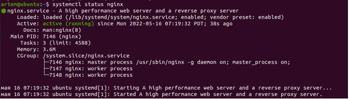
```
~ nano /etc/hosts

127.0.0.1       localhost
127.0.1.1       ubuntu
127.0.0.1       devops.example.com
```

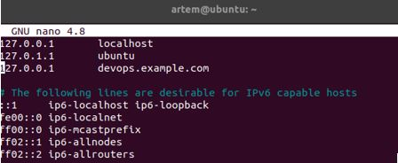
```
~ ping devops.example.com:
```
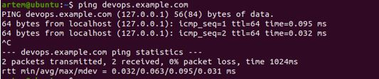
________________________ 

__7.  По инструкции (ссылка) настройте nginx на https, используя ранее подготовленный сертификат:
•	можно использовать стандартную стартовую страницу nginx для демонстрации работы сервера;
•	можно использовать и другой html файл, сделанный вами;__
```
~ nano /etc/nginx/sites-enabled/default
....
server {
....

        # SSL configuration
        #
        listen 443 ssl default_server;
        listen [::]:443 ssl default_server;
        ssl_certificate /root/devops.example.com.crt.pem;
        ssl_certificate_key /root/devops.example.com.crt.key;
....
```
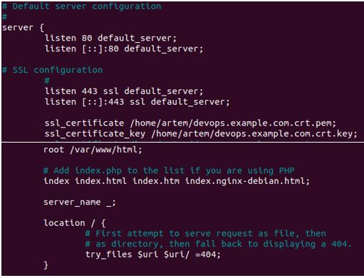

```
~ nginx –t 

nginx: the configuration file /etc/nginx/nginx.conf syntax is ok
nginx: configuration file /etc/nginx/nginx.conf test is successful
```
```
root@vagrant:~# systemctl reload nginx
root@vagrant:~# root@vagrant:~# curl -I https://devops.example.com
```
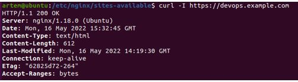
________________________ 

__8.  Откройте в браузере на хосте https адрес страницы, которую обслуживает сервер nginx.__
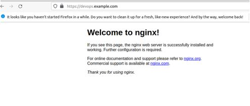
________________________ 

__9.  Создайте скрипт, который будет генерировать новый сертификат в vault:
•	генерируем новый сертификат так, чтобы не переписывать конфиг nginx;
•	перезапускаем nginx для применения нового сертификата.__

```
~ nano script_sert.sh

#!/bin/bash
vault write -format=json pki_int/issue/example-dot-com common_name="devops.example.com" ttl=720h > /home/artem/devops.example.com.crt
cat /home/artem/devops.example.com.crt | jq -r .data.certificate > /home/artem/devops.example.com.crt.pem
cat /home/artem/devops.example.com.crt | jq -r .data.issuing_ca >> /home/artem/devops.example.com.crt.pem
cat /home/artem/devops.example.com.crt | jq -r .data.private_key > /home/artem/devops.example.com.crt.key
systemctl reload nginx

~ chmod ugo+x sert.sh
```
________________________ 


__10.  Поместите скрипт в crontab, чтобы сертификат обновлялся какого-то числа каждого месяца в удобное для вас время.__
```
~ crontab -l
....
# m h  dom mon dow   command
0 0 7 * * /home/artem/script_sert.sh
```
Для примера проставил выполнение скрипта «каждую минуту», чтобы отследить в логе его выполнение:
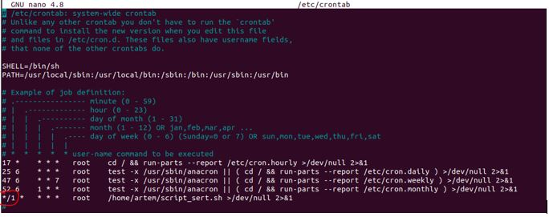

Ниже скриншот лог файла /var/log/syslog:  
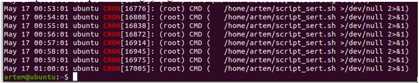
________________________ 


