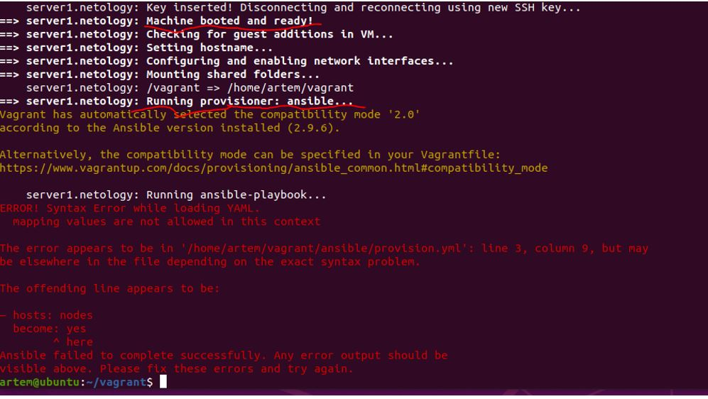

##В ходе выполнения задания 4* в 5-2  было выполнено следующее:

__на Ubuntu установлен virtualbox__
```
artem@ubuntu:~/vagrant$ vboxmanage --version
6.1.32_Ubuntur149290
```
__на Ubuntu установлен vagrant__
```
artem@ubuntu:~/vagrant$ vagrant -v
Vagrant 2.2.6
```


__на Ubuntu установлен ansible__
```
artem@ubuntu:~/vagrant$ ansible --version
ansible 2.9.6
  config file = /home/artem/vagrant/ansible.cfg
  configured module search path = ['/home/artem/.ansible/plugins/modules', '/usr/share/ansible/plugins/modules']
  ansible python module location = /usr/lib/python3/dist-packages/ansible
  executable location = /usr/bin/ansible
  python version = 3.8.10 (default, Mar 15 2022, 12:22:08) [GCC 9.4.0]
```

__Создана папка vagrant в домашней директории, далее произведен *vagrant init* и добавлены файл ansible.cfg и папка ansible для хранения playbook-а:__
```
artem@ubuntu:~/vagrant$ ls -lha
итого 40K
drwxrwxr-x  4 artem artem 4,0K мая 21 03:45 .
drwxr-xr-x 24 artem artem 4,0K мая 20 23:45 ..
drwxrwxr-x  2 artem artem 4,0K мая 22 05:07 ansible
-rw-r--r--  1 artem artem  20K мая 21 02:40 ansible.cfg
drwxrwxr-x  4 artem artem 4,0K мая 20 23:38 .vagrant
-rw-rw-r--  1 artem artem 1,2K мая 21 00:46 Vagrantfile
```

__Содержание файла Vagrantfile:__
```
ISO = "bento/ubuntu-20.04"
NET = "192.168.192."
DOMAIN = ".netology"
HOST_PREFIX = "server"
INVENTORY_PATH = "../ansible/inventory"

servers = [
 {
         :hostname => HOST_PREFIX + "1" + DOMAIN,
         :ip => NET + "11",
         :ssh_host => "20011",
         :ssh_vm => "22",
         :ram => 1024,
         :core => 1
 }
]

Vagrant.configure(2) do |config|
        config.vm.synced_folder ".", "/vagrant", disabled: false
        servers.each do |machine|
                config.vm.define machine[:hostname] do |node|
                        node.vm.box = ISO
                        node.vm.hostname = machine[:hostname]
                        node.vm.network "private_network", ip: machine[:ip]
                        node.vm.network :forwarded_port, guest: machine[:ssh_vm], host: machine[:ssh_host]
                        node.vm.provider "virtualbox" do |vb|
                                vb.customize ["modifyvm", :id, "--memory", machine[:ram]]
                                vb.customize ["modifyvm", :id, "--cpus", machine[:core]]
                                vb.name = machine[:hostname]
                        end
                        node.vm.provision "ansible" do |setup|
                                setup.inventory_path = INVENTORY_PATH
                                setup.playbook = "../ansible/provision.yml"
                                setup.become = true
                                setup.extra_vars = { ansible_user: 'vagrant' }
                        end
                end
        end
end
```

__Содержание файла /home/artem/vagrant/ansible/ansible.cfg__
```
[defaults]
inventory=./inventory
deprecation_warnings=False
command_warnings=False
ansible_port=22
interpreter_python=/usr/bin/python3
```

__Содержание файла /home/artem/vagrant/ansible/inventory__
```
[nodes:children]
manager
[manager]
server1.netology ansible_host=127.0.0.1 ansible_port=20011 ansible_user=vagrant
```

__Убеждаемся, что нет поднятых машин:__
```
artem@ubuntu:~/vagrant$ vagrant global-status 
id       name   provider state  directory                           
--------------------------------------------------------------------
There are no active Vagrant environments on this computer! Or,
you haven't destroyed and recreated Vagrant environments that were
started with an older version of Vagrant.
```

__Смотрим, какой образ ОС есть в box-е:__
```
artem@ubuntu:~/vagrant$ vagrant box list
bento/ubuntu-20.04 (virtualbox, 202112.19.0)
```

__Версия python:__
```
artem@ubuntu:~/vagrant/ansible$ python3 --version
Python 3.8.10
```

__Создаем файл /etc/vbox/networks.conf__
```
* 10.0.0.0/8 192.168.0.0/16
* 2001::/64
```

__Включаем VT-X для машины:__
```
VBoxManage modifyvm "server1.netology" --nested-hw-virt on
```

__Запускаем ВМ:__
```
vagrant up
```

__Далее возникает следующая ошибка:__


